# Palinopsia

> *palinopsia (n.): the persistence or recurrence of a visual image after the stimulus is gone.*

An **OSC-controlled ISF visual instrument** — the visual sibling to
[dataFLOU](https://github.com/filliformes/dataFLOU). A lightweight Electron +
WebGL2 **four-layer compositor**, *played* over OSC (by [Pandore](https://github.com/filliformes))
rather than patched like a tool. It composites layers of shader synthesis and
treated video through blend modes, per-source / per-layer / master ISF effect
racks, a modulation brain, and a curated Randomize — into a fullscreen or
network output.

The afterglow of a feedback compositor *is* palinopsia — the name is a
description, not a metaphor. The house voice is matte, glitchy, digital-arts
work: **never cheap psychedelia, never a 3D game engine.**

- **Matte over neon** — near-black canvas, one accent, glitch as controlled texture.
- **Curated, not open-ended** — a fixed instrument topology; Randomize draws from
  aesthetic sub-ranges, never raw shader min/max.
- **Played, not patched** — every parameter reachable over OSC, MIDI, or the UI,
  through a single write path.

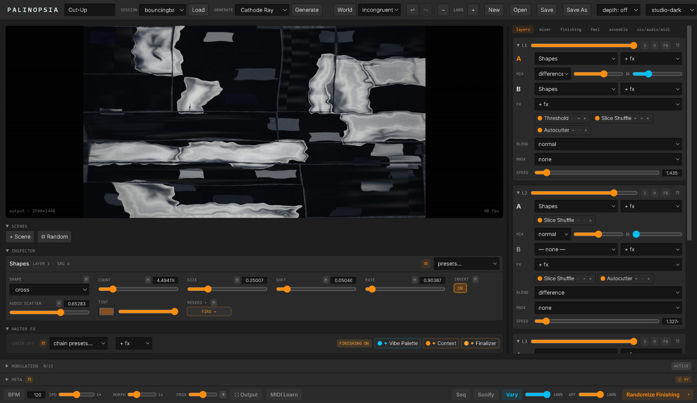

*The instrument: live preview and scene bank at the top left, the Inspector for
whatever is selected below it, the pinned master finalizers under that, and the
layer stack down the right column — here two layers of Shapes cut up by Slice
Shuffle and **Autocutter**, differenced together.*

### What it looks like

Every frame below was made by the app alone, no external footage: pick a recipe
from the **Generate** menu and it builds an entire coherent session — sources,
racks, palette, World and macro biases — in one click.

| | | |
|---|---|---|
| 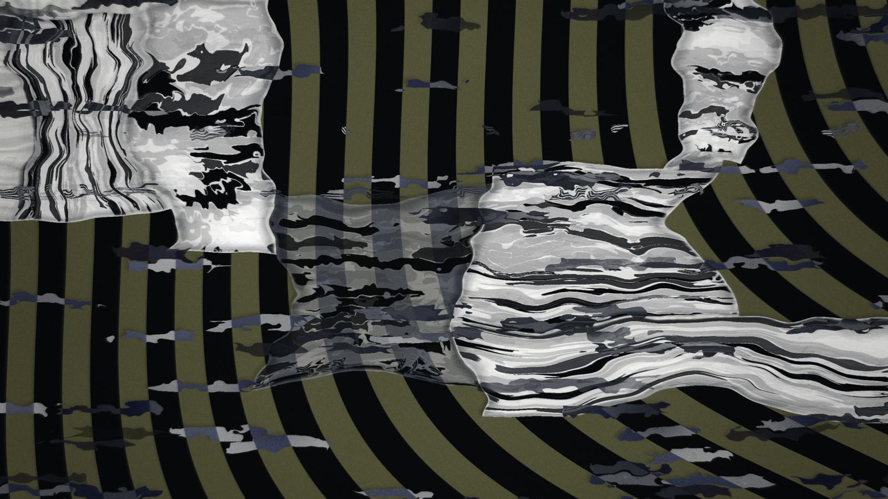<br>**Cut-Up** — Autocutter's torn, curved, still-tessellating collage | 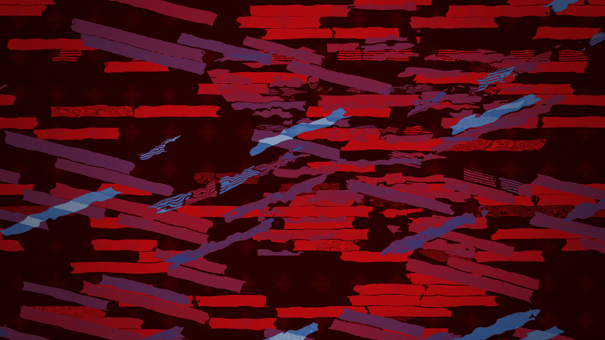<br>**Constructivist** — hard slabs, one accent | 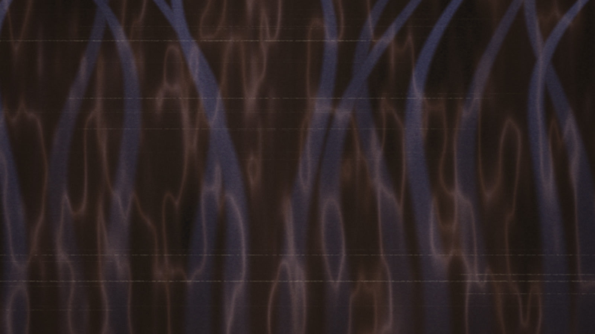<br>**Mycelial** — reaction-diffusion filaments |
| 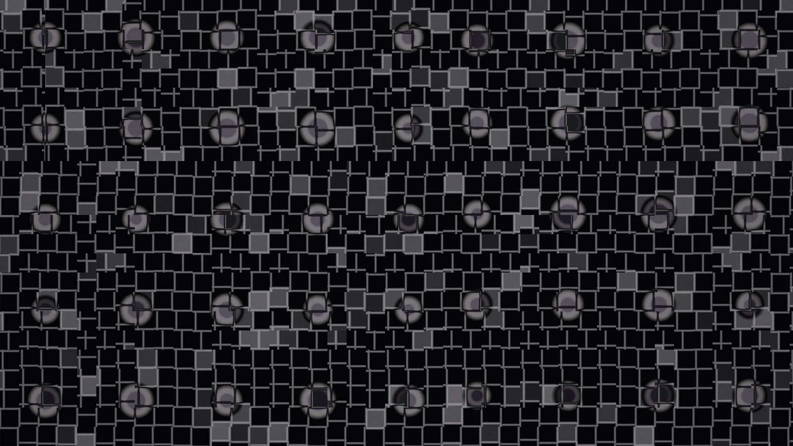<br>**Op Field** — Riley/Vasarely optical grids | 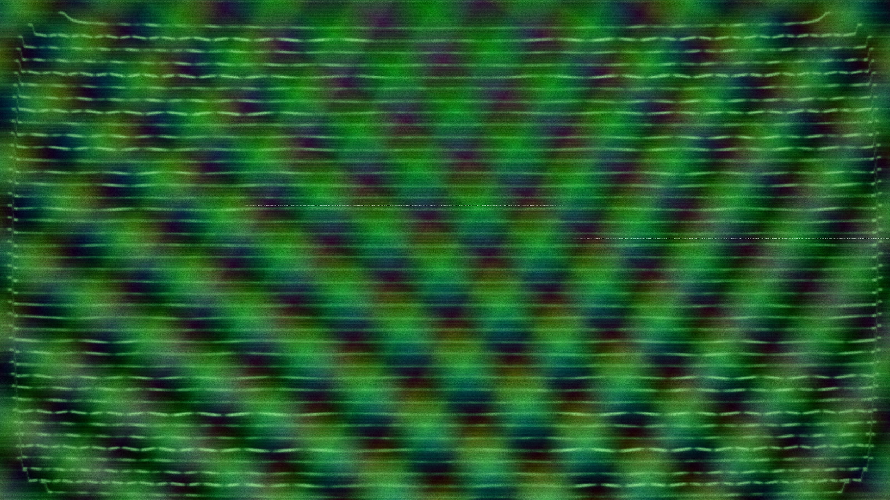<br>**Cathode Ray** — analog video-synthesis lineage | 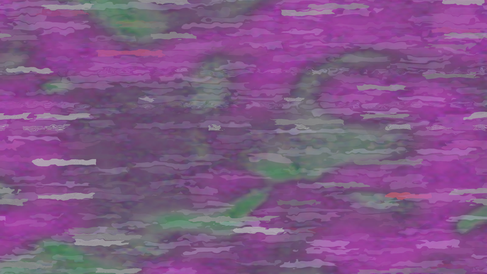<br>**Pixel Sort** — the datamosh / compression family |

---

## Contents

**Play it**
- [What it looks like](#what-it-looks-like) · [Concept](#concept) · [Getting started](#getting-started) · [Your first five minutes](#your-first-five-minutes)
- [Keyboard shortcuts](#keyboard-shortcuts)

**The instrument**
- [The layer stack](#the-layer-stack) — sources · A/B mix · racks · blends · masks · coupling
- [Video sources](#video-sources) — import (DXV/HAP/ProRes…) · transport · modulatable playhead · granulation
- [Collage](#collage--a-wall-of-films-key-source-gen-collage) — a wall of films cut up by the Autocutter partition · folder or Assemble-bank feed
- [The Transport bar](#the-transport-bar-bottom) · [Feel — the global macros](#feel--the-global-macros-key-g)
- [Meta Controller](#meta-controller-16-knobs--xy-pads) (16 knobs + XY pads) · [Modulation brain](#modulation-brain-8-modulators--matrix)
- [Sequencer](#sequencer-key-q) — auto-pilot · long-forms (Burial · Long-Take · Frame-Weave)
- [Worlds / diegesis](#worlds--diegesis-key-w) · [Audio in](#audio-in) · [MIDI](#midi) · [Output & mapping](#output--mapping-key-o) — incl. Flash safety
- [Sonify — image to sound](#sonify--image-to-sound-key-s) — six voices (Spectra · Orbit · Flow · Raster · Transmission · Filter) · quantizer · audio in recordings
- [Assemble — the automatic editor](#assemble--the-automatic-editor-key-e) — corpus point cloud · matching modes · cut pace + time curves · export
- [Sessions, scenes & themes](#sessions-scenes--themes) · [Metasurface](#metasurface--the-continuous-scene-space) · [Randomize & Vary](#randomize--vary) · [Undo](#undo)

**The vocabulary**
- [Sources](#sources-33-generators) (33 generators) · [Effects](#effects) (52 FX) ·
  [Native nodes](#native-nodes) (19) · [Master finalizers](#master-finalizers--pinned-always-last)
- [Blend modes](#blend-modes) (18)

**Control & internals**
- [OSC implementation](#osc-implementation) — inbound · outbound · OSCQuery · setup
- [Stack & architecture](#stack) · [Aesthetic guardrails](#aesthetic-guardrails) · [Credits & license](#credits--license)

---

## Concept

Palinopsia is a **compositor you perform**, not a patcher you wire. Its topology is
fixed and its vocabulary is curated: a seed library of glitch / generative /
digital-arts shaders that *is* the instrument's voice. You build an image by
stacking layers, treating each through effect racks, mastering the whole through
three pinned finalizers, and steering all of it live — by hand, by an internal
modulation brain, or over OSC from a companion "brain" like Pandore.

It also **reads audio** rather than merely pulsing to it: a shared audio bus, an
A↔B coupling engine (synchresis as balance behaviour), global World/diegesis
presets, and named Feel macros turn sound→image relations into playable
structure. A generative macro-form sequencer can then auto-pilot a whole set from
tagged scenes.

---

## Getting started

```bash
npm install
npm run dev          # electron-vite dev
npm run typecheck    # tsc — node + web projects (both must be green)
npm run build        # electron-vite build (bundle only)
npm run build:win    # NSIS installer + portable
npm run build:mac    # DMG
```

The native Spout addon (`native/spout/`) is optional and Windows-only; it's
rebuilt against the Electron ABI and loaded at runtime — the app runs fine
without it (the Spout toggle simply reports unavailable). Video ingest and
recording delivery use the bundled `ffmpeg-static`; a system `ffmpeg` on PATH (or
`OPSIA_FFMPEG`) overrides it.

On launch the app quietly **pre-warms the whole shader registry** in the
background (one compile per frame, starting ~1 s in) so scene recalls and
Randomize bursts hit the GPU program cache instead of stalling the driver. The
first-ever launch pays this once; it persists on disk afterwards.

## Your first five minutes

1. **Launch.** You land on a fresh random one-layer scene. Press **`R`** a few
   times — each press re-rolls the whole instrument (sources, racks, blends,
   modulators) from curated ranges, crossfading over the **MRPH** time.
2. **Open the Feel tab (`G`).** Drag **Density**, **Flow ⇄ Interruption**,
   **Drift** — these are the instrument's whole-image "feel" macros. Double-click
   any slider to reset it.
3. **Click a layer's source** (the A chip) and play with its parameters in the
   **Inspector** below the preview. Every slider has a dice `⚄`, presets, and an
   **M** button to bind a modulator.
4. **Save a scene**: get something you like, click `+` in the Scene bank, then
   press `1`–`9` to recall it live (recalls morph over MRPH).
5. **Go fullscreen**: press **`O`**, pick a display, hit fullscreen. Or try
   **Generate** in the toolbar — 76 themed recipes that build a coherent
   session (visuals + World + palette + macro biases) in one click.

---

## Keyboard shortcuts

Bare keys are ignored while typing in a text field; `Ctrl/Cmd+S` always fires.

| Key | Action |
|---|---|
| `1`–`9` | Recall scene 1–9 |
| `P` / `Shift+P` | Open Vibe Palette / cycle its presets |
| `C` / `Shift+C` | Open Context / cycle its presets |
| `L` / `M` / `F` / `G` | Right column → Layers / Mixer / Finishing / **Feel** |
| `O` | Output / Mapping page |
| `W` | World editor |
| `Q` | Sequence page |
| `S` | **Sonify** page (image-to-sound engine) |
| `E` | Right column → **assemble** (the automatic editor) |
| `A` | Right column → **osc/audio/midi** setup tab |
| `D` / `X` / `I` | Collapse Modulation / Master-FX / Inspector |
| `R` | Fire the Transport's selected Randomize |
| `0` | **Panic flush** — clear every self-feeding buffer (feedback / trails / rings / accumulators) at once |
| `Esc` | Exit MIDI Learn first; otherwise close World / Sonify / Output / Sequence |
| `Ctrl/Cmd+Z` · `Ctrl/Cmd+Shift+Z` / `Ctrl/Cmd+Y` | Undo · Redo (100 levels) |
| `Ctrl/Cmd+S` | Save session |
| `Ctrl/Cmd` `+` / `-` / `0` · `Ctrl`+wheel | UI zoom in / out / reset |

**MIDI:** the **MIDI Learn** toolbar button maps any controller — see
[MIDI](#midi).
**Everywhere:** double-click a slider/knob to reset it to its neutral value.

---

## The layer stack

Bottom → top: **Background → Layer 1 → Layer 2 → Layer 3 → Layer 4.** Four layers
composite over one background "ground."

Each of the **4 layers** carries:

| Element | What it does |
|---|---|
| **Source A / B** | Two source slots. Each holds a generator, an imported video (`🎞`), a capture (webcam `📷` / screen `🖥` / device `🎥`), a HIVE network stream (`📡`), or nothing. |
| **A/B mix** (`MIX`) | `sourceBlend` (how B combines with A, incl. the relation modes Weave / Lumakey / Consume) · `sourceMix` (0 = A only … 1 = full B) · `harmony` (⚖ consonant → dissonant B hue). Inert until B has a source. |
| **Source FX** | A separate effect rack under **each** source slot (`sourceAFx`, `sourceBFx`). |
| **Layer FX** (`FX`) | The layer's own effect rack — the only rack that accepts the **sidechain** [native nodes](#native-nodes) (Transfert, Convolution); the self-contained nodes run in any rack. |
| **Blend** (`BLEND`) | How the layer composites onto the stack below ([18 blend modes](#blend-modes)). |
| **Mask** | A per-layer spatial mask beyond blend modes: **luma** (keyed off the layer's own brightness, lo/hi + soft knee), **gradient** (a directional wipe at any angle/position), or **shape** (a soft rect/ellipse window — centre, size, aspect, roundness), each invertible. Multiplies into the layer's alpha before the blend. |
| **Opacity** | Header slider (0–1; double-click → 1). |
| **Speed** (`SPEED`) | The layer's own clock multiplier (0–20×) over global speed (double-click → 1). |
| **Feedback** (`FB` + `TRAIL`) | Samples the layer's own previous frame (ping-pong FBO decay-feedback). |
| **Solo / Mute** (`S` / `M`) | Per-layer isolation; per-layer dice `⚄`. |
| **Coupling** (`CPL`) | Audio drives the A/B balance (hidden until Coupling is enabled in the Audio tab): modes off/lean/hocket/cut/gate/drift + audio feature + amount + tightness. |

Shader hot-swaps preserve feedback buffers — no reset-to-black mid-performance.
Right-click a layer for Init / Randomize / Copy / Paste / layer presets.

The **Background** slab has one source (from a curated set), its own full FX rack,
opacity, a slow clock (default 0.25×), a **Depth** control (the foreground casts a
soft contact shadow onto it), and a **blend / isolate** mode against the stack. It
has its own preset bank and its own dice, and is never touched by the global
Randomize.

The right column switches between **six views** (tabs, or keys `L` / `M` / `F` /
`G` / `E` / `A`): **Layers** (the strips + background), **Mixer** (tall
opacity/speed faders + blend for all four), **Finishing** (the Vibe · Context ·
Finalizer stack), **Feel** (the global macros), **assemble** (the automatic
editor), and **osc/audio/midi** (the OSC, Audio and MIDI panels).
The main Inspector's FX-controls band **auto-fits its parameters** — selecting any
effect or source sizes the band to exactly its controls, so there's never blank space
over a few params nor a hidden row behind a scroll (you can still drag its handle to
override until the next selection). The Modulate side panel is resizable too (widths /
heights persist).

## Video sources

Drop a video into a source slot (`🎞`). Beyond plain H.264/VP9/AV1, Palinopsia
imports **DXV3 (Resolume), HAP, ProRes, DNxHD, MJPEG, CineForm, QuickTime
Animation and raw video** (`.mp4 .m4v .mov .dxv .webm .mkv .avi .mpg .mpeg .mxf
.m2v`): anything Chromium can't decode is converted **once** through the bundled
ffmpeg into an **all-intra H.264 cache** (every frame a keyframe), keyed by file
identity. All-intra means every seek is frame-accurate — which is what makes the
whole transport below modulatable. Conversions dedupe, survive crashes
(tmp-then-rename), and **loading a session warms every video in the session's
folder in the background**.

The selected video slot shows a full **transport** in the Inspector:

- **Play/pause** · play mode **forward → reverse → pendulum** · **loop** (or
  play-once-and-hold) · **speed** 1/28×–128× (log slider).
- A **scrub timeline** with a live playhead and draggable **in/out trim points**.
- **`M` targets** — the playhead position, speed, and loop in/out are modulation
  targets like any shader param: a saw LFO loops, S&H jump-cuts, an audio
  follower scrubs, chaos wanders the trim window.
- **⌗ grain — video granulation.** Three grain voices scatter short windowed
  reads around the (still-moving) playhead: **size** (grain length), **spray**
  (scatter distance), **rev** (probability a grain plays backward), **jit**
  (per-grain speed jitter), plus a **sync** clock — free (seconds) or a BPM
  division (1/16 · 1/8 · 1/4 · 1/2) that retriggers grains on the beat grid.
  With grain on, `gr·size` and `gr·spray` also become modulation targets.
  Granulation is at its best on imported/converted (all-intra) clips.

Live **captures** (webcam / screen / device) and **HIVE** (HEVC-over-TCP network
streams) fill slots the same way, and every video/capture slot has zoom / pan /
crop **framing** and its own Source-FX rack.

## The Transport bar (bottom)

Left → right:

- **BPM** (20–800) — the label is a **tap-tempo button** (tap it in time) ·
  **SPD** global speed (1/64×–64×, log; double-click → 1×) · **MRPH** morph time
  (0–30 s — scene recalls and Randomize crossfade over this).
- **WRLD** World selector + `⧉` World editor · **Seq** (opens the sequencer;
  lights when running) · **Sfy** (opens Sonify; lights while the sound engine
  runs) · **PROX** proximity (far ↔ close depth zone) + `◑` audio-brightness
  follow.
- **MIDI Learn** — arms the controller-mapping mode (see [MIDI](#midi)).
- **⚡ Flush** — the panic button (also key `0`): drops every self-feeding buffer at
  once — per-layer trails, the Feedback / Réponse / Chronoscan frame rings, the
  Sediment / Scanner accumulators, the reaction-diffusion field — so a runaway
  feedback build-up clears instantly without reloading anything.
- **Vary** (a baseline-anchored variant — structure fixed, values nudged) + amount.
- **amt** Randomize intensity (gentle walk ↔ full re-roll) · **Randomize**
  split-button (main fires the selected scope; `▾` picks the scope — see
  [Randomize & Vary](#randomize--vary)).

## Feel — the global macros (key `G`)

Eight whole-image macros in their own right-column tab, each a wide slider with
poles, a live readout, and a one-line description. They write **on top of** the
composition each frame (they stack with modulators and each other, never
clobber), persist across restarts (except the strobing ones), and are all OSC
endpoints.

**Field — spatial + material** (bipolar, neutral 0.5):

| Macro | Poles | What it does |
|---|---|---|
| **Density** | sparse ↔ dense | Fades the upper layers out or fills them in. |
| **Gesture ⇄ Texture** | gesture ↔ texture | Clean directional movement (sharpen) ↔ internalised churn (trails). |
| **Coalesce** | grain ↔ mass | Broken into grain/dither ↔ pulled into smooth mass (blur). |

**Temperament — film character** (neutral 0, except Flow at 0.5):

| Macro | Poles | What it does |
|---|---|---|
| **Flow ⇄ Interruption** | interruption ↔ flow | Stutter — frame-holds, breakup, blank stabs ↔ a liquid, continuous image. |
| **Tonicity** | off ↔ colour | Tonal/harmonic audio pulls colour in; noise pulls toward black-and-white (needs Audio on). |
| **Shutter** | off ↔ stepped | Global full-freeze stop-motion: low = chunky (~2 fps) → high = fluid (~24 fps). |
| **Drift** | off ↔ wander | Slow analog-instability wander over the grade + rare accidents. |
| **Superimposition** | off ↔ strobe | Hypnagogic flicker: cross-cuts which layer shows on the drawn cadence. |

**Proximity** (in the Transport bar) is the ninth macro: it pushes the Context
mood into a near/far depth zone, optionally following audio brightness.

## Meta Controller (16 knobs + XY pads)

A flat bank of 16 macro knobs. Each tile is a 270° dial (drag vertically, Shift =
fine, double-click resets), with a destination count, a rename, an output **curve**
(linear / log / exp / eases / sigmoid / smoothstep / db / gamma / step / invert), a
**CC** MIDI-learn, and an **M** button binding one modulator to the knob. Each knob
can drive up to 8 destinations. `⚄` shuffles knob positions while keeping bindings.

The **`⊞ XY` toggle** (Meta title bar) turns **knobs 13–16 into two XY
performance pads** — knob 13/14 drive pad 1's X/Y, 15/16 pad 2's — for
two-finger macro gestures; toggle back to `◎ 16` for the flat bank. Bindings are
the knobs' own, so a pad is just a faster way to play four of them.

Knob gestures (drag, glide, MIDI CC, OSC `/opsia/meta/n`) fan out to their
destinations **engine-side at frame rate** — the store only commits once per
gesture, so gliding a knob costs nothing.

## Modulation brain (8 modulators + matrix)

Eight modulator slots, each of a chosen **type** — `lfo` (7 shapes) · `ramp` ·
`adsr` · `arp` · `random` · `s&h` · `slew` · `chaos` · `audio` (follower) ·
`organic` · `physics` · `motion` · `vision` · `homeostat` · `euclid` · `turing` ·
`cellular` (the modulator types are dropdown-listed alphabetically) — with a clock
(free Hz or BPM division), type-specific params, a live meter, and retrigger. Slot 8
(`⊛`) is reserved for the active World's audio routing and is skipped by Randomize.

Three **generative** types (borrowed from the LZX Videomancer vocabulary) join the
stepped family and take **SLIP** like the rest:

- **`euclid`** — a Euclidean/Bjorklund rhythm : `pulses` spread evenly over `steps`,
  read as a gate that a `decay` release rides continuously (a pluck/swell; decay 0 =
  a hard 0/1 gate).
- **`turing`** — a Turing-machine shift register : a `length`-bit loop read as a
  value, its falling bit fed back unless a `mutate` probability flips it — an
  evolving-but-locked pattern that slowly rewrites itself.
- **`cellular`** — a 1-D elementary cellular automaton (rule 30 / 90 / 110 / 150) read
  as live-cell density : generative, on-brand, never quite repeating.

Two of the types close the loop **from the image back to control**:

- **`vision`** follows a feature of the *rendered output* (brightness, motion,
  edges…) — the picture modulates itself.
- **`homeostat`** is a self-regulating controller: it watches an image feature
  and *steers its target* to hold a setpoint (gain + adaptation), an
  Ashby-style homeostat that keeps a quality of the image in balance.

**SLIP** (on `arp`, `random`, `chaos`, and the LFO's stepped shapes) makes a
stepped modulator's rhythm impossible to feel. The clock keeps ticking, but some
ticks simply don't fire — so events stay *on* the beat while becoming
unpredictable, which reads as a cross-rhythm rather than as sloppiness (and it
survives BPM sync, where jittered timing wouldn't). It generalises the
un-feelable clock that the **Spastic** LFO shape has always had; Spastic itself
now offers a **binary** throw (hard flip between the extremes) or **float**
(anywhere in between, with the same irregular timing).

The **mod-matrix** holds up to **12** assignments (M# → target param, with a
bipolar depth and a **Multiply** or **Replace** mode). Bindings are made from each
parameter's **M** button in the Inspector or Meta tile. Modulation reaches
**float, enum, and bool** inputs — plus the **video** targets (playhead / speed /
loop / grain) — and is written straight to the compositor at frame rate, never
through React re-renders.

The two modes differ in what the parameter's own slider means once bound:

- **Multiply** treats the slider as a ceiling and the modulator as a VCA
  (`base · (1 − amount + amount · mod)`); a negative depth inverts. The base
  value still sets the character, which is what you want on a param you have
  already dialled in.
- **Replace** swings bipolarly *around* the base, so the parameter moves even
  from a standstill.

Binding from the **M** button picks the mode for you: a target sitting at (or
near) zero gets **Replace**, anything else gets **Multiply**. This matters because
Multiply's law is a guaranteed no-op on a zero base — before the auto-pick,
binding an LFO to a freshly-added effect's `torn`, `contour` or any zeroed slider
looked like broken modulation. You can still flip the mode per assignment from
the `mul`/`rep` chip in the Modulate panel.

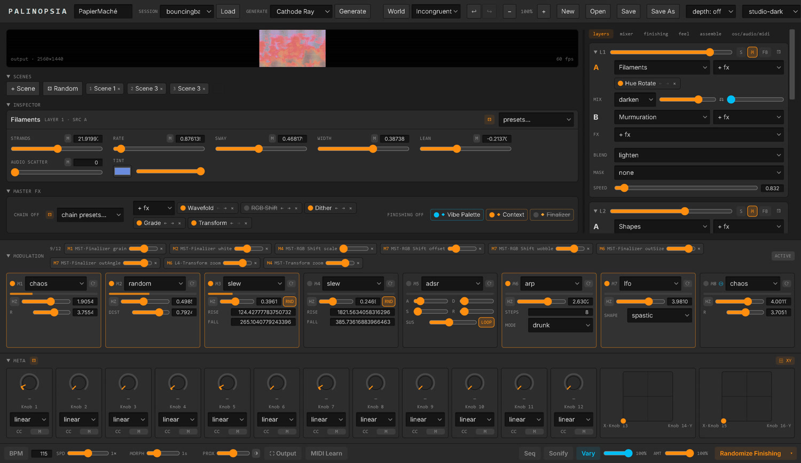

*The eight modulators (`D` toggles the row) over the sixteen Meta knobs and the
two XY pads. Each modulator card carries its type, clock, shape and live meter;
each knob its curve, MIDI CC and destination count.*

## Sequencer (key `Q`)

An auto-pilot over the scene bank. Each scene carries relation tags — **Diégèse**
(world) · **Synchrèse** (coupling) · **Espace-temps** · **Climat**. The sequencer
does weighted / arc / shuffle selection with a no-repeat window, morph/cut/auto
transitions, and subtle no-exact-repeat variation; overlays **Breathe**
(dense↔void) and a **Climate arc** (repose–disturbance–repose); adds **cadence /
rupture / monomedia** punctuation; supports audio/chaos-armed deferred advance; and
exports a Markdown **relation-score** (`⤓ score`). Needs ≥2 scenes to play.

Three **durational long-forms** run underneath the scene clock (minutes-scale):

| Long-form | What it does |
|---|---|
| **Burial → Exhumation** | Degrades the grade toward illegibility over a set length (a slow cosine 0→1→0), then recovers — the image is buried and exhumed once per cycle. |
| **Long-Take / Veil** | A slowness governor: **forbids** auto-cuts for the cycle and drives one slow veil (Context haze) across it — the sequencer holds a single take. |
| **Frame-Weave** | Rose Lowder's temporal interlace: instead of blending, show **one layer per frame**, stepping through a **paintable cell lattice** (each cell = a layer 1–4 or blank) at a set rate — persistence of vision fuses the layers into one woven image. |

The Sequence page has its own live monitor (resizable) and a resizable
inspector column.

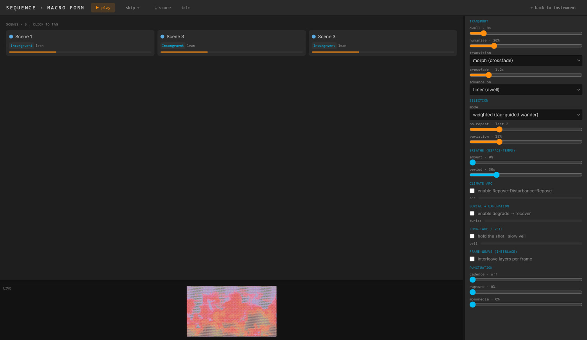

*Tagged scenes across the top, the live monitor at the bottom, and the transport
column on the right: dwell clock, transition style, selection strategy, the
Repose–Disturbance–Repose climate arc, and the punctuation toggles.*

## Worlds / diegesis (key `W`)

A global "proposed world" biases the whole composition — A/B coupling character,
Context mood, and audio routing (which feeds modulator slot 8). The editor holds a
world bank (built-ins + saved), coupling settings, Context mood sliders, an
audio-routing binding, and a live visualiser. Editing the active world updates the
composite live.

## Audio in

The **osc/audio/midi** right-column tab (key `A`) holds the control panels:

- **Audio** — enable the local analyser (input device picker), or receive
  features over OSC from an audio brain (`/opsia/audio/*`). The **coupling**
  master switch (pinned right) reveals each layer's CPL row. Live meters show
  level / flux / transient / centroid / bands.
- **OSC** — inbound listener (port, on/off, this machine's IPs), outbound
  feedback (host/port/interval), and the OSCQuery status.
- **MIDI** — controller input picker + the learned-bindings ledger
  (see [MIDI](#midi)).

Everything that "listens" to sound reads one shared **audio bus**: coupling,
Tonicity, the `audio` modulator, World routings, Proximity's `◑` follow, and the
Parametric generator.

## MIDI

Hardware control, Ableton-style. Press **MIDI Learn** in the bottom toolbar
(it turns blue) : every learnable control grows a **blue overlay**. Click one
(it pulses), then move a knob / hit a pad on your controller — bound (the
overlay turns **green**). The mode stays armed so you can map the next control
immediately; right-click a green overlay to clear its binding, press the
button again or `Esc` to exit. While learning, incoming MIDI never fires
anything — browse your controller safely.

Learnable targets:

- **Meta knobs** (all 16, CC only) — hardware drives them through the same
  per-knob smoothing as a mouse drag. These bindings live **in the session**
  (the per-knob **CC** button still works as a direct shortcut).
- **Transport** — BPM (CC → 40–240), SPD, MORPH, PROX (each mirrors its
  slider's curve).
- **Fires** (pad/note or button-CC, press edge only) — **Vary**, **Randomize**
  (the selected scope), **Sonify** on/off.
- **Scene chips** — a pad recalls that scene *slot* (like the `1`–`9` keys).

Everything except the Meta-knob CCs is machine-local (survives restarts,
doesn't travel with sessions). The **MIDI** section of the osc/audio/midi tab
(key `A`) has the **input dropdown** (all controllers, or just one — hot-plug
is handled) and the full bindings ledger with per-row clear.

## Output & mapping (key `O`)

A full-page takeover (the engine keeps rendering underneath):

- **Mapping** — a live keystone editor (drag four corner handles over a mirror of
  the output) + alignment grid + reset.
- **Resolution** — render-scale 0.1–2× of 1920×1080 (½ lo-fi / 1080p / 1440p / 4K;
  rebuilds the engine).
- **Fullscreen output** — pick a display; borderless-fullscreen or windowed. The
  output window runs its own compositor fed per-frame state — pixel-perfect, no
  transcode.
- **Record** — format select (MP4/H.264 default; ProRes / FFV1 / uncompressed via
  ffmpeg) + record / stop + screenshot → `Recorded/`. **The take keeps rolling
  when you leave the page** — a pulsing REC pill in the top bar shows the
  elapsed time and stops/saves it, so you can tweak parameters live mid-take.
- **Send** — NDI / Spout toggles (optional native senders; the frame readback is
  asynchronous — attaching a sink costs ~nothing); **HIVE** HEVC-over-TCP network
  output + port.
- **Flash safety** — a photosensitivity limiter on the very last stage of the
  chain: a GPU slew limiter caps how fast the frame's mean luminance may rise,
  taming strobes from any source (Superimposition, Triangle Flicker, feedback
  accidents) without touching a steady image. One slider from loose to tight;
  it ships **on** at a moderate setting and mirrors to the output window.
- A resource **HUD** (FPS · CPU · RAM · VRAM · GPU).

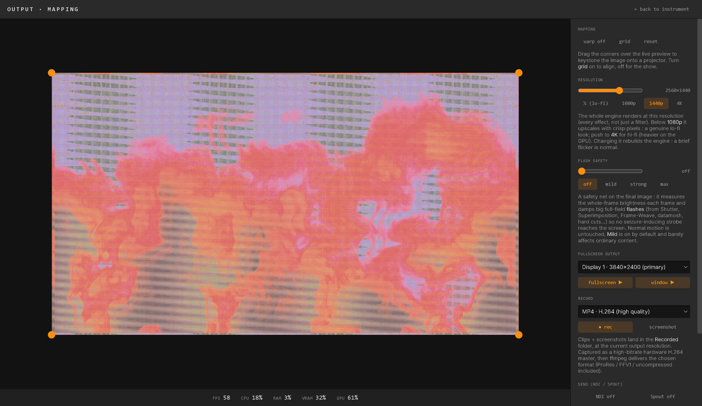

*The keystone editor with its four corner handles over a live mirror of the
output, and the right column holding resolution, flash safety, display + record
controls. The HUD runs along the bottom.*

**If the GPU driver resets** (a Windows TDR — heavy sessions across two displays
can provoke one), the picture no longer dies for good: both the main window and
the output window listen for WebGL context loss and rebuild their compositor when
the context comes back, with a forced rebuild after 6 s as a fallback. You lose
what was in the feedback and Context history buffers; you do not lose the session
or need to restart.

## Sonify — image to sound (key `S`)

The instrument's sound half : the image itself synthesizes audio, in real time,
inside the app (an AudioWorklet engine — no external software). A full-page
takeover: the live composite mirrored large with the **probes drawn on it** —
because the probe is the instrument — plus three voice strips and a master bus.

**The six voices** (each one lineage of the sonification literature):

| Voice | Mapping | Register |
|---|---|---|
| **Spectra** | The frame as a spectrogram : a column of 96 partials reads the image under a scan line — vertical position → pitch, brightness → loudness. The line **sweeps** (tempo-syncable, one sweep per bar) or **holds** (drag it). | ANS · Metasynth · vOICe — shimmering masses; the musical one |
| **Orbit** | The frame as a **waveform** : an orbit (circle or Lissajous) reads pixels at audio rate — the image *is* the oscillator, so the visuals mutate the timbre live. Drag the centre and radius on the mirror; pitch is a note or free Hz. | wave terrain · Oramics — alive, analog-adjacent |
| **Flow** | Whatever **moves** sings : each moving region fires a grain — position → pan, motion energy → loudness, height → pitch. Onsets are dithered across the frame interval so 30 Hz control never quantizes audibly. | Pelletier's flow fields — Gestalt grain clouds |
| **Raster** | Audification : a draggable **probe rect** read row-major as raw samples — the rect's contents *are* the waveform (edges buzz, gradients hum, datamosh blocks tick). One full scan = the period, so pitch is a note or free Hz; **smooth** 0 is the hard aliased register. | Ikeda · Yeo/Berger raster scanning — harsh, digital |
| **Transmission** | The SSTV register : the image scanned line-by-line as a **monophonic FM voice** (black 1500 Hz → white 2300 Hz) with the 1200 Hz **sync tick** as a metronome. Line rate free or synced (one line per 16th). The melody *is* the image rows. | slow-scan TV — narrative, decodable |
| **Filter** | Sonify **without synthesizing** : 48 band-pass filters whose gains come from the image column under the (sweepable) line — **noise** or **live line-in** played *through* the frame. Wide resonance = wind, narrow = flute; band centres can snap to the scale (a resonant harmonic wash). | Metasynth's Filter room · Pelletier's wind |

**Adaptive sources** : each voice listens to one of two **taps** — the
composited master output or any single layer's post-FX image — so different
voices can sonify different layers (a real ensemble). **Quantizer** : a global
key (root + scale : chromatic, major, minor, pentatonic, whole-tone, modes)
with a per-voice **♪ snap** — sonified data lands on real notes, or runs free.
**Master** : gain + an always-on peak limiter (the audio Flash-safety) + live
meter, and an **output-device picker**. While the engine runs, **recordings mix
the sound in** — exports become true audiovisual pieces.

**✨ Auto-voice** : one button reads the session's actual vocabulary — which
generators, nodes and FX are live on which layers — and picks the fitting
voices by register : glitch/datamosh → Raster, motion/video → Flow, feedback →
Orbit, line-work → Spectra, scan registers → Transmission, atmosphere → Filter.
The strongest voice taps the layer that earned it; your key, gains and probes
are kept. Deterministic — the same session always suggests the same setup.

**Fully integrated** : every probe and pitch (scan columns, orbit centre/radius/
pitch, the raster rect and its pitch) is a **modulation target** — bind M1–M8 or
a Meta knob via the M chips on the Sonify strips, and the mod-matrix stirs the
listening the same way it stirs the image (overlays show the modulated probes
live). The sound patch **travels with sessions and scenes** — recalling a scene
switches the sonification with it (the on-switch and output device stay
machine-local). And the whole page speaks **OSC** under `/opsia/sonify/…`
(on/master/root/scale + per-voice on·gain·pan·probes·pitches, all 0..1) —
advertised over OSCQuery and streamed outbound like everything else. Spectra
also gained **breath** : a per-partial sine↔noise morph (the Coagula blue) from
glassy additive to breathy bands.

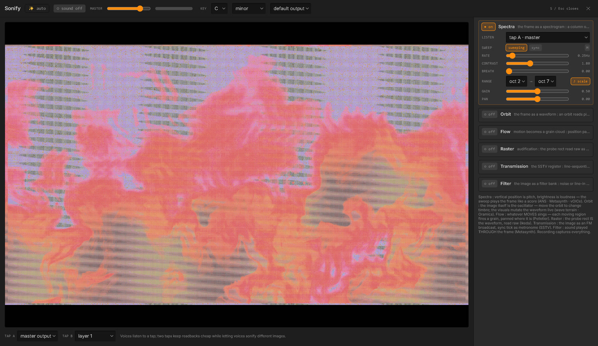

*The composite mirrored large with the probes drawn on it — the probe is the
instrument — and the voice strips on the right, each with its own tap, gain,
pitch and ♪ snap.*

## Assemble — the automatic editor (key `E`)

Concatenative synthesis for video : point the **assemble** tab at a folder of
films, and every file is segmented into shots and reduced to 18 visual
descriptors (brightness, motion, warmth, texture, drift…). The corpus becomes a
**point cloud where neighbours look alike**; an edit is a walk through it,
played live as a layer source — so it takes FX, blends and modulation like any
other picture.

- **Corpus** — `folder…` scans the folder's top level (`mp4 m4v mov webm mkv avi
  mpg mpeg mxf m2v dxv`). Codecs Chromium can't play (DXV, HAP, ProRes, DNxHD,
  MPEG-2) are converted **once** into the same cache your video imports use —
  first sweep of a heavy folder takes time, every later one is seconds.
- **Map** — the cloud, tinted by each shot's own colour. In *trajectory* mode,
  drag **A → B** and the edit travels that path.
- **Matching** — *free walk* (each clip chosen against the last), *trajectory*,
  or *follow the live output* (the edit chases what Opsia is showing, re-matching
  at every cut). The **similar ↔ contrast** dial asks for morphing joins or
  whiplash ones; **variety** loosens the choice; the weight sliders decide what
  "similar" means (set motion to full and colour to zero and it matches purely
  on movement).
- **Time** — output **length** + **loop**, then the pace machinery :
  **cut** sets the base cut length — `natural` keeps each shot's own duration;
  push right for a fixed pace (at **0.33s, a 10-second loop is ~30 cuts**; each
  cut then starts at a fresh moment inside its shot). The two **curves** (cut
  length · speed) shape how that pace and the playback rate evolve across the
  sequence — cross them for slow-motion stutter into accelerating cuts.
- **Generate** builds the edit onto the selected layer slot instantly; **Vary**
  re-rolls the same recipe; name + **save** keeps it in the bank; **export…**
  renders it to `Recorded/` via ffmpeg. Assemblages travel with sessions and
  scenes, and the Inspector shows a cut-timeline transport with `position` /
  `speed` as mod targets.

## Collage — a wall of films (key source `gen-collage`)

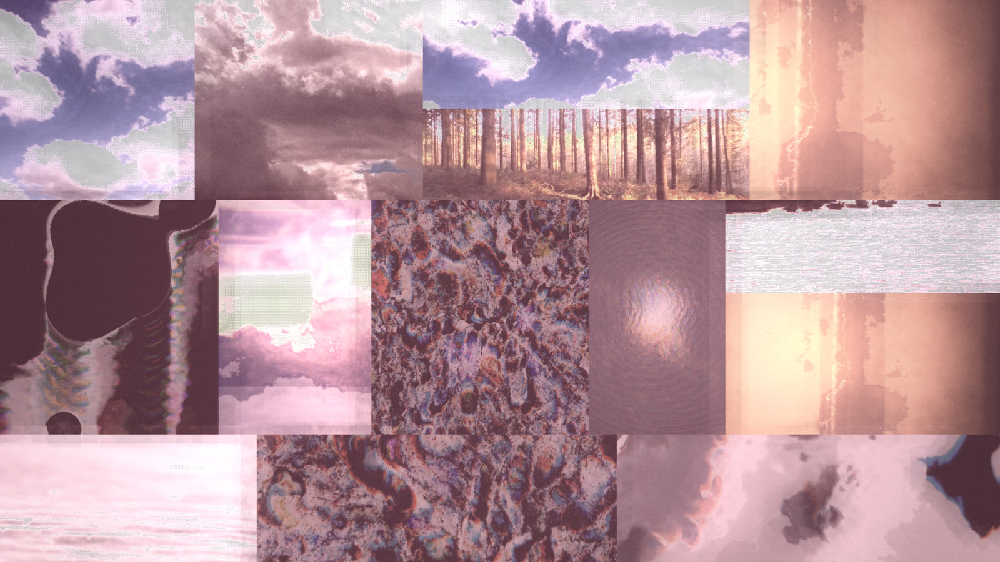

*Twelve different films at once, each cover-cropped into its own piece of the
Autocutter's partition — folder feed, no post work.*

Point the **Collage** source at a folder of videos and it plays every clip at
once, each inside its own piece of the **Autocutter's** cut-up partition — a
living mosaic where every fragment is a different film. Pick it as a layer source
(or the Background source), then open the folder from the Inspector.

- **Any format, any shape.** The folder scan takes the same codecs as Assemble
  and converts anything Chromium can't decode; portrait, landscape and 4K all
  **cover-crop** to their piece's shape, so nothing letterboxes or distorts.
- **Two feeds.** `folder` plays one film per piece; **`assemblages`** plays one
  of your saved Assemble edits per piece, each cutting on its own — selected from
  the Assemble bank in the same strip. The chosen edits copy onto the layer, so a
  session replays without the bank.
- **`films`** is how many decode at once (up to **50**); **more cuts than films**
  is fine — extra pieces show the same film at another crop and rotation.
  **`window`** loops a slice of each clip (0 = play the whole film, the smoothest
  setting); **`churn`** is how many pieces re-cut on their own fast clock, from
  all-holding to every-piece-its-own-montage.
- **`deal`** re-deals the wall by hand, **`rate`** on a clock, and a **`crossfade`**
  dissolves one deal into the next instead of snapping. contour · curve length · torn
  paper · mask · rotate are the **Autocutter's own dials**, working identically here;
  **`shape`** switches the pieces between the cut-up rectangles and a **Voronoi
  mosaic**, and a **contour mode** (normal / warped) chooses whether Contour frays
  **only the cut edges** (the film inside stays straight) or ripples the whole clip.
  Either way the film **adapts to its piece** — normal, warped and mosaic shapes all
  fill edge-to-edge with real video, no black in the cuts.
- **Optimise** (a button in the strip) re-encodes the whole folder to 720p
  all-intra H.264 — the shape the wall's constant seeking wants. Slow (minutes for
  a big folder) but one-time and cached; measured to hold 60 fps with 50 films.

## Sessions, scenes & themes

Sessions are `.opsia.json` files: **New / Open / Save / Save As** in the toolbar,
plus **Ctrl/Cmd+S** (overwrites the current file, Save-As the first time). A 60 s
autosave loop and a save-before-quit handshake protect live state. Theme, worlds,
scenes and the sequencer all travel inside the session file. Opening a session
also **pre-converts every video in its folder** in the background.

**Scenes** are full-instrument snapshots recalled by bare **`1`–`9`** or a
double-click in the bank; recall crossfades over the **MRPH** morph time. Scenes
carry their sequencer tags and are saved inside the session.

**Session Loader** (toolbar) — a dropdown of every saved session + a **Load**
button, so you can jump between saved sessions without the file dialog.

**Generate** (toolbar) — a dropdown of **76 visual themes** (grouped by family:
Analog Video Synthesis, Glitch/Datamosh, Cameraless/Direct Film, Optical/Op-Art,
Organic/Reaction-Diffusion, Data/Parametric, Feedback/Afterimage,
Cinematic/Atmospheric, Retro Screen, Minimal/Structural, Datamosh & Compression —
plus a **Test** family with one diagnostic theme per Feel macro) + a **Generate**
button. Each theme is
a *recipe* — a tight source/FX pool, a Vibe palette, a matching World (coupling +
audio routing), and Feel biases — so Generate builds a whole new, coherent,
on-theme session in place (unsaved; Ctrl+S keeps it). Pressing it again re-rolls
a fresh variation within the same theme.

## Metasurface — the continuous scene-space

The **surface** section (in the right column's Layers view, under the Background)
turns the discrete bank into a **continuous 2D plane** (Bencina, NIME 2005): every
scene is a point, and a cursor
**blends** between them, so you *navigate* the bank by dragging rather than stepping
scene-to-scene. Drag anywhere to move the cursor (it turns the surface on); drag a **dot**
to arrange which scenes sit near which; **arrange** re-spreads them evenly.

The blend passes **through** each scene (at a scene's own point the output *is* that
scene) and interpolates smoothly in between — a **local, natural-neighbour-style** weighting,
so only the handful of scenes around the cursor contribute (far scenes don't muddy the mix as
the bank grows). **Structure** — shader ids, counts, enums, modulator types — can't interpolate,
so it **snaps to the nearest scene**; only numeric params ease, and only across the scenes that
share that structure at each slot (a Datamosh's `refresh` means nothing to a Blur). A structure
change dissolves with a **speed-aware crossfade** (slow drag = long dissolve, fast = short), and
a **dead-band** around each boundary keeps the shaders from flip-flopping when you sit on a seam.
A faint **territory map** on the pad shows each scene's region (tinted by scene, soft at the
seams), and a readout names the two scenes you're between and by how much. Scene positions travel
in the session; the whole plane is playable over OSC — **`/opsia/surface x y`** is Pandore's
Trill Square.

**Draw sequencer.** Flip to **draw** and sketch a path across the plane, then **play** —
the cursor auto-traces the drawing so the output morphs through scene-space hands-free.
**time** sets how long one traversal takes (up to 60 s); **way** picks the direction (forward ·
backward · ⇄ ping-pong); **⟳ loop** closes the path end→start so forward play flows around
instead of teleporting; **jump %** randomly teleports the playhead to other spots on the path
(a stutter — 0 % is a clean trace, higher values fracture it); **wiggle %** adds a smooth
sinusoidal wobble around the traced position (a vibrato, distinct from jump). The drawn gesture
and its timing travel in the session. Drivable over OSC too: **`/opsia/surface/play`**,
**`/time`**, **`/jump`**, **`/way`**, **`/wiggle`**, **`/loop`**.

## Randomize & Vary

**Randomize** is structural: it doesn't just re-roll parameters, it rebuilds its
targets — picks generators per layer, builds FX racks of random length, enables
2–5 modulators and rolls a fresh mod-matrix. Every float draw comes from the
shader's **curated aesthetic sub-range**; colors stay matte.

Scopes (the `▾` next to the button): **All · Sources · Source Parameters ·
Source+FX · Source FX · Layers · Layer FX · Master FX · Finishing · Modulators ·
Meta Knobs · Sonification.** All except *Meta Knobs* and *Sonification* are also
OSC-fireable (see the [table below](#inbound-control--instrument)).

Built-in guarantees so a roll always *plays*:

- **Never black:** at least **two layers** come up active, and the stack's bottom
  visible layer is forced to a stack-safe blend (normal/add/screen/lighten) at
  solid opacity.
- **Never static:** after the matrix roll, every active layer that ended up
  untargeted receives one solid modulation assignment.
- **Never blinding:** Finishing randomize holds brightness-critical params
  (levels, gamma, gains, bloom, haze) in tight neutral bands; the Flash-safety
  limiter guards the output regardless.
- The Vibe Palette, Context, the Background, and World slot-8 routing survive
  every global roll.

The **intensity** slider (amt) turns a full re-roll into a *walk*: below 100%,
each unit keeps its structure with probability (1 − intensity) and is merely
jittered. **Vary** is the third mode: a baseline-anchored variant — structure
completely fixed, every continuous value nudged around the captured baseline.

## Undo

100 levels, gesture-grouped (a slider drag is one step). The history snapshots
the **whole session surface** — composition, scene bank, sequence, worlds, and
session name — so an accidental **New** or **Generate** really is one `Ctrl+Z`
away, scenes and all. The auto-sequencer's own advances are excluded so they
don't flood your history.

---

## Sources (33 generators)

33 sources produce an image from nothing. Any generator can fill **Source A or B**
of any layer (and all but a few can be the Background source). Each ships curated
Randomize sub-ranges and its own preset bank.

<details>
<summary><b>The full generator catalogue</b> (click to expand)</summary>

| Source | Description |
|---|---|
| **Drift Field** | Slow directional noise flow posterized into matte bands over near-black, with an accent tint and a restrained edge chroma-split. |
| **Slabs** | Sparse horizontal slabs on a stepped clock with slice-jitter and a rare accent cell — the slice/shuffle glitch register, built to be blended. |
| **Contour** | Slow marching contour lines over a drifting, domain-warped noise basin — topographic matte line-work. |
| **Grid Drift** | A flat grid whose rows and columns breathe out of alignment, occasionally slipping whole lanes, with sparse filled cells. |
| **Ten Print** | The Commodore one-liner maze — every cell one diagonal, / or \, dealt by a seeded coin-flip. **Reseed ▸** re-deals the lattice on a trigger; audio scatter shivers the maze apart segment by segment. |
| **Particle Drift** | Sparse points carried through a flow direction with capsule trails, wandering inside their cells. |
| **Interference** | Two near-frequency line fields beating into moiré, handled as matte texture (never op-art); the beat crawls at the detune rate. |
| **Column Scan** | Horizontal scan lines vertically displaced by a drifting internal signal; brightness follows the slope. |
| **Ash** | Sparse particulate falling at per-column rates with lateral wander and flicker — near-black particulate weather. |
| **Murmuration** | A flock of points steered by one shared, slowly-turning wind field — coherent density waves pass through the crowd. |
| **Filaments** | Vertical strands swaying like kelp, each with its own rate and phase; drift leans the whole bed. |
| **Erosion** | Anisotropic ridged noise advected downward, carving streaks that gather and split — the geological register. |
| **Membrane** | One large soft mass slowly deforming in the dark — a breathing thresholded silhouette shaded by depth. |
| **Mycelium** | A thin branching network revealed by a growth front expanding from an off-centre seed, then dissolving and regrowing. |
| **Swell** | An open water surface as pure luminance — several wave trains beating plus chop, no horizon. |
| **Congeal** | A self-referential feedback field: sparse seeds injected, then a domain-warped, decayed copy resampled each frame — material congeals and dissolves. |
| **Slit Scan** | A slit-scan of an internal oscillator — each column is the signal frozen at an earlier moment (time = position), a scrolling time-history. |
| **Ramps** | Clean voltage-style gradient signals (H / V / diagonal / radial / diamond), optionally stepped and drifting — raw material to colorize or key. |
| **RGB Oscillators** | Each channel its own 2D oscillator (waveform × frequency × phase), detuned so colour separates into drifting interference — the analog-video register, kept matte. |
| **Recurse** | Recursive geometry — a shape redrawn into a space shrunk, slightly rotated and shifted off-centre, cascading inward (a spiral, deliberately not a radial kaleidoscope). |
| **Shapes** | Hard-edged primitive fields (circle / ring / bar / cross / triangle), tiled and animatable — a matte source, or a stencil keyed through the A/B mixer. |
| **Op-Art** | Hard-edged optical-illusion fields (waves, grids, moiré, herringbone) with illusory motion — curated and minimal, at home under anaglyph 3D. |
| **Direct Marks** | Hand-drawn direct-film marks — ruled lines, dots or scratches in flat ink, appearing on a gate you can drive from audio (marks on the beat). |
| **Dye Field** | Subtractive pigment pooling over a near-black emulsion, disciplined toward decay and crystallisation — painted-on-film dye, never additive glow. |
| **Reaction** | A Gray-Scott reaction-diffusion field self-organising into drifting spots, stripes, labyrinths and splitting critters, with its own zoom/pan/rotate framing. |
| **Metamorph** | Birth-from-within (Blu's *Muto* register): a solid organic silhouette lives on screen; each cycle a new form is born from a point inside the old one, grows, and replaces it — endless metamorphosis, matte white-on-black. |
| **Sync Osc** | A morphing video-synth oscillator — one waveform morphing saw → triangle → sine, with a sync control from scrolling → frozen; colorized between two tints. |
| **Differential** | Visual polyrhythm — several wave trains at integer speed ratios beating against each other, rendered as pulsing topographic contour bands. |
| **Solid Color** | A flat colour fill or a smooth 3-stop linear gradient at any angle — the quietest source, to key / tint / grade against. |
| **Organic** | Living elemental textures in motion — fire (upward flames), water (caustic depth), or nature (growing canopy); `vary` shifts each toward an alternate season. |
| **Text** *(native)* | Typography as a source — type in the Inspector; choose font / size / weight / spacing / position; a sidechain layer can fill the glyphs. |
| **Parametric** *(native)* | A literal audio → image reading — the audio bus as a hard raster, waveform trace, spectrum bars, or scrolling spectrogram (needs Audio ingest for real sound). |
| **Collage** *(native)* | A wall of films cut up by the Autocutter partition — a folder of clips, or your saved Assemble edits, one per piece (see [Collage](#collage--a-wall-of-films-key-source-gen-collage)). |

</details>

Two gestures mined from the EYESY lineage run through the field generators:

- **Reseed ▸** (Ten Print · Slabs · Grid Drift · Shapes) — an event input that
  re-deals the generator's whole stochastic layout in one cut. Fire it from the
  Inspector, over OSC, or bind **M** to an audio modulator for the
  re-deal-on-the-beat gesture. A shader-side latch fires exactly once per
  rising edge, whatever drives it.
- **Audio scatter** (Ten Print · Slabs · Grid Drift · Shapes · Filaments · Ash)
  — each element (band, lane, cell, strand, column) rides its **own** live
  audio sample from a shared 128-sample waveform texture, so fields ripple
  element-by-element instead of pulsing globally. Silent input = perfectly
  still. Mirrors to the output window.

> Beyond generators, a source slot can also hold an **imported video** (see
> [Video sources](#video-sources)), a **live capture** (webcam / screen / device),
> or a **HIVE** HEVC-over-TCP network stream — each treatable through the slot's
> own Source-FX rack.

---

## Effects

### Where FX live

There are **five effect racks**: **Source-A FX** and **Source-B FX** (one under each
source slot), **Layer FX**, **Master FX**, and **Background FX**.

- **Any standard ISF effect below can be placed in any of the five racks** —
  placement is not restricted by effect. The picker (grouped by sub-category) is the
  same everywhere. Each unit has enable, dry/wet **opacity** (double-click → 1),
  drag-reorder, presets, a dice `⚄`, and a **reset `↺`** (the whole effect back to
  its defaults).
- **Right-click any effect** (its chip, or its name in the Inspector) to **copy**
  it — then **paste its settings** onto another unit of the same shader, or **paste
  it as a new effect** into any rack that can host it (the menu says where a shader
  can and can't go) — plus **Assign and randomize modulation**, which seeds random
  modulation (a modulator source + a **Mul** depth) across a spread of the effect's
  parameters, and **Randomize modulation** (shown once the effect carries modulation)
  which re-rolls the source + depth of what's already bound. Sources are drawn from
  the modulators you have **enabled**. Right-clicking a **source's** name in the
  Inspector header offers the same **Randomize modulation** when it carries any.
- **Every picker is searchable.** Click the `+ fx` box, a source picker, a preset
  list or the Generate menu and type — the list filters by name *and* family, so
  "glitch" surfaces the whole Glitch group and "atct" still finds Autocutter.
- **Every effect, source and modulator names itself on hover** — a plain-English
  sentence or two on the item's name in the Inspector, saying what it does.
- **Native nodes**: the two **sidechain** nodes (Transfert, Convolution) are
  **Layer-FX only** — they read another layer as their input. The self-contained
  nodes run in any rack; Parallax runs in a layer or the Master rack (it needs the
  whole-picture depth map).
- **The three master finalizers** (Vibe · Context · Finalizer) are **pinned, locked,
  and always last in the Master rack, in that order.** They can't be added, removed,
  reordered, or duplicated — only bypassed.

An effect's position in a rack matters: effects apply top-to-bottom. Source FX treat
one slot before the A/B mix; Layer FX treat the mixed layer before its blend; Master
FX treat the whole composite before the finalizers.

### The catalogue (52 effects)

<details>
<summary><b>The full effect catalogue</b> (click to expand)</summary>

| Effect | Description |
|---|---|
| **Posterize** | Quantize tones into matte, gamma-aware bands. |
| **Dither** | 4×4 Bayer ordered dithering at a chosen dot scale, quantizing into few levels — matte texture, not noise. |
| **Chroma Shift** | Restrained RGB split along a chosen axis — subtle chromatic aberration. |
| **Pixelate** | Aspect-correct mosaic quantization of the sampling grid. |
| **Displace** | Drifting value-noise domain warp of the sampling coordinates — asymmetric, never radial. |
| **Scanlines** | Line darkening as controlled texture, with an optional slow roll — darkening only, no glow. |
| **Edge** | Sobel luminance contours, mixable over the source — matte line-work. |
| **Grade** | Brightness / contrast / saturation / lift — the master-rack workhorse. |
| **Slice Shuffle** | Horizontal band displacement on a stepped clock — cuts, not flow. |
| **Smear** | Pseudo pixel-sort — bright pixels streak along a direction with decaying taps, gated to highlights. |
| **Palette** | Re-color by mapping luminance through a 2–5 stop gradient, with band/blend morph and dither — duotones to full palettes. |
| **Threshold** | Luma key to hard two-tone with a soft knee and optional invert — carve shapes. |
| **Solarize** | Invert everything whose luminance clears a level, with a soft knee (Sabattier). |
| **Mosh Blocks** | Macroblock corruption on a stepped clock — displaced, sometimes channel-swapped blocks (datamosh register). |
| **Grain** | Physically-modelled noise per medium — film (clumped, midtone-peaked), digital sensor (shot / read / fixed-pattern), CRT (snow / dropout), VHS (smear / chroma error). |
| **Streak** | Uniform 16-tap directional blur — camera-drag motion smear (not luma-gated). |
| **Sharpen** | 3×3 unsharp mask — makes dithers bite and posterized bands snap. |
| **Fold** | A single-axis mirror at a movable seam with a slide offset — one deliberate fold, kept asymmetric. |
| **Transform** | Zoom / pan / rotate the sampling frame (wrap or clamp), with **edge crop** (independent up / down / left / right insets); with Shape set, clips the layer into a geometric silhouette. |
| **Stutter** | Probabilistic frame holds — horizontal bands freeze independently on their own irregular clocks, with optional blackout. |
| **Sync Loss** | Vertical hold rolling away plus horizontal tear bands on a stepped clock — the broken-monitor register. |
| **Row Echo** | Chance-selected row bands freeze onto their top line and repeat downward — a line-hold smear. |
| **Byte Corrupt** | Bit-depth crush plus per-block arithmetic scrambling that folds channels into each other — data damage, with a warped block grid. |
| **Ringing** | Alternating-sign high-pass edge echoes repeating at a fixed distance — compression ghosting / over-sharpened broadcast. |
| **Tracking** | VHS tracking error — a noisy head-switch band placed by position and crept by roll, a wandering freeze line, analog x-distortion and tinted chroma bleed. |
| **Motif** | Spatial counterpoint — re-instantiates the image's gesture elsewhere, transposed (translated / rotated / scaled / mirrored) as directional echoes, never radial. |
| **Feedback Zoom** | The image feeds back through a zoom and twist, echoes marching inward / outward — mix-decay so trails converge instead of blooming. |
| **Force Lines** | Incrustation along the image's own lines of force — luminance-contour bands slide along the local gradient's tangent (alternating directions), the image cut and inlaid along its own structure. |
| **Aperture** | A projector's gate over the image — iris, slit, or film-gate rectangle — with a real gate's couplings: **flicker** re-rolls the opening on a drawn cadence, **defocus** softens the image as the aperture closes. |
| **Distort** | Ten warp modes on one control set — wave, ripple, bulge, pinch, swirl, shear, glass, corrugate, pull, turbulent. |
| **Slit Buffer** | A write head sweeps across the frame, freezing the live image into a buffer as it passes — a real slit-scan (normal / inverted / pendulum). |
| **Difference Bloom** | Frame-difference motion key — only what moved survives, spread softly; still areas fall to near-black. |
| **Triangle Flicker** | Triangle-wave rhythmic brightness flicker with an optional hard strobe and beat channel-shuffle — clock it to tempo. |
| **Colorizer** | Analog CV colorizer — luminance through gain + bias, soft-clipped, then a smooth 3-colour gradient (a scan-processor colouring stage). |
| **Wavefold** | Analog wavefolder on the video signal — drive the value and repeatedly reflect it inside [0,1], carving hard contour bands. |
| **Rutt** | Rutt/Etra-style scan processor — horizontal scan lines displaced vertically by the image's own luminance (a wireframe topography). |
| **CRT Screen** | A whole-tube finish — barrel curvature, edge chromatic aberration, scanline grille, corner vignette, rounded bezel. |
| **NTSC** | Composite-video crosstalk — YIQ encode/decode with **dot-crawl** artifacts, a **carrier** beat, chroma **fringing**, and **interlace field modulation** (even/odd fields pulled apart in hue and warp); the analog-broadcast register, cheap enough to run per-pixel at 60 fps. |
| **Pixelmask** | Stencil the image through a pattern (aperture grille / shadow mask / dot / line / bayer / noise); an RGB-triad option gives real phosphor stripes. |
| **Light Trails** | max()-blend trails — the brightest pixels persist and streak (long-exposure light-painting); optional drift. |
| **Decay** | Analogue generation loss — chroma bleed, block crush, head-switch jitter, a bounded feedback ghost, tape noise and dropout lines; only ever degrades. |
| **Abstraction** | One knob from representation to abstraction — luma-driven displacement + posterize + desaturation; a source dissolving into moving matter. |
| **Wide Time** | A temporal average across the last N frames — the image crossfades with its own recent past into evolving scapes (mean / brightest / add / screen / difference / darkest). Because those modes brighten or darken by construction, a **preserve** dial re-anchors the output's exposure to the live image (0 = the raw accumulated look, 1 = fully re-anchored) so you can keep the base colours readable without pre-compensating with contrast. |
| **Hue Rotate** | Rotate the image's hue, optionally weighted by luminance — the missing colour primitive, beautiful under a slow LFO. |
| **RGB Shift** | The three channels pulled apart geometrically (offset + independently scaled about centre) with an animated wobble — the channel-separation look. |
| **Granular** | Video granular synthesis — the frame shattered into a grid of windowed grains, each rotated / scattered / scaled, with a persistent buffer for temporal smear. |
| **Mosaic** | An analysis/resynthesis grid — each cell its average colour, redrawn as a tile whose size follows its luminance (bright swells, dark shrinks to nothing). |
| **Optical Rain** | Shatters the image's edges into downward-drifting vertical streaks, each carrying a red/cyan disparity — a floating tactile texture under anaglyph 3D. |
| **Phosphene** | The retinal afterimage that names the instrument — a bright stimulus burns a lingering complementary-colour negative ghost that slowly decays. |
| **Compress** | Real intra-frame compression artefacts (the JPEG/MPEG keyframe look): macroblocks crushed toward DC + coarse low-frequency reconstruction, chroma subsampled so colour bleeds across luma edges. |
| **Databend** | The byte-editing register (the stream, not the motion): bands tear and jump on a stepped clock, some hold-and-repeat their top line, channels rotate out of registration. |
| **Pixel Sort** | The signature glitch pixel-sort — contiguous runs inside a threshold band pulled toward their brightest value along an axis, streaks stopping dead at the band edges. |

</details>

### Native nodes

These run a TypeScript class behind a header-only ISF (so the auto-UI, presets and
modulation still work). They keep **inter-frame state** — flow fields, frame rings,
accumulators. The two **sidechain** nodes (Transfert, Convolution) read another layer,
so they are **Layer-FX only** and get a layer picker in the Inspector; the
**self-contained** nodes run in any rack (Faultline is happiest on the Master, where
the whole programme glitches at once).

<details>
<summary><b>The full node catalogue (19)</b> (click to expand)</summary>

| Node | Description |
|---|---|
| **Transfert** | Imprint another layer's **motion** onto this one (optical-flow transfer) — *Déplacement* warps by the sidechain's flow, *Traînée* is a flow-steered line blur. |
| **Convolution** | Treat another layer as a convolution **kernel** — every bright pixel of this layer stamps a scaled copy of the sidechain's shape, transferring its glare / texture / energy. |
| **Réponse** | Temporal convolution — the layer's last 16 frames summed through a shaped attack/decay envelope (reversible): a convolution-reverb for image. |
| **Feedback** | A full video-feedback engine (LZX-Memory-Palace-class) — the last frame re-sampled through a drifting off-centre transform + self-displacement, held at the edge of chaos by AGC + a noise floor. **Couple** runs a second buffer under a diverged transform and cross-mixes it (emergent behaviour no single loop shows); a delay-tap ring with **RGB delay** (channels sheared in time) and an echo **route** (back into the loop, or feedforward onto the output only); blend modes. A **keyer** gates what re-enters — on **luma** (key black / white) or **chroma** (key desaturated / colourful) — so only the keyed region trails; a **placement** switch puts the spatial process on the recirculating buffer (*feedback* : a wandering tunnel) or on the incoming live image (*painting* : the source smeared into a still accumulator that holds its shape); and a per-repeat **hue cycle** and **sat drift** bleach the trails toward grey or intensify them toward neon as they age. |
| **Datamosh** | The codec-mosh look, real-time and codec-free: optical flow quantised to macroblocks advects a feedback buffer (the P-frame smear). Refresh (the I-frame) down + a scene cut = the bloom; **sticky/melt/fluid** modes; **actants** — sparse autonomous frozen patches that drift along the flow; **manifest** reveals a new source only where there's motion; auto-bloom on detected cuts; motion-transfer from a sidechain; **flow-shaping** — a **mosh gate** restricts the smear to moving or to still regions, **edge-repel** pushes the flow off the image's own contours, and **re-sharpen** claws back the mush. |
| **Scanner** | A flatbed-scanner slit-scan — a head sweeps the frame, capturing each line at a different instant; anything moving mid-sweep smears and tears across the scanlines. |
| **Autocutter** | A cut-up collage — the frame recursively split into pieces, shuffled among their slots (and optionally rotated); the layout holds while live video keeps playing inside every piece, and re-cuts on `cut ▸` or an auto **rate**. Four dials shape the cut itself: **contour** bends the straight seams into uneven curves that still tessellate perfectly (past 1 it shreds), **curve length** trades many small wiggles for a few long, simple curves, **torn paper** grows a ragged off-white fringe and collage shadow along each edge for the ripped-magazine look, and **mask** peels pieces away into transparent holes — at full mask a single piece survives, and each new cut elects a different one. **Shape** switches between the rectangles and an irregular **Voronoi mosaic** (denser, more organic — every dial behaves the same in both). Set an **auto rate** and a **crossfade** to dissolve one cut layout into the next instead of snapping. Ships 9 presets from *Clean cut-up* to *Last piece*. |
| **Chronoscan** | Per-pixel time displacement over a ~32-frame ring — a control field (slit-scan gradient, luminance, noise…) sets how far into the past each pixel reads, so each region lives in a different present. |
| **Sediment** | Long-term image memory — a decaying long-exposure accumulator (seconds to **minutes**) plus a sparse keyframe store, so the deep past stays recallable and resurfaces through the present. |
| **Parallax** | Real 2.5D from the shared depth map — near features sway more than far ones, with depth-of-field around a focus plane and aerial fog (needs the Depth engine set in the header). |
| **Eternalism** | Persistence-of-vision as a signal path (Ken Jacobs): two temporal taps a gap apart alternate across a black shutter interval at a drawn rate — an unfrozen slice of time, held micro-motion going nowhere. |
| **Afterimage** | Goethe's complement — where a bright form **departs**, its negative/complementary ghost blooms back and decays; chroma sweeps the ghost from dark subtraction to full complement. |
| **Pulfrich** | Monocular 3D from a temporal eye-delay — one eye reads a delayed image (per-pixel, keyed by depth or luminance) so lateral motion becomes stereo depth; the disparity is temporal, not spatial. |
| **Corrode** | Durational corrosion that only ever grows — a blotch field seeds and creeps as the integrated bury level rises, eating the picture over minutes; it never recovers until you **exhume** (reset). |
| **Decimate** | Time-lapse / sample-and-hold — grabs a frame only every so often and holds between grabs; smooth crossfades the last two grabs from hard snap to continuous slow-tween. |
| **Melt** | A seam-local dissolve that **creeps** — reads the picture's own light/dark edges and, inside a band along each, dissolves the node's **own previous frame** back one-sided along the edge normal, so the boundaries between forms soften and slowly walk outward. Edge-driven, not motion-driven, so it keeps melting a still picture; **creep** direction/speed, band **width**, and an edge **gate**. |
| **Faultline** | A dirty vision-mixer — a **rate** clock and a **dirt** probability fire momentary **structural faults** at the output and the picture is completely clean between them (the SLIP skip-law moved to the blend stage). Each fire is one discrete fault : **dropout** (the signal loses lock and cuts out in sweeping streaks), **cut** (a hard cut to the frame frozen at the fire instant), **timebase** (a head-switch knock — scanline-block shear + field roll + a torn switch band), **noise** (a sweeping switching-static band), or **roulette** (a fresh pick each fire). **Depth** severity, **hold** length, **fire ▸** by hand / OSC / a modulator. Best on the Master rack. |
| **Sillage** | Advected-noise feedback (IBFV, van Wijk 2002) — a dye buffer is dragged each frame along a **flow field** and topped up with fresh filtered noise, so the noise smears into flow-aligned filaments (a line-integral / LIC look) and **decays into structure** instead of glowing : a wake of dye trailing the motion, reading as material, not neon. The field is a divergence-free **curl-noise** base (**field** — always flowing, so even a still image streams) plus the image's own **optical flow** (**motion** — its movement advects the dye); steer the wake anywhere with **wind** (a drift of strength *push* in any *angle*) and **swirl** (a spiral about the centre). **dye** tints the wake by the picture so it reads as its own substance, **flow** the streak length, **injection** the decay rate, **grain** the noise frequency. |
| **Toile** | Reworks the picture as a **painting that follows its own structure** — a structure tensor finds each contour's orientation, and the image is smoothed into strokes running **along** it (anisotropic Kuwahara), so forms flatten into coherent paint (steady frame-to-frame, not speckling) while the **edges are preserved**, not washed out. **line** adds flow-XDoG ink : clean outlines measured across each contour and smoothed along it, following the image's own structure. **brush** size, **flatten** hardness, **paint** amount, **line edge** threshold. The real *Peint* + *Griffé* as a rack effect. |

</details>

### Master finalizers — pinned, always last

| Stage | Description |
|---|---|
| **Vibe Palette** | The always-on colour-**mastering** stage: an **opacity** dry/wet on top, auto-levels (temporally smoothed min/max), gamma tone placement, palette map, source mix-back, contrast, saturation, and split-tone. Decides the whole output's look; survives every global Randomize. Ships 56 palettes. |
| **Context** | The always-on **depth** finalizer: temporal trails, a soft key light with volumetric bloom, atmospheric haze, spatial blur, a depth vignette, a **void / edge-dissolve** (the frame's edges eaten toward black), and PBR texture mapping (project the composition onto a material). Every parameter at zero is a clean passthrough. |
| **Finalizer** | The last always-on stage: a final grade (input black/white + gamma + per-channel R/G/B gain), sharpen, and physically-modelled grain over everything, plus an **output shaper** (clip the frame to any of ~21 silhouettes with a drop-shadow, filled by a colour or the Background), the **anaglyph 3D stage** (`stereo`: off / red-cyan / grayscale, with depth, convergence and invert — this is where the shaders described as "at home under anaglyph" get their glasses), and the **Cameraless film hold**. Neutral at defaults. |

`toggleFinishing` bypasses/enables the three as one bank; they are excluded from
Randomize (only their own dice re-rolls their params, holding brightness-critical
bands neutral). After the finalizers, the **Flash-safety limiter** has the true
last word on the frame.

### Blend modes

18 modes, shared by the layer→stack blend and (via `sourceBlend`) the A/B mix,
in index order (for OSC): `normal, add, subtract, multiply, screen, overlay,
softlight, hardlight, darken, lighten, difference, exclusion, dodge, burn, wrap,
weave, lumakey, consume`.

The last three are **relation modes**, at their best on the A/B mix:

- **weave** — interleaves A and B in alternating bands;
- **lumakey** — B keys into A by luminance;
- **consume** — a *stateful competition field*: A and B fight for territory
  frame-by-frame (a reagent surface remembers who held each pixel), so the mix
  boils and creeps instead of crossfading.

---

## OSC implementation

All addresses live under `/opsia`; anything else is ignored. **Every continuous
control takes a normalized `0..1` float** scaled to the target's declared range.
Enums accept a name (`s`), an int index (`i`), or a `0..1` float across members.
Bools/toggles are true at `≥ 0.5`. Triggers fire on the **rising edge**. **BPM is
the only raw value.** All indices in addresses are **1-based**.

### Inbound (control → instrument)

**Layers** — `/opsia/layer{1..4}/…` (canonical; the segmented form
`/opsia/layer/{1..4}/…` is also accepted).

| Address | Type | Meaning |
|---|---|---|
| `…/opacity` | f | Layer opacity (0..1) |
| `…/speed` | f | Layer speed (0..1 → 0..20×) |
| `…/mix` | f | A/B source mix |
| `…/trail` | f | Feedback trail amount |
| `…/blend` | i / f / s | Layer blend mode (index, 0..1 across 18, or name) |
| `…/sourceblend` | i / f / s | A/B blend mode |
| `…/mute` · `…/solo` · `…/feedback` | bool | Toggles (≥ 0.5) |
| `…/source/{A\|B}` | s | Set source shader (id / name / `none`) |
| `…/source/{A\|B}/{input}` | f · color · point2D | A source shader input |
| `…/source/{A\|B}/fx/{i}/{input}` | f · color · point2D | A Source-FX unit input |
| `…/fx/{i}/{input}` | f · color · point2D | A Layer-FX unit input |
| `…/coupling/mode` | i / f / s | `off·lean·hocket·cut·gate·drift` |
| `…/coupling/amount` · `…/tightness` | f | Coupling depth / tightness |
| `…/coupling/feature` | i / f / s | `level·flux·transient·centroid·band·pitch` |

**Video transport** — `/opsia/layer{n}/video[/{A|B}]/…`. Without an explicit
slot, the message lands on the layer's first video slot (A, then B). Ignored
unless the slot actually holds a video.

| Address | Type | Meaning |
|---|---|---|
| `…/video/play` · `…/loop` · `…/grain` | bool | Play/pause · loop · granulation on (≥ 0.5) |
| `…/video/direction` | i / f / s | `forward·reverse·pendulum` |
| `…/video/speed` | f | Clip speed, 0..1 log across 1/28×..128× |
| `…/video/position` | f | **One-shot seek** to 0..1 within the in/out trim |
| `…/video/in` · `…/video/out` | f | Trim points (0..1; kept ordered) |
| `…/video/grainsize` | f | Grain length (0..1 → 0.05..1 s) |
| `…/video/grainspray` · `…/grainrev` · `…/grainjit` | f | Scatter · reverse probability · speed jitter |
| `…/video/grainsync` | i / f / s | `free·1/16·1/8·1/4·1/2` (BPM grain clock) |

**Master** — `/opsia/master/…`

| Address | Meaning |
|---|---|
| `master/fx/{i}/{input}` | Master-FX unit input (the locked finalizers are excluded here) |
| `master/vibe/{input}` · `master/context/{input}` · `master/finalizer/{input}` | The three locked finalizers' inputs |

**Background** — `/opsia/bg/…`

| Address | Meaning |
|---|---|
| `bg/opacity` · `bg/speed` · `bg/depth` | f (0..1) |
| `bg/blend` | bool → `isolate` (≥ 0.5) else `blend` |
| `bg/source` · `bg/source/{input}` · `bg/fx/{i}/{input}` | Background source / its inputs / FX inputs |

**Feel macros & temperament** — each a single `0..1` float:
`/opsia/density`, `/gesture`, `/coalesce`, `/proximity` (field macros; 0.5 = centre)
· `/opsia/flow` (0.5 = centre) · `/tonicity`, `/shutter`, `/drift`,
`/superflicker` (temperament; 0 = off).

**Meta / transport / structure**

| Address | Type | Meaning |
|---|---|---|
| `/opsia/meta/{1..16}` | f | Drives meta knob *n* (smoothed) |
| `/opsia/bpm` | f | Tempo — **raw**, clamped 20..800 |
| `/opsia/world` | s / i | Select World (name, or 1-based index) |
| `/opsia/seq/run` | level | Run (≥ 0.5) / stop the sequencer |
| `/opsia/seq/skip` | trigger | Advance to next scene |
| `/opsia/scene/{n}` | trigger | Recall scene *n* (1-based) |
| `/opsia/randomize[/{scope}]` | trigger | Fire Randomize (scope defaults to `all`; `sources`, `sourceparams`, `sourcefx`, `sourcefxonly`, `layer`, `layerfxonly`, `master`, `finishing`, `modulators`) |
| `/opsia/panic` | trigger | **Panic flush** — drop every self-feeding buffer (same as key `0` / the ⚡ Flush button); advertised over OSCQuery |
| `/opsia/surface` | f f | **Metasurface** cursor — two `0..1` floats (x, y) on the scene plane; sending it turns the surface on (Pandore's Trill Square) |
| `/opsia/surface/active` | bool | Enable / disable the Metasurface |
| `/opsia/surface/play` | bool | **Draw sequencer** — auto-trace the drawn path |
| `/opsia/surface/time` | f | Draw-path loop time (seconds, or ms if > 120) |
| `/opsia/surface/jump` | f | Draw-path jump jitter (`0..1` → 0–100 %) |
| `/opsia/surface/way` | f | Draw-path direction: `0` fwd · `1` back · `2` ping-pong |
| `/opsia/surface/wiggle` | f | Draw-path smooth wobble (`0..1` → 0–100 %) |
| `/opsia/surface/loop` | bool | Close the draw path into a loop |

**Audio sensors** (pushed by the "audio brain"; bypass the store, feed the audio bus
directly): `/opsia/audio/{level|flux|transient|centroid|pitch}` and
`/opsia/audio/band/{1..6}` — all `f`, `0..1`.

Type resolution: `float` → `min + v·(max−min)`; enum → nearest member;
`bool`/`event` → `v ≥ 0.5`; `color` → 3–4 raw `0..1` args (or one → grayscale);
`point2D` → 2 per-axis args.

> For continuous playhead motion, prefer binding a modulator to the transport's
> `M` targets (an LFO loops, S&H jump-cuts, audio scrubs); `…/video/position`
> over OSC is a **one-shot seek** per message. A seek also mirrors to the
> output window's own decoders.

### Outbound (instrument → control, "feedback")

When enabled, the instrument diffs its streamable parameters and pushes the changed
ones to a peer (e.g. Pandore's UI mirrors yours). Same `/opsia/…` addresses
(layers in the canonical `layer{n}` form), same `0..1` convention; **every
outbound value is a single float `f`** (enums/bools normalized). Streamed: every
layer control, meta knobs, BPM (raw), the three master finalizers' float inputs,
background controls + source inputs, all macros/temperament, world (1-based
index), and `seq/run` — plus, while a slot holds a video, its transport
(`video/{A|B}/play·direction·loop·speed·in·out·grain·grain*`). **Not** streamed:
`/opsia/audio/*`, `/opsia/seq/skip`, and `video/…/position` (the playhead flies
at frame rate; it's advertised for discovery but never echoed).

Behaviour: a diff loop on a `max(40, interval)` ms timer; a leaf is sent only when it
moves by ≥ `0.0015`; a first-pass burst cap (~97 leaves/tick) spreads the initial
sync over subsequent ticks; a full resend on (re)start.

### OSCQuery

An HTTP server on **OSC port + 1** (loopback only) serves a self-describing address
tree so Pandore / dataFLOU auto-bind every parameter. `?HOST_INFO` reports the OSC
port, UDP transport, and a WebSocket value-stream on the same HTTP port
(`LISTEN` / `IGNORE` per path; pushes `{FULL_PATH, VALUE}` frames while a client is
attached). Advertised leaves are typed `f` with `RANGE`, `VALUE` and `DESCRIPTION`.
The advertised tree covers the streamable set plus the audio sensors and `seq/skip`;
source/FX-unit inputs and scene/randomize triggers are **handled but not advertised**
(address them directly).

### Setup

| Thing | Default | Notes |
|---|---|---|
| Inbound OSC (UDP listen) | port **9000** | bound `0.0.0.0`; enable in the osc/audio tab |
| OSCQuery HTTP / WS | **9001** (OSC + 1) | `127.0.0.1` only |
| Outbound feedback | host `127.0.0.1`, port **9001** | enable + host/port/interval in the osc/audio tab |
| Outbound interval | **100 ms** | floor 40 ms |

Enabling the inbound listener starts the UDP receiver + OSCQuery server and returns
this machine's IPv4 addresses so you know where to point the controller. All OSC
config persists to `localStorage`.

---

## Stack

| Layer | Choice |
|---|---|
| Shell | Electron + electron-vite + TypeScript + React 18 + Tailwind + Zustand |
| Engine | WebGL2 + [`interactive-shader-format`](https://github.com/msfeldstein/interactive-shader-format-js) runtime; WebGPU compute is post-MVP |
| Control | `osc` (main) in/out + OSCQuery HTTP tree; Web MIDI in the renderer |
| Video | `ffmpeg-static` ingest (DXV/HAP/ProRes… → all-intra cache) + `<video>` hardware decode; WebCodecs (HEVC) for HIVE; ffmpeg for recording delivery |
| Audio | Web Audio (local analyser + the Sonify AudioWorklet engine) + OSC audio bus |
| Output | Fullscreen HDMI · Spout (native DX11) · NDI (optional) · HIVE (HEVC/TCP + mDNS) — async PBO readback |

## Architecture

```
src/
  main/       Electron main — OSC in/out, OSCQuery, output window, HIVE in/out,
              video ingest (ffmpeg → all-intra cache), Assemble corpus analysis
              + edit export, Spout/NDI senders
  preload/    contextBridge API surface (window.api)
  renderer/   React UI + the WebGL2 engine
    engine/   Compositor (per-layer ISF → blend → stack), modulation engine,
              audio bus, coupling, Feel macros + Proximity, macro-form sequencer,
              Video/Capture/Hive/Text/Parametric/Assemble sources, native nodes
              (convNodes), strobe limiter, output shaper, PBR
    shaders/  ISF .fs files + registry (curated ranges) + presets
    audio/    the Sonify engine — AudioWorklet + voice managers + auto-voice
    assemble/ the corpus matcher — descriptor costs, live matching, PCA map
  shared/     types shared across processes (incl. the descriptor definitions,
              so corpus and live image are measured with one ruler)
native/spout/ N-API DX11 Spout sender addon (vendored Spout2 SDK)
docs/         specs (convolution · cameraless · sequencer), research notes, and
              the screenshots used by this README
```

The store holds one **single write path** — UI edits, session loads, OSC and MIDI all
reconcile into the engine through `syncFromState`, so nothing races. Per-frame
overlays (modulation, Feel macros, Meta-knob gestures, the sequencer's long-forms)
write **straight into the compositor** through a shared frame-value bus, so
co-engaged systems stack on the same parameter instead of clobbering each other —
and none of it ever re-renders React.

---

## Aesthetic guardrails

The seed ISF library **is** the voice: glitch / datamosh / dither / chroma-shift /
feedback trails / posterize / displacement / scanlines, plus disciplined generative
fields. **No** kaleidoscope, plasma, Lissajous, or additive-glow-on-black. Near-black
canvas, one accent, glitch as controlled texture. New parameters are a fixed, curated
set — never an open-ended pile of knobs.

*Not a clip-launcher VJ app · not a node patcher · not a timeline compositor · not a
3D engine · not defined by analog-video-synth emulation · not cheap psychedelia.*

---

## Credits & license

Built by **Vincent Fillion** ([filliformes](https://github.com/filliformes)).
Vendors the [Spout2](https://github.com/leadedge/Spout2) SDK (BSD) for the native
sender; bundles [`ffmpeg-static`](https://github.com/eugeneware/ffmpeg-static) for
video ingest and recording delivery; PBR materials from
[ambientCG](https://ambientcg.com) (CC0). HIVE interop follows
[gllm/HIVE](https://codeberg.org/gllm/HIVE). The audiovisual-relations design
draws on the Chion → Coulter → Basanta → Boucher/Piché lineage on sound/image
relations; the durational and afterimage families draw on the ecological-media
lineage (Jacobs' Eternalism, Lowder's frame-weaving, Goethe's complements, the
Pulfrich effect).

MIT — see [LICENSE](LICENSE).
