# Palinopsia

> *palinopsia (n.): the persistence or recurrence of a visual image after the stimulus is gone.*

An **OSC-controlled ISF visual instrument** : the visual sibling to
[dataFLOU](https://github.com/filliformes/dataFLOU). A lightweight Electron +
WebGL2 **four-layer compositor**, *played* over OSC (by [Pandore](https://github.com/filliformes))
rather than patched like a tool. It composites layers of shader synthesis and
treated video through blend modes, per-source / per-layer / master ISF effect
racks, a modulation brain, and a curated Randomize, into a fullscreen or
network output.

The afterglow of a feedback compositor *is* palinopsia : the name is a
description, not a metaphor. The house voice is matte, glitchy, digital-arts
work: **never cheap psychedelia, never a 3D game engine.**

- **Matte over neon** : near-black canvas, one accent, glitch as controlled texture.
- **Curated, not open-ended** : a fixed instrument topology; Randomize draws from
  aesthetic sub-ranges, never raw shader min/max.
- **Played, not patched** : every parameter reachable over OSC, MIDI, or the UI,
  through a single write path.

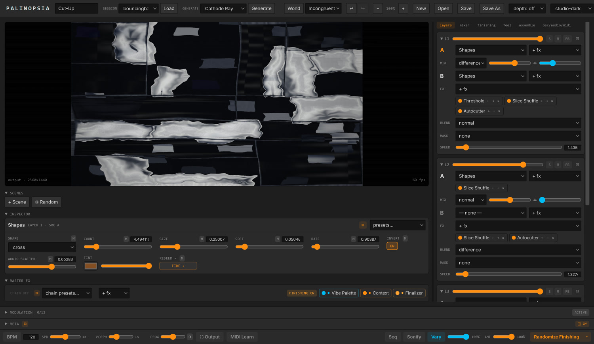

*The instrument: live preview and scene bank at the top left, the Inspector for
whatever is selected below it, the pinned master finalizers under that, and the
layer stack down the right column : here two layers of Shapes cut up by Slice
Shuffle and **Autocutter**, differenced together.*

### What it looks like

Every frame below was made by the app alone, no external footage: pick a recipe
from the **Generate** menu and it builds an entire coherent session : sources,
racks, palette, World and macro biases : in one click.

| | | |
|---|---|---|
| 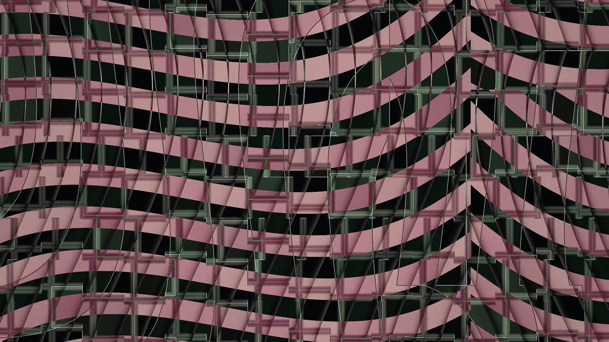<br>**Op-Art** : a grid warped and folded until it breathes | 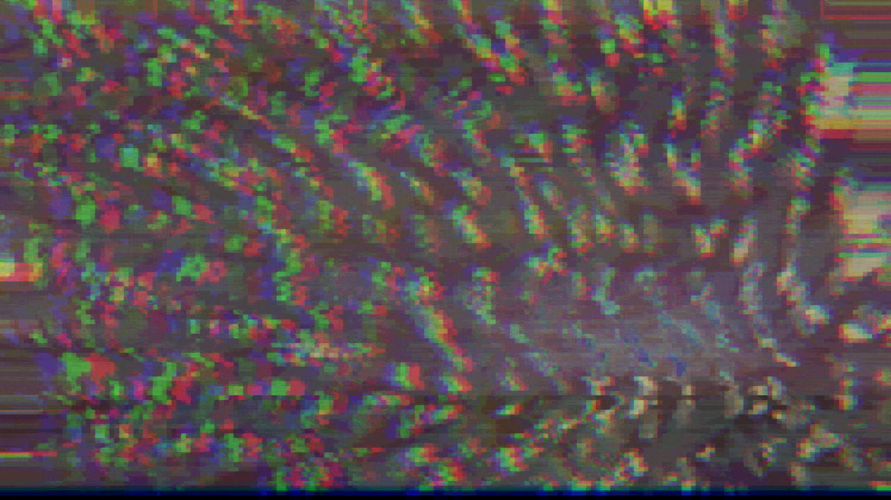<br>**Datamosh** : a slit-scan torn into RGB compression noise | 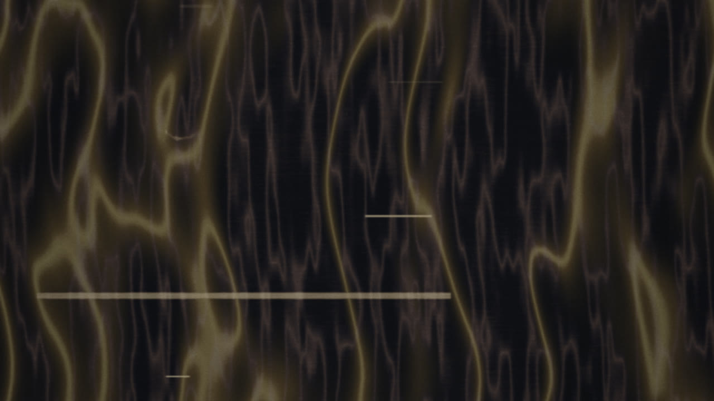<br>**Mycelial** : reaction-diffusion filaments, grown then eroded |
| 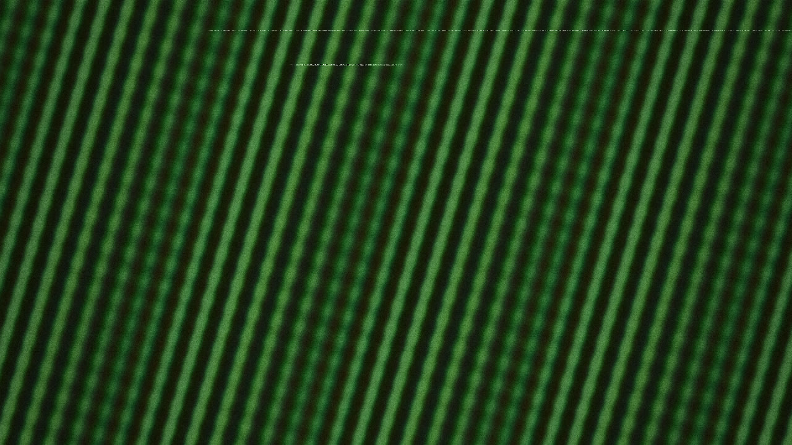<br>**Cathode Ray** : phosphor scanlines, one colour on black | 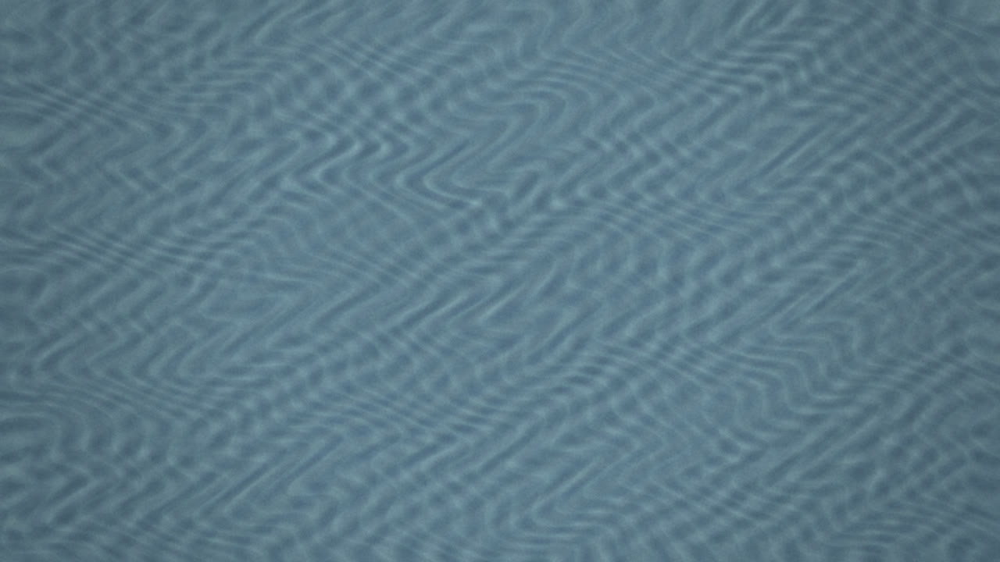<br>**Analog moiré** : a wobbulated interference field | 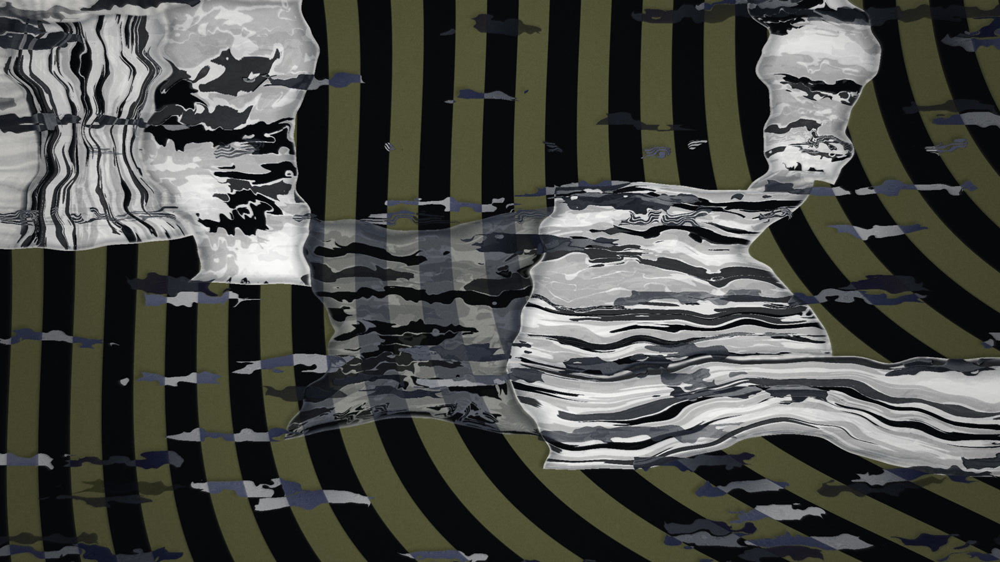<br>**Cut-Up** : a wall of films, each in its own torn piece |

*(These frames are fresh from v1.0.0. The older shots stay in `docs/images/`.)*

---

## Contents

**Play it**
- [What it looks like](#what-it-looks-like) · [Concept](#concept) · [Getting started](#getting-started) · [Your first five minutes](#your-first-five-minutes)
- [Keyboard shortcuts](#keyboard-shortcuts)

**The instrument**
- [The layer stack](#the-layer-stack) : sources · A/B mix · racks · blends · masks · coupling
- [Video sources](#video-sources) : import (DXV/HAP/ProRes…) · transport · modulatable playhead · granulation
- [Collage](#collage--a-wall-of-films-key-source-gen-collage) : a wall of films cut up by the Autocutter partition · folder or Assemble-bank feed
- [The Transport bar](#the-transport-bar-bottom) · [Feel : the global macros](#feel--the-global-macros-key-g)
- [Meta Controller](#meta-controller-16-knobs--xy-pads) (16 knobs + XY pads) · [Modulation brain](#modulation-brain-8-modulators--matrix)
- [Sequencer](#sequencer-key-q) : auto-pilot · long-forms (Burial · Long-Take · Frame-Weave)
- [Worlds / diegesis](#worlds--diegesis-key-w) · [Audio in](#audio-in) : analyser · monitoring · denoiser · Performance · [MIDI](#midi) : learn + clock/transport out · [Body : embodied control](#body--embodied-control-key-b) · [Output & mapping](#output--mapping-key-o) : **fulldome** (210° domemaster + 3D dome simulator) · composition size · light out (DMX/WLED) · installation · Flash safety
- [Sonify : image to sound](#sonify--image-to-sound-key-s) : nine voices (Spectra · Orbit · Flow · Events · Raster · Transmission · Filter · Chord · Collage) · quantizer · audio in recordings
- [Assemble : the automatic editor](#assemble--the-automatic-editor-key-e) : corpus point cloud · matching modes · cut pace + time curves · export
- [Sessions, scenes & themes](#sessions-scenes--themes) · [Metasurface](#metasurface--the-continuous-scene-space) · [Randomize & Vary](#randomize--vary) · [Undo](#undo)

**The vocabulary**
- [Sources](#sources-41-generators) (41 generators) · [Effects](#effects) (52 FX) ·
  [Native nodes](#native-nodes) (25) · [Master finalizers](#master-finalizers--pinned-always-last)
- [Blend modes](#blend-modes) (19)

**Control & internals**
- [Resolume OSC mapper](#resolume-osc-mapper-key-k) : Palinopsia signals × any Resolume address, read from a composition
- [OSC implementation](#osc-implementation) : inbound · outbound · OSCQuery · setup
- [Stack & architecture](#stack) · [Aesthetic guardrails](#aesthetic-guardrails) · [Credits & license](#credits--license)

---

## Concept

Palinopsia is a **compositor you perform**, not a patcher you wire. Its topology is
fixed and its vocabulary is curated: a seed library of glitch / generative /
digital-arts shaders that *is* the instrument's voice. You build an image by
stacking layers, treating each through effect racks, mastering the whole through
three pinned finalizers, and steering all of it live : by hand, by an internal
modulation brain, or over OSC from a companion "brain" like Pandore.

It also **reads audio** rather than merely pulsing to it: a shared audio bus, an
A↔B coupling engine (synchresis as balance behaviour), global World/diegesis
presets, and named Feel macros turn sound→image relations into playable
structure. A generative macro-form sequencer can then auto-pilot a whole set from
tagged scenes.

The papers, books and standards the instrument draws on are listed in
[docs/bibliography.md](docs/bibliography.md) (APA 7).

---

## Getting started

**Installing a release** : download it from the [releases page](https://github.com/filliformes/palinopsia/releases).

- **macOS (Apple Silicon)** : the app is signed ad hoc, not notarized. Drag Palinopsia into
  **Applications** first (run from the disk image or Downloads, macOS runs a hidden
  temporary copy), then run `xattr -cr /Applications/Palinopsia.app` once in Terminal, or
  open it and click **Open Anyway** in System Settings → Privacy & Security. Accept the
  local network prompt on the first launch (OSC, NDI and light output need it), and the
  camera / microphone prompts when you use them.
- **Windows** : the installer or the portable exe; SmartScreen : More info → Run anyway.
- **Linux** : the AppImage (`chmod +x` it, then run it) or the `.deb`.

**Building from source** :

```bash
npm install
npm run dev          # electron-vite dev (edits hot-reload into the running app)
npm run typecheck    # tsc : node + web projects (both must be green)
npm run build        # electron-vite build (bundle only)
npm run build:win    # NSIS installer + portable
npm run build:mac    # DMG
npm run build:linux  # AppImage + deb
```

A hot update re-runs the edited module in place. The long-lived engines (Sonify, the
audio input, the body tracker) shut down their previous copy when that happens, so a
reload is only needed after a main-process or preload change.

NDI needs no build step : the sender calls the NDI runtime through an FFI (`koffi`).
`npm run ndi:bundle` copies an installed official NDI runtime into `resources/ndi/` so
the next build ships it (see [NDI](#ndi)).

The Syphon addon (`native/syphon/`, macOS) is built by `sh native/syphon/build.sh`
(needs Xcode : it builds the Syphon framework from source, then the addon); CI does it
on the macOS job.

The native Spout addon (`native/spout/`) is optional and Windows-only; it's
rebuilt against the Electron ABI and loaded at runtime : the app runs fine
without it (the Spout toggle simply reports unavailable). Video ingest and
recording delivery use the bundled `ffmpeg-static`; a system `ffmpeg` on PATH (or
`OPSIA_FFMPEG`) overrides it.

On a laptop with two graphics chips, Palinopsia **asks for the discrete GPU** itself
(Windows otherwise leaves a program it doesn't know on the integrated chip, about 15x
slower on an RTX 4070 laptop), so no Windows graphics setting is needed.

On launch the app quietly **pre-warms the whole shader registry** in the
background (one compile per frame, starting ~1 s in) so scene recalls and
Randomize bursts hit the GPU program cache instead of stalling the driver. The
first-ever launch pays this once; it persists on disk afterwards.

## Your first five minutes

1. **Launch.** You land on a fresh random one-layer scene. Press **`R`** a few
   times : each press re-rolls the whole instrument (sources, racks, blends,
   modulators) from curated ranges, crossfading over the **MORPH** time.
2. **Open the Feel tab (`G`).** Drag **Density**, **Flow ⇄ Interruption**,
   **Drift** : these are the instrument's whole-image "feel" macros. Double-click
   any slider to reset it.
3. **Click a layer's source** (the **A** button) and play with its parameters in the
   **Inspector** below the preview. Every slider has a dice `⚄`, presets, and an
   **M** button to bind a modulator.
4. **Save a scene**: get something you like, click `+` in the Scene bank, then
   press `1`–`9` to recall it live (recalls morph over MORPH).
5. **Go fullscreen**: press **`O`**, pick a display, hit fullscreen. Or try
   **Generate** in the toolbar : 100 themed recipes that build a coherent
   session (visuals + World + palette + macro biases + motion) in one click.

**Lost?** Press **`?`** anytime for the full keyboard cheat-sheet.

---

## Keyboard shortcuts

Bare keys are ignored while typing in a text field; `Ctrl/Cmd+S` always fires.

| Key | Action |
|---|---|
| `1`–`9` | Recall scene 1–9 |
| `P` / `Shift+P` | Open Vibe Palette / cycle its presets |
| `C` / `Shift+C` | Open Context / cycle its presets |
| `M` / `F` / `G` | Right column → Mixer / Finishing / **Feel** (Layers is the default view : `M` toggles Mixer↔Layers, or click the tab) |
| `O` | Output / Mapping page |
| `W` | World editor |
| `Q` | Sequence page |
| `S` | **Sonify** page (image-to-sound engine) |
| `B` | **Body** page : embodied control (a camera → gestures + modulators) |
| `K` | **Resolume OSC mapper** page : drive any Resolume address from Palinopsia's signals |
| `E` | Right column → **assemble** (the automatic editor) |
| `A` | Right column → **audio/midi/osc** setup tab |
| `D` / `X` / `I` | Collapse Modulation / Master-FX / Inspector |
| `R` | Fire the Transport's selected Randomize |
| `H` | **Freeze / hold** the output (the ❄ latch : the Transport button lights while held) |
| `L` | **MIDI Learn** on/off : from any tab or full-page view |
| `?` | Keyboard **cheat-sheet** : this table, in-app (Esc closes) |
| `0` | **Panic flush** : clear every self-feeding buffer (feedback / trails / rings / accumulators) at once |
| `Esc` | Close the cheat-sheet, then MIDI Learn; otherwise close Resolume / World / Sonify / Body / Output / Sequence |
| `Ctrl/Cmd+Z` · `Ctrl/Cmd+Shift+Z` / `Ctrl/Cmd+Y` | Undo · Redo (100 levels) |
| `Ctrl/Cmd+S` | Save session |
| `Ctrl/Cmd` `+` / `-` / `0` · `Ctrl`+wheel | UI zoom in / out / reset (menus stay anchored at any zoom) |

**MIDI:** the **MIDI Learn** toolbar button (top bar), or the `L` key from
anywhere : maps any controller; see [MIDI](#midi).
**Everywhere:** double-click a slider/knob to reset it to its neutral value : including the A/B mix, harmony, coupling, background opacity / depth and the
video **in / out** trim handles.
**Feedback:** a brief **toast**, docked in the empty middle of the
[bottom toolbar](#the-transport-bar-bottom), confirms actions with no natural home on
screen : a recording saved (with its filename), a panic flush, or a live-capture
that couldn't start *and why* (permission denied / no device / cancelled).

---

## The layer stack

Bottom → top: **Background → Layer 1 → Layer 2 → Layer 3 → Layer 4.** Four layers
composite over one background "ground." The Layers column reads in that order, top
down : the Background strip first, then Layer 1 to Layer 4.

Each of the **4 layers** carries:

| Element | What it does |
|---|---|
| **Source A / B** | Two source slots; the **A** / **B** buttons (and **BG** on the background) show that source's controls in the Inspector. Each holds a generator, an imported video (`🎞`), a capture (webcam `📷` / screen `🖥` / device `🎥` / NDI® source `📶`), a HIVE network stream (`📡`), or nothing. |
| **A/B mix** (`MIX`) | `sourceBlend` (how B combines with A, incl. the relation modes Weave / Lumakey / Consume) · `sourceMix` (0 = A only … 1 = full B) · `harmony` (⚖ consonant → dissonant B hue). Inert until B has a source. |
| **Source FX** | A separate effect rack under **each** source slot (`sourceAFx`, `sourceBFx`). |
| **Layer FX** (`FX`) | The layer's own effect rack : the only rack that accepts the **sidechain** [native nodes](#native-nodes) (Transfert, Convolution, Mosaïque); the self-contained nodes run in any rack, and so do the TouchDesigner recipes (Remap, Luma Blur, Gooey, Matte, Lookup), whose other-layer inputs are optional. |
| **Blend** (`BLEND`) | How the layer composites onto the stack below ([19 blend modes](#blend-modes)). |
| **Mask** | A per-layer spatial mask beyond blend modes: **luma** (keyed off the layer's own brightness, lo/hi + soft knee), **gradient** (a directional wipe at any angle/position), or **shape** (a soft rect/ellipse window : centre, size, aspect, roundness), each invertible. Multiplies into the layer's alpha before the blend. |
| **Opacity** | Header slider (0–1; double-click → 1). |
| **Speed** (`SPEED`) | The layer's own clock multiplier (0–20×) over global speed (double-click → 1). |
| **Feedback** (`FB` + `TRAIL`) | Samples the layer's own previous frame (ping-pong FBO decay-feedback). |
| **Solo / Mute** (`S` / `⊘`) | Per-layer isolation; per-layer dice `⚄`. (Mute moved off the letter `M` so it never reads as the Modulate **M** chips. The same `S` / `⊘` chips now also ride each column of the **Mixer** view.) |
| **Coupling** (`CPL`) | Audio drives the A/B balance (hidden until Coupling is enabled in the Audio tab): modes off/lean/hocket/cut/gate/drift + audio feature + amount + tightness. |

Shader hot-swaps preserve feedback buffers : no reset-to-black mid-performance.
Right-click a layer for Init / Randomize / Copy / Paste / layer presets.

A layer's **opacity, A/B mix and blend mode** are themselves [modulation](#modulation-brain-8-modulators--matrix)
targets : a small **M** chip beside each opens the same M1–8 binding row as any
Inspector control. Bound sliders turn the modulated colour and move with the
signal; the blend dropdown cycles its modes. Per-FX **dry/wet opacity** is
modulatable too : select a loaded effect and its opacity slider grows the same
**M** pill. (These are compositor-level, so they apply as a final per-frame
override with the base value preserved, and they travel with sessions.)

The **Background** has one source (from a curated set of grounds), its own full FX
rack, opacity, its own clock (**SPEED**, 0 to 4×, 0.25× by default : its source, its
effects and a Collage's films all play at it), a **SHADOW** (the layers cast a soft
shadow onto it, offset down-right, which lifts them off the ground), and **LAYERS**,
how the four layers sit on it :

- **blend in** : Layer 1 blends onto the Background in its own blend mode (screen lets
  it glow through, multiply darkens it). As the Background fades out, Layer 1 eases
  toward landing as if nothing were under it, so a multiply layer never turns black
  at a low opacity and a morph never pops;
- **group** : the four layers composite among themselves, as if alone, and the group
  sits over the Background, which shows through wherever the layers are transparent
  or dark (a saturated color covers it as much as white does).

Its strip is collapsible like a layer's : the header keeps its opacity (**M** to
modulate it) and its dice, and folded it says what it holds (`Sea Glass · 2 fx ·
0.25× · group`). Speed and shadow have an **M** too, and opacity, speed and shadow are
MIDI-learnable. It has its own presets (built-ins set a ground and its rack and keep
your shadow and mode; yours keep everything) and its own dice (a new ground and rack;
modulation aimed at the old ones goes with them). **Init background** (right-click)
empties it completely. The global Randomize never touches it. When the Finalizer's
output shape uses it as the **outside fill**, the fill follows its opacity (over the
fill color) and goes through Vibe, Context and the Finalizer like the rest of the
picture; only the film dust stays inside the shape.

The right column switches between **seven views** (tabs, or keys `M` / `F` / `G` /
`E` / `A`): **Layers** (the strips + background), **Mixer** (tall
opacity/speed faders + blend for all four), **Finishing** (the Vibe · Context ·
Finalizer stack), **Feel** (the global macros), **assemble** (the automatic
editor), **audio/midi/osc** (the Audio, MIDI and OSC panels) and **performance**
(the live load meter).
The main Inspector's FX-controls band **auto-fits its parameters** : selecting any
effect or source sizes the band to exactly its controls, so there's never blank space
over a few params nor a hidden row behind a scroll (you can still drag its handle to
override until the next selection). The Modulate side panel is resizable too (widths /
heights persist). Every effect, generator and source in a picker, and each FX
chip already in a rack : shows a **one-line description on hover**, so the whole
catalogue is learnable without adding-then-reading.

## Video sources

Drop a video into a source slot (`🎞`). Beyond plain H.264/VP9/AV1, Palinopsia
imports **DXV3 (Resolume), HAP, ProRes, DNxHD, MJPEG, CineForm, QuickTime
Animation and raw video** (`.mp4 .m4v .mov .dxv .webm .mkv .avi .mpg .mpeg .mxf
.m2v`): anything Chromium can't decode is converted **once** through the bundled
ffmpeg into an **all-intra H.264 cache** (every frame a keyframe), keyed by file
identity. All-intra means every seek is frame-accurate, which is what makes the
whole transport below modulatable. Conversions dedupe, survive crashes
(tmp-then-rename), and **loading a session warms every video in the session's
folder in the background**.

The selected video slot shows a full **transport** in the Inspector:

- **Play/pause** · **■ stop** (pause and back to the in point) · play mode
  **forward → reverse → pendulum** · **loop** (or play-once-and-hold) · **speed**
  1/64×–128× (log slider). The browser plays a clip natively from 1/16× up to 8×;
  slower and faster speeds step the frames by seeking, and a clip whose decoder
  stalls at speed drops to that path on its own instead of freezing. On an ordinary
  clip a seek decodes from the last keyframe (seconds on heavy footage), so when its
  seeks run slow the player steps **keyframe to keyframe** from an index ffmpeg
  builds once per file in the background : about 14-18 pictures a second at 16-64×
  on 1080p camera footage, where exact seeks managed under one. The playhead lights
  up while you drag it.
- **◇ smooth scrub.** A **native** H.264/VP9/AV1 clip only seeks to keyframes, so
  reverse / pendulum / high-speed jump keyframe-to-keyframe. One press transcodes the
  clip once to the all-intra cache (with a progress badge) and swaps the slot to it : transport, FX and modulation are preserved, after which every direction and speed
  scrubs smoothly. A clip that's already all-intra shows a **◆ smooth** badge instead.
  The button lights up when the current settings will strobe on an ordinary clip
  (fast, reverse, pendulum or grain : about 10 pictures a second, against about 40
  on a smooth copy).
- A **scrub timeline** with a live playhead and draggable **in/out trim points** :
  click or drag anywhere on it to move the playhead, playing or paused.
- A **clip** row : **◀ / ▶** and a dropdown of every video in the clip's folder
  (natural order, wraps at the ends). Swapping keeps speed, direction, loop and
  grain and resets the trim; a clip in a codec the player can't read is converted
  first, like an import.
- **`M` targets** : the playhead position, speed, and loop in/out are modulation
  targets like any shader param: a saw LFO loops, S&H jump-cuts, an audio
  follower scrubs, chaos wanders the trim window.
- **⌗ grain : video granulation.** Three grain voices scatter short windowed
  reads around the (still-moving) playhead: **size** (grain length), **spray**
  (scatter distance), **rev** (probability a grain plays backward), **jit**
  (per-grain speed jitter), plus a **sync** clock : free (seconds) or a BPM
  division (1/16 · 1/8 · 1/4 · 1/2) that retriggers grains on the beat grid.
  With grain on, `gr·size` and `gr·spray` also become modulation targets.
  Granulation is at its best on imported/converted (all-intra) clips.

Live **captures** (webcam / screen / device), [NDI](#ndi) sources and **HIVE**
(HEVC-over-TCP network streams) fill slots the same way, and every video/capture slot
has zoom / pan / crop **framing** and its own Source-FX rack. A camera that drops out
(unplugged, or reset by USB power saving) **reconnects by itself** : it is tried again
2, 4, 8… up to 30 s apart, and at once when a device appears, found again by name if it
comes back under another id; its last frame holds meanwhile.

## The Transport bar (bottom)

Left → right:

- **BPM** (20–800) : the label is a **tap-tempo button** (tap it in time) ·
  **SPD** global speed (1/64×–64×, log; double-click → 1×) · **MORPH** time (0–30 s,
  default 1 s : scene recalls, Randomize, Variation, the sequencer, sessions, New and
  Generate all morph over this, live) · **PROX** proximity (far ↔ close depth zone) + `◑` audio-brightness follow.
- **World** (opens the World editor, also key `W`) + the World selector · **❄ Freeze** :
  hold the output on the current frame (the button lights while held; also key `H` or a
  learned pad). Messages (a refused effect drop, a saved recording) appear in the
  toolbar's empty middle, always in the same place, over nothing; a long instruction
  grows upward from there.
- **Output** (opens the Output / mapping page; lights while the external output is on) · **Body** (opens the embodied-control
  page; lights while the camera is live; also key `B`) · **Seq** (opens the
  sequencer; lights when running) · **Sonify** (opens Sonify; lights while the sound
  engine runs).
- **Vary** (a baseline-anchored variant : structure fixed, values nudged) + amount.
- **amt** Randomize intensity (gentle walk ↔ full re-roll) · **Randomize**
  split-button (main fires the selected scope; `▾` picks the scope : see
  [Randomize & Vary](#randomize--vary)).

The **top bar** carries the session controls (name · Session · Generate · New /
Open / Save / Save As · render-depth + theme selectors), the **MIDI Learn**
button (key `L`), the **REC** pill (stop it here and a toast confirms the saved
file), undo / redo, UI zoom, and, at the far right, **⚡ Flush**, the panic
button (also key `0`) that drops every self-feeding buffer at once: per-layer
trails, the Feedback / Réponse / Chronoscan frame rings, the Sediment / Scanner
accumulators, the consume blend's competition field, and the persistent buffers of
every rack effect (Light Trails, Wide Time, Slit Buffer, Context's trails), so a
runaway feedback build-up clears instantly without reloading anything. Generators
that grow their picture (Reaction, Colony…) are left alone : their buffer *is* the
picture.

## Feel : the global macros (key `G`)

Eight whole-image macros in their own right-column tab, each a wide slider with
poles, a live readout, and a one-line description. They write **on top of** the
composition each frame (they stack with modulators and each other, never
clobber), persist across restarts (except the strobing ones), and are all OSC
endpoints.

**Field : spatial + material** (bipolar, neutral 0.5):

| Macro | Poles | What it does |
|---|---|---|
| **Density** | sparse ↔ dense | Fades the upper layers out or fills them in. |
| **Gesture ⇄ Texture** | gesture ↔ texture | Clean directional movement (sharpen) ↔ internalised churn (trails). |
| **Coalesce** | grain ↔ mass | Broken into grain/dither ↔ pulled into smooth mass (blur). |

**Temperament : film character** (neutral 0, except Flow at 0.5):

| Macro | Poles | What it does |
|---|---|---|
| **Flow ⇄ Interruption** | interruption ↔ flow | Stutter : frame-holds, breakup, blank stabs ↔ a liquid, continuous image. |
| **Tonicity** | off ↔ colour | Tonal/harmonic audio pulls colour in; noise pulls toward black-and-white (needs Audio on). |
| **Shutter** | off ↔ stepped | Global full-freeze stop-motion: low = chunky (~2 fps) → high = fluid (~24 fps). |
| **Drift** | off ↔ wander | Slow analog-instability wander over the grade + rare accidents. |
| **Superimposition** | off ↔ strobe | Hypnagogic flicker: cross-cuts which layer shows on the drawn cadence. |

**Proximity** (in the Transport bar) is the ninth macro: it pushes the Context
mood into a near/far depth zone, optionally following audio brightness.

## Meta Controller (16 knobs + XY pads)

A flat bank of 16 macro knobs. Each tile is a 270° dial (drag vertically, Shift =
fine, double-click resets), with a destination count, a rename, an output **curve**
(linear / log / exp / eases / sigmoid / smoothstep / db / gamma / step / invert), a
**CC** MIDI-learn, and an **M** button binding one modulator to the knob. Each knob
can drive up to 8 destinations. `⚄` shuffles knob positions while keeping bindings.

The **`⊞ XY` toggle** (Meta title bar) turns **knobs 13–16 into two XY
performance pads** (knob 13/14 drive pad 1's X/Y, 15/16 pad 2's) for
two-finger macro gestures; toggle back to `◎ 16` for the flat bank. Bindings are
the knobs' own, so a pad is just a faster way to play four of them.

Knob gestures (drag, glide, MIDI CC, OSC `/opsia/meta/n`) fan out to their
destinations **engine-side at frame rate** : the store only commits once per
gesture, so gliding a knob costs nothing.

## Modulation brain (8 modulators + matrix)

Eight modulator slots, each of a chosen **type** : `lfo` (7 shapes) · `ramp` ·
`adsr` · `arp` · `random` · `s&h` · `slew` · `chaos` · `audio` (follower) ·
`organic` · `physics` · `motion` · `vision` · `body` · `homeostat` · `euclid` ·
`turing` · `cellular` (the modulator types are dropdown-listed alphabetically), with a clock
(free Hz or BPM division), type-specific params, a live meter, and retrigger. Slot 8
(`⊛`) is reserved for the active World's audio routing and is skipped by Randomize.

Three **generative** types (borrowed from the LZX Videomancer vocabulary) join the
stepped family and take **SLIP** like the rest:

- **`euclid`** : a Euclidean/Bjorklund rhythm : `pulses` spread evenly over `steps`,
  read as a gate that a `decay` release rides continuously (a pluck/swell; decay 0 =
  a hard 0/1 gate).
- **`turing`** : a Turing-machine shift register : a `length`-bit loop read as a
  value, its falling bit fed back unless a `mutate` probability flips it : an
  evolving-but-locked pattern that slowly rewrites itself.
- **`cellular`** : a 1-D elementary cellular automaton (rule 30 / 90 / 110 / 150) read
  as live-cell density : generative, on-brand, never quite repeating.

Two of the types close the loop **from the image back to control**:

- **`vision`** follows a feature of the *rendered output* (brightness, contrast,
  motion, edges, entropy, bright-mass X/Y, warmth, **saturation**, **hue**, depth, depth
  spread, and the picture's own **motion field** : `flowX`, `flowY`, `divergence`,
  `curl`, `coherence`) : the picture modulates itself. The colour features make the crossmodal table
  playable : bind the picture's **hue** or **saturation** to a Sonify parameter and
  the *colour drives the sound*, the inverse of Sonify's image-to-sound path.
- **`homeostat`** is a self-regulating controller: it watches an image feature
  and *steers its target* to hold a setpoint (gain + adaptation), an
  Ashby-style homeostat that keeps a quality of the image in balance.

One type follows the **live performer** instead of the picture:

- **`body`** follows a feature off the [Body page's](#body--embodied-control-key-b)
  webcam (a hand's height / openness, body lean / motion, a face blendshape, head
  pose, or a silhouette zone's coverage) : the room in the frame plays the
  instrument. The `audio` follower also gained a **`noisiness`** feature (spectral
  flatness) : bind a sound's noise to a layer's tint saturation and the *sound
  colours the picture* (the other direction of the same crossmodal table).

**SLIP** (on `arp`, `random`, `chaos`, and the LFO's stepped shapes) makes a
stepped modulator's rhythm impossible to feel. The clock keeps ticking, but some
ticks simply don't fire, so events stay *on* the beat while becoming
unpredictable, which reads as a cross-rhythm rather than as sloppiness (and it
survives BPM sync, where jittered timing wouldn't). It generalises the
un-feelable clock that the **Spastic** LFO shape has always had; Spastic itself
now offers a **binary** throw (hard flip between the extremes) or **float**
(anywhere in between, with the same irregular timing), and a **HOLD** (0 … 10 s,
log) : the rate then only decides *when* it may rise, once in a while as the coin
falls, and each rise stays up for the hold before dropping straight back to the
bottom, where it rests until the next one (a pulse rather than a held state; at
5 ms it is a one-frame blip). HOLD 0 keeps the original : up until the next throw.

The **mod-matrix** holds up to **12** assignments (M# → target param, with a
bipolar depth and a **Multiply** or **Replace** mode). Bindings are made from each
parameter's **M** button in the Inspector or Meta tile. In the Modulation strip,
**click an assignment chip to turn it off** (dimmed and struck through : the
parameter sits at its own value, the depth and binding are kept) and click again to
turn it back on. Modulation reaches
**float, enum, and bool** inputs, plus the **video** targets (playhead / speed /
loop / grain), the compositor-level **layer** controls (opacity / A-B mix /
blend-mode, from the M chips on the layer strip), and per-**FX dry/wet opacity**, and is written straight to the compositor at frame rate, never through React
re-renders.

The **Mul** (depth) control spans **−10 … +10**. Between −1 and +1 it behaves as
before; past ±1 it **over-drives** : in Multiply mode the modulator's trough is
pushed below zero (clamped to the param's minimum), a harder downward scale, and in
Replace mode the swing saturates hard against the param's range. The number box next
to the slider takes exact values.

The two modes differ in what the parameter's own slider means once bound:

- **Multiply** treats the slider as a ceiling and the modulator as a VCA
  (`base · (1 − amount + amount · mod)`); a negative depth inverts. The base
  value still sets the character, which is what you want on a param you have
  already dialled in.
- **Replace** swings bipolarly *around* the base, so the parameter moves even
  from a standstill.
- At the **edge of a range** (a base at its minimum or maximum) a swing keeps its full
  travel : it shifts inside the range instead of losing half its cycle against the edge.
- A **toggle** (a Collage's `freeze`, any on/off switch) follows one law in both modes,
  so its chip reads `tgl`. At depth 1 it follows the modulator : on while the modulator
  is in its upper half, half the time with an LFO. Less depth leans toward the stored
  state : stored off, it switches on only near the modulator's peaks (depth 0.5 : the
  top quarter); stored on, it switches off only near the troughs.
- A modulated slider's thumb moves with the live value. **Dragging it moves the base
  by as much as you drag** (from wherever the thumb was when you grabbed it); let go
  and it follows the modulator again. Counts (a Collage's `cuts` and `films`) step in
  whole numbers. Double-clicking a binding's depth slider puts it back to 0.5. A modulated
  on/off button turns the modulated color too and shows its live ON / OFF.

Binding from the **M** button picks the mode for you: a target sitting at (or
near) zero gets **Replace** (so does a menu sitting on its first choice), anything else
gets **Multiply**. This matters because
Multiply's law is a guaranteed no-op on a zero base, before the auto-pick,
binding an LFO to a freshly-added effect's `torn`, `contour` or any zeroed slider
looked like broken modulation. You can still flip the mode per assignment from
the `mul`/`rep` chip in the Modulate panel.

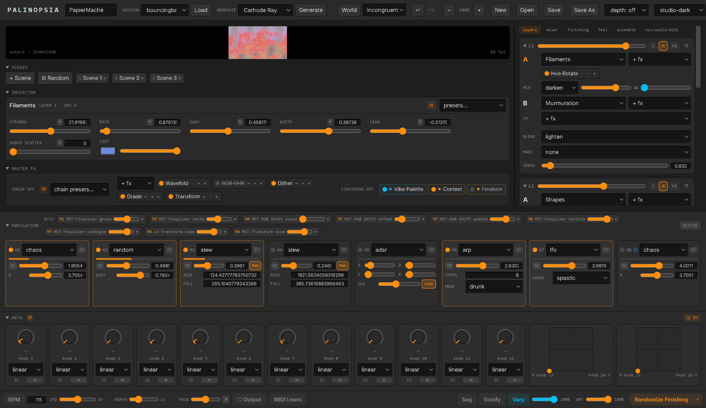

*The eight modulators (`D` toggles the row) over the sixteen Meta knobs and the
two XY pads. Each modulator card carries its type, clock, shape and live meter;
each knob its curve, MIDI CC and destination count.*

## Sequencer (key `Q`)

An auto-pilot over the scene bank. Each scene carries relation tags : **Diégèse**
(world) · **Synchrèse** (coupling) · **Espace-temps** · **Climat** (set in the tag
editor : click a scene card ; **Climat** also takes a **◔ from picture** suggestion
that reads the live composite's palette : warm + saturated → tension / expectation,
cool + muted → release / resolution). The sequencer
does weighted / arc / shuffle selection with a no-repeat window, morph/cut/auto
transitions, and subtle no-exact-repeat variation; overlays **Breathe**
(dense↔void) and a **Climate arc** (repose–disturbance–repose); adds **cadence /
rupture / monomedia** punctuation; supports audio/chaos-armed deferred advance; and
exports a Markdown **relation-score** (`⤓ score`). Needs ≥2 scenes to play.

Three **durational long-forms** run underneath the scene clock (minutes-scale):

| Long-form | What it does |
|---|---|
| **Burial → Exhumation** | Degrades the grade toward illegibility over a set length (a slow cosine 0→1→0), then recovers : the image is buried and exhumed once per cycle. |
| **Long-Take / Veil** | A slowness governor: **forbids** auto-cuts for the cycle and drives one slow veil (Context haze) across it : the sequencer holds a single take. |
| **Frame-Weave** | Rose Lowder's temporal interlace: instead of blending, show **one layer per frame**, stepping through a **paintable cell lattice** (each cell = a layer 1–4 or blank) at a set rate : persistence of vision fuses the layers into one woven image. |

The Sequence page has its own live monitor (resizable) and a resizable
inspector column.

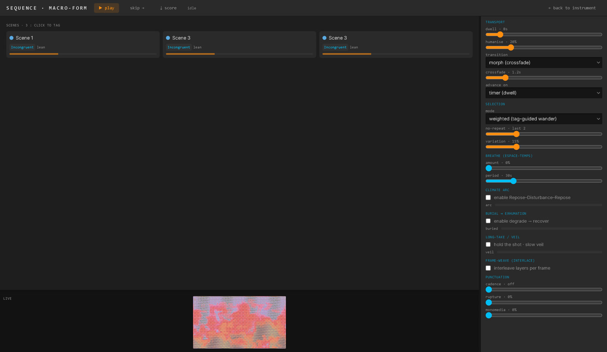

*Tagged scenes across the top, the live monitor at the bottom, and the transport
column on the right: dwell clock, transition style, selection strategy, the
Repose–Disturbance–Repose climate arc, and the punctuation toggles.*

## Worlds / diegesis (key `W`)

A global "proposed world" biases the whole composition : A/B coupling character,
Context mood, and audio routing (which feeds modulator slot 8). The editor holds a
world bank (built-ins + saved), coupling settings, Context mood sliders, an
audio-routing binding, and a live visualiser. Editing the active world updates the
composite live.

## Audio in

The **audio/midi/osc** right-column tab (key `A`) holds the control panels
(**Audio · MIDI · OSC**), and the **performance** tab beside it the load meter:

- **Audio** : enable the local analyser (input device picker), or receive
  features over OSC from an audio brain (`/opsia/audio/*`). The **coupling**
  master switch (pinned right) reveals each layer's CPL row. Live meters show
  level / flux / transient / centroid / **noisiness** (spectral flatness) / bands.
  - **Monitoring / passthrough** : route the input through to a chosen output
    device (its own **sink** picker), so you can hear a source (e.g. the sound of
    an Ableton Move on interface inputs 1&2) while it drives the visuals. The
    **Sonify** sound and the monitored input have **separate levels**, so both run
    at once without fighting.
  - **Denoiser** : a built-in filter for USB / interface hum. It **learns** the
    input's noise (mains-hum series + strong tones), models a set of notches, and
    applies a high-pass + multi-notch filter to clean the signal before it is
    monitored or analysed.
- **MIDI** : controller input picker + the learned-bindings ledger, plus the
  **MIDI output** controls (see [MIDI](#midi)).
- **OSC** : inbound listener (port, on/off, this machine's IPs), outbound
  feedback (host/port/interval), and the OSCQuery status.
- **Performance** (its own tab, right of audio/midi/osc; it meters only while
  shown) : a per-section load monitor : each part of the instrument
  (render, output, vision, depth, lights, sonify, audio, modulation, MediaPipe)
  with its CPU frame-budget share, estimated VRAM, and active-feature chips, so you
  can see what a heavy session is spending, with units and hover tooltips on every
  figure. Fixed layout (no reflow as modulation comes and goes). Under it, the
  **picture** section reads out every feature the picture reports, live : light and
  color (brightness, contrast, saturation, hue, warmth), texture (edges, entropy),
  motion (amount, flow sideways and up/down, spreading or closing, turning, moving as
  one) and where and how deep (the bright mass on a little plane, depth, relief), each
  with what 0 and 1 mean and its `/opsia/vision/…` address. These are the numbers
  `vision` modulators follow and OSC, the Resolume mapper and the dataflou mesh read;
  the readout keeps them computed while it is open.

Everything that "listens" to sound reads one shared **audio bus**: coupling,
Tonicity, the `audio` modulator, World routings, Proximity's `◑` follow, and the
Parametric generator.

## MIDI

Hardware control, Ableton-style. Press **MIDI Learn** in the top toolbar (or the
`L` key, from any tab) : it turns blue and every learnable control grows a **blue
overlay**. Click one (it pulses), then move a knob / hit a pad on your
controller : bound (the overlay turns **green**). The mode stays armed so you can
map the next control immediately; right-click a green overlay to clear its
binding, press the button / `L` again or `Esc` to exit. While learning, incoming
MIDI never fires anything : browse your controller safely.

**One CC, many targets** : learn the *same* CC onto several controls and one knob
drives them all at once (every match fires, not just the first). A wide hardware
gesture can sweep a whole cluster of parameters.

Learnable targets:

- **Meta knobs** (all 16, CC only) : hardware drives them through the same
  per-knob smoothing as a mouse drag. These bindings live **in the session**
  (the per-knob **CC** button still works as a direct shortcut).
- **Transport** : BPM (CC → 40–240), SPD, MORPH, PROX (each mirrors its
  slider's curve).
- **Continuous (CC)** : each of the **4 layer opacities** and their **A/B mix**,
  the **background opacity**, the **8 Feel dials**, the **Metasurface XY**, and
  the **Sonify master** (each mirrors its own curve).
- **Fires** (pad/note or button-CC, press edge only) : **Vary**, **Randomize**
  (the selected scope), **Tap tempo**, **Freeze**, **Panic flush**, **Record**
  start/stop, **Sonify** on/off, and the **Sequence** + **Sonify-sequence**
  transports.
- **Scene chips** : a pad recalls that scene *slot* (like the `1`–`9` keys); a
  pad can also step **scene next / prev**.

Everything except the Meta-knob CCs is machine-local (survives restarts,
doesn't travel with sessions). The **MIDI** section of the audio/midi/osc tab
(key `A`) has the **input dropdown** (all controllers, or just one : hot-plug
is handled), a **live-activity readout** (last message + how many controls are
wired, so you can confirm the port is really talking), and the full bindings
ledger with per-row clear.

**MIDI output.** The same panel also picks a **MIDI output** device and sends
Opsia's tempo out over it: a 24-PPQN **clock** + **Start/Stop transport** (both
toggleable), so an external instrument locks to Opsia's BPM. A **thru / merge**
pass forwards the learned input to that output (with a loop guard), so one USB
cable both plays Opsia and drives the gear downstream. Built to sync an **Ableton
Move** over USB-C: Opsia is the visual sibling, the Move keeps the beat.

## Body : embodied control (key `B`)

A full-page takeover that turns a **webcam of the performer** into control:
MediaPipe **Hands + Pose + Face + Silhouette** read the body into a live bus,
feeding continuous **modulators** and discrete **gestures**. A camera is strictly
**opt-in**: nothing opens until you press **Enable**, and the lit toolbar **Body**
button is the privacy tell while it runs (over a full-page view that hides the toolbar,
Sonify, Output, World, Sequence or Resolume, a pulsing red **BODY** pip in the lower
right corner takes over, a click opens the Body page). The
tracker uses a dedicated low-res capture, independent of any webcam layer. The
MediaPipe models run on **their own thread** : the picture only hands each camera
frame over (about 0.1 ms) and reads back the landmarks, so tracking never slows the
render (on a machine where that thread cannot start, they run on the main thread as
before). The models ship inside the app, so it works offline and in kiosk.

**Capture bar** (one distributed line): **Hands** (21 landmarks per hand, up to two)
· **Pose** (33-point whole body) · **Face** (ARKit blendshapes: jaw, smile, brow,
blink, pucker + head yaw/pitch/roll) · **Silhouette** (the pose segmentation mask
reduced to a 3×3 zone grid; heavier) · **Motion** (the camera's motion field, no body
model; cheap) · **Mirror** (selfie view) · **Hi-res** (track on every display frame
instead of once per new camera frame : for a fast camera, at about twice the cost) ·
**sensitivity**
(how easily gestures fire, a global default that any single gesture can override) ·
**hold time** (how long a held pose must last) · **OSC out**. The camera picker sits
in the page header.

**Features → modulators.** Every tracked quantity is a normalised 0..1 **feature** on
the body bus: hand height / horizontal / openness, hands-apart (the accordion), body
lean / sway / motion-energy / arm-span / stance / weight, the movement qualities (below),
the face blendshapes and head pose, and (with Silhouette on) each of the nine **zone
coverages** `zoneTL…zoneBR` plus whole-frame `bodyCover`. The **Feature monitor** shows
them live, grouped and colour-coded by body region (Hands · Pose · Movement qualities ·
Face · Silhouette · Motion field · Presence); its **→**
routes one into the first free modulator slot as a `body` modulator, ready to bind to
any parameter with a param's **M** button (exactly like an LFO). So a raised hand can
open a filter, or the body's motion drive feedback, continuously.

**Gestures → actions (the rule builder).** The **Create actions** panel authors rules:
**one gesture, or two combined**, fires an action and/or an OSC bang. Combos trigger
when both land close **together** (`+`) or **in order** (`→`); an **exclusive** combo
swallows its component gestures' own singles (a chord that doesn't also play its
notes). Every action is drawn from the **shared trigger vocabulary** (identical to
MIDI Learn and the keyboard): the Randomize scopes (everything / sources / source-FX /
layer-FX / modulators / finishing / background / master / meta / inspector / Sonify /
per-layer), the transport (Vary, Flush, Freeze, Record, Tap, sequencer, Sonify-seq,
**Undo / Redo**), Master-FX on/off, scenes (next / prev / a numbered slot), Sonify
voices, and session New / Load / Open. Leave a rule's **name** blank and it auto-labels
itself ("hands up randomizes modulators"); leave its **OSC** name blank and it defaults
to a truncated `/body/HandsUpRndMod`. With **OSC out** on, a firing rule also sends its
`/body/<name>` bang to the OSC-out target, so the body plays the sound side too. A
**single-gesture** rule carries its own **sensitivity** slider (double-click resets it
to the global), so one gesture can be tuned to fire eagerly or reluctantly on its own.

The gesture vocabulary spans **hands** (pinch L/R, clap, cross), **pose** (hands-up,
lean L/R, crouch, jump, arms-cross, T-pose, single-hand raise L/R), **face** (mouth-pop,
brow-raise, wink L/R, smile, frown, brow-furrow, squint, cheek-puff, kiss, jaw / mouth
L/R, tongue-out, blink, head turn / nod / tilt), **holds** (a sustained pose that fires
once after the hold time: hands-up, pinch L/R, arms-wide, mouth-open), the
**silhouette zones** (`cover TL…BR`: your shadow covering one of the nine screen
regions past a threshold), and **presence** edges (body / hands / face **in / out**:
debounced enter-and-leave onsets, the installation trigger for someone walking into or
out of frame). A live **⚡ recognised** pill in the panel header names the last gesture
the tracker saw.

**Silhouette** is the shadow-theatre control: the pose segmentation mask is reduced to
a 3×3 coverage grid drawn over the camera preview, each cell lighting up as your shadow
fills it. Cover a region to fire its `cover …` rule, or bind a zone's continuous
coverage to a modulator: screen-space control that reads clearly to an audience.
The same mask is also a picture : the **Silhouette** source (listed with the live
inputs in the source picker) draws it as a **cutout** of the camera (background
removal, no green screen), a white **matte**, a colored **shadow**, or a **hole** in the
room, with a `trail` of fading echoes. It only reads the camera : its Inspector line
says whether the camera is live and offers the one click that turns it on.

**Motion** reads the camera's **motion field** (dense optical flow on a small copy of
each frame, no body model), so it follows anything that moves in front of the camera :
a hand, a crowd, a curtain, a dancer the models lose. Nine features : how much moves
(`flowEnergy`), which way (`flowX`, `flowY`), whether the motion **spreads out or closes
in** (`flowDivergence` : someone approaching the camera or opening their arms reads as
spreading, walking away or folding as closing), whether it **turns** (`flowCurl`),
whether everything moves **one way or in every direction** (`flowCoherence` : a sweep
against a dance), where it happens (`flowCenterX`, `flowCenterY`) and how much of the
frame moves (`flowArea`). Its gestures : **swipe** L / R / up / down (a coherent sweep, so
a dance doesn't fire them), **approach** and **withdraw**, **turn** clockwise and
counter-clockwise, and **stillness**, fired once when a room that was moving holds still.

**Movement qualities** read HOW the body moves (Pose on), after the effort descriptors
of dance movement analysis in their computable form (Camurri et al.; Larboulette &
Gibet) : **energy** (`moveEnergy`, the weight of the movement, held at its peak),
**expansion** (`moveExpansion`, how far the limbs reach from the body), **fluidity**
(`moveFluidity`, a shake, a tremor or a stop-go reads jerky, a sweep or a slow reach
smooth), **suddenness** (`moveSuddenness`, sustained against sudden), **directness**
(`moveDirectness`, circles and meanders against a straight reach) and **symmetry**
(`moveSymmetry`, left and right mirroring each other). Everything is measured in torso
lengths, so a dancer far from the camera reads like one close to it, and the camera's
own jitter is learned in the first moments and taken off, so a still body reads still.
Fluidity and directness hold their last value while the body is still. Gestures :
**impulse** (a burst out of calm) and **freeze** (a quick stop held still).

With **OSC out** on in the app, every body feature also streams as
`/opsia/body/<feature>` while the camera runs, beside the picture's `/opsia/vision/*`.

## Output & mapping (key `O`)

A full-page takeover (the engine keeps rendering underneath). Its sections, top to
bottom:

- **Composition size** : override the 16:9 base with a **custom composition** (e.g.
  **7680×2160** for a wide wall or a stack of projectors). The whole engine renders
  at that shape; the output window can then **span separate displays**, so several
  projectors show one continuous picture. The size lives on the machine, not in the
  session, so a show file stays resolution-independent.
- **Render scale** : a quality multiplier (0.1–2×) on the composition size (½ lo-fi /
  1× / 1⅓× / 2×; the readout shows the real render resolution; rebuilds the engine).
- **Mapping** : a live keystone editor (drag four corner handles over a mirror of
  the output) + alignment grid + reset.
- **Fulldome** : render a square **domemaster** for a dome (see [Fulldome](#fulldome) below).
- **Fullscreen output** : pick a display; borderless-fullscreen or windowed. The
  output window shows the control window's exact pixels, streamed at the
  projector's own resolution and keystoned on its side.
- **Record** : format + record / stop + screenshot → `Recorded/`, or any folder you
  pick with **location…** (remembered on this computer; ↺ goes back to `Recorded/`,
  the path opens the folder; if the chosen folder can't be reached, an unplugged
  drive, takes go to `Recorded/` and the section says so). Assemble exports follow
  the same folder. **The take keeps
  rolling when you leave the page** : a pulsing REC pill in the top bar shows the
  elapsed time and stops/saves it, so you can tweak parameters live mid-take.
  **Sound** : every format records the **Sonify** sound whenever Sonify plays during
  the take (switched on before or during it, off and on again : silence while it is
  off, in sync with the picture); a take during which Sonify never played is saved
  with no sound at all. The video encoder and the sound card warm up quietly a few
  seconds after launch (the sound card then stays awake, silent), so every take starts
  recording at once, even the first one and even after a long pause.
  - **DXV3 · Resolume** : Resolume's GPU codec, recorded in **real time** : the
    graphics card compresses each frame, the file is written as it goes, nothing to
    convert after. **Any size** (the 4096² dome master included; a bigger master is
    scaled to 4096), a **constant 30 or 60 fps** (a frame the engine was late for is
    written again, so the clip keeps time), the clean picture (before keystone).
    Plays smoothly in Resolume, with the Sonify sound as an uncompressed PCM track.
    Big files : ~1 Gbit/s at 4K 30 fps,
    ~1.7 Gbit/s for a 4096² dome : record to a fast SSD.
  - **Encoder formats** (MP4 H.264 / H.265, ProRes 422 HQ, FFV1, uncompressed, VP9) :
    captured as a high-bitrate hardware H.264 master, then ffmpeg delivers the
    format when you stop (MP4 H.264 is an instant remux). The hardware encoder
    takes **up to 3840×2160** : above that (the 4K dome master), they show greyed
    out and a take records DXV3 instead. The MIDI record button uses your chosen
    format the same way.
  - **"MKV · H.264 as captured"** (the former "Fast · no re-encode") is exactly
    what Chromium's hardware encoder wrote : H.264 in Matroska, variable frame rate,
    no seek index, Opus sound when Sonify played. Instant, but editors and Resolume
    prefer the MP4 (also instant, the same video remuxed).
- **Spout / Syphon** : share the output with another app on the same computer
  (Resolume, TouchDesigner, MadMapper, OBS…) through the graphics card. Spout on
  Windows, Syphon on macOS, both built in : nothing to install. Sends the clean
  picture (before keystone) at the full render size, every frame (4K : ~58 fps
  measured, ~3 ms of the frame). Syphon is built in CI but not yet tried with a Syphon
  client.
- **Send** : **NDI** (built in, see [NDI](#ndi) below) and **HIVE** HEVC-over-TCP
  network output + port.
- **Flash safety** : a photosensitivity limiter on the very last stage of the
  chain, after the common flash-safety guidance (no more than three flashes a second).
  It measures brightness in linear light, plus saturated red, over regions of the
  frame, and counts each region's flashes over the last second : a region that strobes
  faster than that (Shutter, Superimposition, Frame-Weave, film blanks, feedback
  accidents) is held to a soft, gentle pulse until it stops, while cuts, motion and a
  steady image pass untouched (on a very bright scene it can soften film flutter too).
  One slider plus **off / mild / strong / max**; it ships **on** at **mild** (0.35),
  applies to the preview and every output, and its section starts collapsed.
- **Light output** : push the picture's colour **into the room**. The composite is
  averaged into a small zone grid and sent over **ArtNet / DMX** (to fixtures or a
  console) and to **WLED** LED strips, so stage lighting breathes with the visuals.
- **Installation mode** : a panel to run Opsia as a **kiosk**. Boot a chosen session
  **fullscreen on a chosen display** on launch (or from the command line:
  `--kiosk [--session=<file>] [--display=<n>]`), with its sound playing if Sonify (or
  its step sequence) was on when the session was saved (at boot and after every
  self-heal reload; opening a session by hand never starts the sound). **Enable on next
  restart** arms it (it takes effect at the next launch); **use current session**
  points it at the open session file.
  - **Start with the computer** : after a reboot or a power cut it starts by itself, and
    again if it ever crashes (macOS : a LaunchAgent; Windows : a login item and a check
    every 5 minutes). Turning Installation mode off removes it. Only one copy runs.
  - **It looks after itself** : the screen never sleeps; a crashed, hung or frozen
    control window reloads (1, 2, 4… s apart; the whole app relaunches after 5
    failures in 10 minutes, or if WebGL or the GPU keeps failing); a GPU reset rebuilds
    the engine in about two seconds, in any mode (feedback trails start over); a crashed output
    reloads; the output reopens if it closes and follows its projector when displays
    change (found again by name if Windows renumbers it); a camera that drops out
    reconnects; Sonify's sound comes back by itself after an audio device error; no
    dialog ever waits (no "restore the autosave?" after a power cut);
    the menu's reload / close / quit / dev-tools shortcuts are off, and the output stays
    above system notices.
  - **Exit** : hold `Esc` or `O` on the output for 1.5 s (a brushed key no longer ends
    it), or press `Ctrl/Cmd+Shift+O` anywhere. That returns to the operator UI; it does
    not disarm Installation mode.
  - **The log** : every crash, hang and recovery is written to `logs/palinopsia.log`
    in the app's data folder (`%APPDATA%\Palinopsia` on Windows, `~/Library/Application
    Support/Palinopsia` on macOS), with main-process errors (never an error box on
    screen) and every window's errors and warnings. It holds 2 MB plus one previous copy;
    a message repeated within a minute is counted, not repeated.
  - **On the machine** : turn on automatic login, turn off the lock screen, screen saver
    and automatic OS updates (Windows Update can also swap the graphics driver), and
    launch the app once by hand to accept every permission prompt (local network,
    camera, microphone, Documents) with the build that will run the show.
  - **On a Mac** : Palinopsia in **Applications** and `xattr -cr` run on it (or Open
    Anyway) BEFORE turning on Start with the computer (it refuses from the disk image).
    Automatic login needs FileVault off (System Settings → Users & Groups). Turn on a
    **Focus** mode so notifications stay quiet, set the display to never sleep on power
    adapter, turn off automatic macOS updates, and keep the Mac on its charger. The app
    keeps itself out of App Nap and keeps rendering while its fullscreen output covers
    its control window.
- A resource **HUD** (FPS · CPU · RAM · VRAM · GPU).

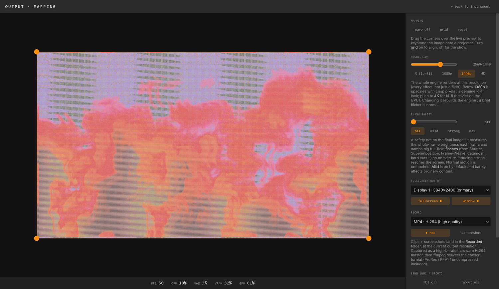

*The keystone editor with its four corner handles over a live mirror of the
output, and the right column holding resolution, flash safety, display + record
controls. The HUD runs along the bottom.*

### Fulldome

The **Fulldome** section of the Output page turns the output into a **domemaster** : a square,
equidistant fisheye with the zenith at the centre and the **front of the dome at the
bottom** (the fulldome standard, what a planetarium or the SAT Satosphère takes). The
engine keeps rendering the flat composition at its own size; one pass maps it into the
master at **2K or 4K**, and the master replaces the flat frame **everywhere** : the
preview, the projector window (letterboxed, never stretched), NDI, Spout / Syphon,
recordings and stills. Keystone warp is off in dome mode (a dome is mapped by its own media server).

- **Aperture** 180–230° (210° default : the Satosphère's 210°, its rim 15° below the
  horizon). The Satosphère takes **4096×4096 max, live over NDI** on its 10 Gb network.
  The dome records in **DXV3** at full 4096² (see Record). The live master stops at 4K :
  an 8K master cost about 1.9 GB of video memory on its own and pushed the graphics
  driver into resets (blue screens) during dome shows.
- **Three ways to fit a 2D picture to a dome** :
  - **full dome** (the default) : the WHOLE Palinopsia frame over the WHOLE 210° :
    its centre at the zenith, its edges all around the rim. **fill** uses every pixel of
    the frame and leaves no black anywhere inside the dome (a square-to-disc projection
    curves the frame to the circle); **cover** spans the dome with the frame's height and
    crops its sides; **contain** keeps the whole frame inside with black around it.
    **scale** and **offset** move it on the master.
  - **panorama** : the picture wrapped around the room. **turns** (how many times it goes
    around; fewer = more horizontal stretch), **mirror seams** (alternate copies mirror so
    the repeats join), **top / bottom** (the elevations its edges reach : 90° is the
    zenith, −15° the rim of a 210° dome), and what fills the **zenith** above a lower top
    (fade / stretch / black).
  - **screen** : the picture hung on the dome as a flat virtual screen, re-projected so it
    reads **undistorted from the centre** (a giant cinema screen) : **azimuth, elevation,
    width, roll**, with a dim wrapped **surround** so the dome is never black.
- **rotate**, a continuous **spin** (°/s), a **feather** at the rim, **flip**, and a
  **grid on output** : 10° rings, 30° spokes, the horizon in cyan, the front meridian in
  red, burned into the master for projector alignment.
- **3D dome simulator** (the in-app port of the TouchDesigner *FulldomeSimulator*) : the
  live master wrapped back onto a dome. **inside** puts you in the seat (drag to look
  around; wheel out widens the lens, then keeps going by **backing off** away from the
  centre, the wall it passes through hidden, until the whole inside is in view; wheel in
  comes back); **whole dome** jumps straight to the entire inside at once, seen from
  below the opening; **outside** is a cutaway orbit (the near shell hidden so
  the far half reads the right way round). **tilt** (for tilted planetariums; the
  Satosphère is level), an alignment **template** at low opacity, and the **sweet spot**
  patch (width, low / high elevation, off by default) where an audience facing front
  naturally looks. It reads a small copy of the master straight from the engine, so
  the Output page keeps full frame rate even with a 4K master.
  **master** shows the flat domemaster instead. Double-click the view to reset the camera.
- The dome mapping lives on the machine (the venue) **and** travels with the session (the
  piece). The dome itself always starts **off** (a restart or a session load never switches
  it on) and its section starts collapsed. The section's **↺** puts every dome setting and
  the simulator back to their defaults, leaving the dome on or off as it is.

### NDI

The network video link, **built in** both ways : no plugin, no OBS, no Spout-to-NDI bridge.

**NDI input** : a layer's source menu → **NDI Input…** lists every NDI source on the
network (and on this computer) : a camera, a phone running an NDI camera app, OBS, NDI
Tools, another Palinopsia. Pick one and it plays in the layer like a webcam (framing, FX,
blend), received at full quality and shown the right way up; **Switch input** in the
Inspector changes it. Several layers can show the same source (one receiver). A session
remembers the source by name and picks it up again when it appears on the network.
Listing never turns the camera on. Over Wi-Fi, prefer NDI HX sources (compressed); a
closed network with no internet is fine (NDI finds sources on the local network), and a
Discovery Server (below) reaches other subnets.

The layer always shows the **newest** frame : when Palinopsia renders slower than the
source, frames are skipped, never queued, so the picture cannot drift behind. The
Inspector shows what arrives : picture size, frames per second, and how far behind the
sender it is (when both clocks agree : the same computer, or synced clocks). Measured on
the Aero (on its integrated graphics, so a floor) : a 1080p source arrives ~45 ms behind
at the source's full rate; a 4096×4096 one ~110 ms behind with the app still at 53 fps. Sources that large are heavy for NDI's
own codec (about 15 fps on a laptop CPU) : send 1080p or 2K when motion matters.

**NDI output** is
how a fulldome venue takes the picture (at the SAT, the artist's machine sends and the
mapping server driving the projectors receives). Turn it on in the **NDI** section of the
Output page; it stays on across restarts.

- It sends the **clean** picture (before keystone), or the **domemaster** when the dome
  is on : 4096×4096 at 30 fps is the Satosphère's format, and it holds that rate (measured
  into a receiver) even with a scene that keeps the GPU full, and even when the Palinopsia
  window is **minimized or covered** (the render loop no longer depends on the window
  being painted).
- **Name** (receivers see `MACHINE (name)`), **rate** (25 · 29.97 · 30 · 50 · 59.94 · 60,
  declared and paced), **size** (native, capped at 4096, or 4096 / 3840 / 2048 / 1920 /
  1280), **format** (UYVY, NDI's own 4:2:2, converted on the GPU : the default; or RGB).
- **Network** : a **Discovery Server**, the **network card** to send from, **extra IPs**
  for receivers on other subnets, and **groups**. These apply to Palinopsia's sender
  only (your machine's NDI settings are untouched) and take effect at once.
- The status line shows whether a receiver is connected, the rate actually sent and the
  size; **ON AIR / PREVIEW** tally lights up when a receiver's switcher has you on
  program or preview; a warning appears when the rate falls behind.
- **The NDI runtime** : Palinopsia uses its own bundled copy when the build has one, else
  the machine's NDI (NDI Tools / Runtime / SDK), else the copy another creative app
  carries (TouchDesigner, Resolume, vMix…). The section names the one in use. NDI is
  tested on Windows; the macOS and Linux paths are written but untested.
- **A computer with no NDI at all** : the section offers **install NDI runtime**. One click
  downloads NDI's official runtime installer (about 10 MB on Windows, 5 MB on macOS,
  the link NDI's own SDK gives applications), checks it came from NDI over HTTPS with a
  valid signature, and opens it. You go through NDI's installer (and its licence);
  Palinopsia keeps looking meanwhile and goes live **by itself** as soon as the install
  finishes, no restart. On Linux (no installer exists) it points to the NDI SDK.
- To ship the runtime inside a build instead, install the NDI SDK or NDI Tools and run
  `npm run ndi:bundle` before building (see `resources/ndi/README.md`).

How it is fast enough : the GPU converts the frame to UYVY and reads it back
asynchronously (a ring of six buffers; a capture is skipped rather than ever waiting on
the GPU), the frame is **transferred** (not copied) to the sender in the window's own
preload, and NDI reads it in place with its asynchronous send. Moving a 4K frame to any
other process costs 30–90 ms in Electron, which is why the sender is not a separate process.

NDI® is a registered trademark of Vizrt NDI AB.

**If the GPU driver resets** (a Windows TDR : heavy sessions across two displays
can provoke one), the picture no longer dies for good: both the main window and
the output window listen for WebGL context loss and rebuild their compositor when
the context comes back, with a forced rebuild after 6 s as a fallback. You lose
what was in the feedback and Context history buffers; you do not lose the session
or need to restart.

## Sonify : image to sound (key `S`)

The instrument's sound half : the image itself synthesizes audio, in real time,
inside the app (an AudioWorklet engine : no external software). A full-page
takeover: the live composite mirrored large with the **probes drawn on it** : because the probe is the instrument, plus the nine voices' strips and a master bus. Every parameter explains itself on hover.

**The nine voices** (each one lineage of the sonification literature):

| Voice | Mapping | Register |
|---|---|---|
| **Spectra** | The frame as a spectrogram : a column of 96 partials reads the image under a scan line : vertical position → pitch, brightness → loudness. The line **sweeps** (tempo-syncable, one sweep per bar) or **holds** (drag it), along a **reading path** : horizontal · vertical · radial (a rotating ray) · **spiral**, with an optional **breathe** that slows the sweep at the edges and rushes the middle. | ANS · Metasynth · vOICe · Aural Mirror : shimmering masses; the musical one |
| **Orbit** | The frame as a **waveform** : an orbit (circle or Lissajous) reads pixels at audio rate : the image *is* the oscillator, so the visuals mutate the timbre live. Drag the centre and radius on the mirror; pitch is a note or free Hz. | wave terrain · Oramics : alive, analog-adjacent |
| **Flow** | Whatever **moves** sings : each moving region fires a grain : position → pan, motion energy → loudness, height → pitch. Onsets are dithered across the frame interval so 30 Hz control never quantizes audibly. A **color** amount steers each grain's **timbre** from the color it sits on : saturation brightens (vivid = edgier), hue tints (warm hues → a rounder sub-octave body, cool → an octave-up shimmer). | Pelletier's flow fields · Aural Mirror's granular : Gestalt grain clouds |
| **Events** | Edges and motion are **struck as discrete notes** : a salience field (**spatial** Sobel edges : fires on a still · **motion** frame-difference · **blend** : a moving edge dominates) picks one peak per region and plucks the strongest as scale-quantized notes : pitch from height, velocity from strength, pan from position, and **highs decaying sooner** (a struck-string touch). sine / triangle / saw / square. | after Remo DeVico's *Aural Mirror* : articulation, rhythm |
| **Raster** | Audification : a draggable **probe rect** read row-major as raw samples : the rect's contents *are* the waveform (edges buzz, gradients hum, datamosh blocks tick). One full scan = the period, so pitch is a note or free Hz; **smooth** 0 is the hard aliased register. | Ikeda · Yeo/Berger raster scanning : harsh, digital |
| **Transmission** | The SSTV register : the image scanned line-by-line as a **monophonic FM voice** (black 1500 Hz → white 2300 Hz) with the 1200 Hz **sync tick** as a metronome. Line rate free or synced (one line per 16th). The melody *is* the image rows. | slow-scan TV : narrative, decodable |
| **Filter** | Sonify **without synthesizing** : 48 band-pass filters whose gains come from the image under the (sweepable) line : **noise** or **live line-in** played *through* the frame. Same **reading path** + **breathe** as Spectra. Wide resonance = wind, narrow = flute; band centres can snap to the scale (a resonant harmonic wash) over their own octave range. **loop** replays one frozen stretch of the noise : a few hundred milliseconds flutters, a few milliseconds buzzes (0 = free noise). | Metasynth's Filter room · Pelletier's wind |
| **Collage** | The **films of a Collage source, heard all at once** : every film plays its own sound in its own loop window and speed (held to its picture within a few hundredths of a second, seeks and re-deals included), and every **piece** of the wall is its own voice : a **point source** placed by its position in the frame (left pieces left, centre centre; the film folds to mono so a centred piece really sits in the middle, at the same loudness wherever it is), then rung through a **harmonic resonator** (band-passes on a note and its 2nd and 3rd harmonics) tuned to the Sonify **key / scale** by the piece's **distance from the centre** : the centre sings the lowest note, the pieces rise toward the frame's edges in every direction (up to 64 pieces, 64 resonances). **resonance** goes from the plain films to only the tuned rings (as loud either way), **ring** from a broad colour to a singing tone, **harmonics** weights the overtones, **range** sets the octaves, **width** the stereo spread. Nothing cuts : a new **deal** crossfades, the old pieces fading out as the new ones come in, over the Collage's own **crossfade** time (a quick declick at 0), and a film taking a new clip or looping its window splices with a short crossfade, the old sound playing on until the new one sounds. Masked pieces fall silent, a hidden or muted layer goes quiet, a fading one fades. It hears the ORIGINAL files, so an optimised wall (whose caches carry no sound) still sings. A **Ring bank** (inspired by the S-4) then rings the whole voice through 48 resonant band-passes on the key / scale across its range : **wet** (mix or send), **decay** (12 ms of plain filtering up to 10 s of singing, *sustain* or *choke*), **cutoff**, **peak**, **slope** (low-pass, band-pass, high-pass), **tone**, **tilt** (highs ring longer, or lows), **waves** and **noise** (a travelling or random level across the bands, free or locked to the tempo in straight, triplet or dotted divisions), **detune** (the bands wander, the two sides apart) and a **voicing** (Clean, SEM, MS-20, Steiner, K35 : the filters of Loopex; the driven ones clip inside each band, so their grit never turns the pieces' notes into a ring-modulator rasp). It keeps the voice at its own level; wet 0 is the plain voice. Only active while a Collage with films is in the composition. | a sound collage : the wall's own audio, tuned and placed by the picture |
| **Chord** | A **scale-tuned chord bank** : a few oscillators (2–16 notes spread over the range), one per horizontal **band** of the frame, each note's loudness following that band's brightness : slewed with a **swell** / **fade** so it sustains into a chord that breathes with the image. Unlike Flow it **sings on a still frame**. Low notes = bottom of frame, high = top; **waves** sends a travelling level across the notes (free or tempo-locked) so a held chord keeps moving, **tone** brightens, **spread** fans the bank in stereo : the bass stays in the middle and the notes above alternate right and left, the highest widest. **noise** blends in a smooth pink noise : a band of it on every note, swelling, fading and riding the waves with its note, so it breathes with the chord; **air** sets the bands' width, from a narrow pitched breath around each note to a wide pink wash (same loudness at any width). | after Remo DeVico's *Aural Mirror* : sustained harmony from light |

**Shared FX tail : Reverb / Delay** : one **send** feeds the whole mix into an
analog **BBD delay** → a high-quality **reverb**, returned to the master (the tail
rings out when you pull the send back). Both are ported from the Essaim / Res
instruments. The delay is bucket-brigade: tape-glided **time**, **feedback**,
BBD **tone** (dark analog repeats ↔ bright) with wow/flutter, mono / stereo /
ping-pong. The reverb is a modulated 8-line FDN with two colourings : **Quartz**
(a dual-band-damped pad-verb) and **Prism** (per-band frequency-dependent decay), with full control : **size · decay · damp · predelay · shimmer · width · low-cut ·
freeze**, plus Quartz's **diffusion / low-damp** or Prism's **crossover / low× /
high×**, and its **mix** (its level in the tail : 0.6 is the usual level, 1 is
wetter). A `❄ freeze` holds the tail forever. The tail plays out every echo before it
stops : the delay line empties before it goes quiet.

**Adaptive sources** : each voice listens to one of two **taps** : the
composited master output or any single layer's post-FX image, so different
voices can sonify different layers (a real ensemble). **Quantizer** : a global
key (root + **root octave** + scale : chromatic, major, minor, pentatonic,
whole-tone, modes) with a per-voice **♪ snap** : sonified data lands on real
notes, or runs free. **Master** : gain + an always-on peak limiter (the audio
Flash-safety) + a level meter (left and right : the bar is the average level, the tick
the peak held a moment, on a dB scale from -54 to 0 with lines at -36, -18 and -6, the
peak in dB beside it; yellow above -9 dB, orange while the limiter works; measured
after the master and the limiter, so it is what reaches the speakers), and an
**output-device picker**. While the engine
plays, **recordings carry the sound** (DXV3 included), even when you switch it on
mid-take : exports become true audiovisual pieces.

**Mixer** : the **mixer** view (voices · mixer · seq, all three built from the same
cards as the voices). The mixer shows all nine voices as
channel cards : on/off, **volume**, and a per-voice **HP/LP filter** (a DJ-style
tilt, ported from the Essaim instrument : one knob sweeps a 3-stage lowpass down or
a highpass up, centre = bypass), plus the FX-tail send / delay / reverb mix.
**Presets** : name + save + a load dropdown keep whole Sonify patches. **🎲 dice** :
one in the header re-rolls the whole instrument (always keeping at least one voice
that sings on a still frame); one at the top-right of each voice box re-rolls just
that voice. **↺ default** resets every voice / FX / mixer setting to the factory
patch. Each voice box carries an **ⓘ** with its full description. The whole audio
path is NaN-safe : a wild random patch, or a NaN arriving over OSC, can't get the
reverb/delay stuck or mute a voice. Switching a voice on or off (by hand or from the
sequencer) fades it over 5 ms instead of cutting mid-cycle, and every gain glides : no
clicks, no zipper. The probes are drawn and dragged on the picture itself (the mirror
letterboxes it), where the engine really reads : a held line follows its own reading
path, the Orbit shows its true Lissajous shape, the sweeps run at their real rate.

**Sequencer** : in the **seq** view (voices · mixer · seq), a step sequencer lets the sound *evolve on its
own* : each step stores either a **voice on/off mask** (a rhythmic pattern over
the current patch) or a **whole saved preset** (a structural change), so a full
evolving sonified piece can be built. The rate is free (80 ms – 6 s, log, on its own
**every** row) or beats and bars of the composition tempo (1 beat … 16 bars). Three
advance **modes**, ported from dataFLOU's generative section: **forward**,
**bounce** (each cycle's steps accelerate like a settling ball, the total cycle
time preserved) and **drift** (a biased random walk with a **wrap** or **reflect**
edge). A **🎲** re-rolls the pattern (1–3 voices per active step, presets kept)
and a **↺** resets it; the section grows to fit its steps (no scrollbar). Its
play/stop is MIDI-learnable (the Sonify-sequence transport).

Both sequencer cards resize : drag the bar at a card's foot down for more air between
its rows (up for less; double-click goes back), and its left corner sideways to widen the
sequencers' column, which keeps its own width apart from the voices' (the column's
edge handle works too). Remembered on this machine.

**Key sequencer** : under it, a second sequencer composes the **root, scale and
octave** of the whole instrument over time, so a piece can modulate on its own. Each
mode is drawn as it thinks, under its mode strip (a key's color is its place on the
circle of fifths) : the list's tiles, the circle of fifths with the walk's lean and leap,
the affinity constellation (closer = more shared notes, bigger = likelier), the pivot's
note clock and degrees, the picture's hue wheel and moods. On
each tick of its clock (**rate** : 1 beat … 16 bars of the composition tempo, or free
time : 250 ms to 5 min, 5 s by default, the default rate), a **chance** decides whether the key changes, and an optional **Euclid** rhythm
(pulses / steps / rotation) decides which ticks may change it. Five **modes** :

| Mode | The next key |
|---|---|
| **List** | the keys you write (root, scale, octave; up to 8), **forward**, **bounce** (there and back) or **drift** (a random walk, with a bias) |
| **Circle** | a walk on the circle of fifths : **flats ↔ sharps** lean, a **leap** of 1 to 3 fifths, and a **relative** % of hops to the relative major / minor |
| **Affinity** | chosen by the notes it shares with this one, **jarring ↔ smooth**; **no repeat** skips the last few keys, **tour** visits the whole pool before anything comes back |
| **Pivot** | **same notes** on a new tonic (C major, D dorian, E phrygian, F lydian, A minor) or the **same tonic** in a **brighter** / **darker** mode |
| **Picture** | read off the picture : its **color** picks the root around the circle of fifths (a grey picture keeps it), its brightness the mood (bright lydian … dark phrygian), on the clock or at each scene **cut**, never faster than **hold** |

The generative modes choose from a **pool** of roots (12 toggles) and scales (8 chips).
**Glide** (0 … 4 s) slides every pitch to the new key instead of jumping : Spectra,
Chord, the Filter bank, the Ring bank, Orbit, Raster and the Collage resonators retune
along an eased curve on the audio thread. A key set by hand (or over OSC, or by a
preset) while it runs becomes its **home** and the walk carries on from there;
**↩ home on stop** goes back to it when you stop. While it runs, the effects
sequencer's preset steps keep the key. Both sequencers read **one Sonify beat
clock** : one started while the other runs on the beat waits for the next bar, so
they stay in phase. The key sequence travels with the session (an installation
starts it again), its play/stop is MIDI-learnable, and OSC drives it :
`/opsia/sonify/keyseq/on`, `/next` (a change now), `/mode`, `/glide`, `/chance`.

**✨ Auto-voice** : one button reads the session's actual vocabulary : which
generators, nodes and FX are live on which layers, and picks the fitting
voices by register : glitch/datamosh → Raster, motion/video → Flow, feedback →
Orbit, line-work → Spectra, scan registers → Transmission, atmosphere → Filter,
edges and marks → Events, drones and slow accumulation → Chord, and a Collage with
films (on a layer or the background, folder or assemblages) → the Collage voice. A set
that would fall silent on a still frame (only Flow and Events) always gets a voice that
sings on one. The strongest voice taps the layer that earned it; your key, gains and
probes are kept. Deterministic : the same session always suggests the same setup.

**Fully integrated** : not just every probe and pitch (scan columns, orbit centre/
radius/pitch, the raster rect and its pitch) but **most timbre & motion params** : Spectra gain/contrast/sweep/breath, orbit drive/smooth, flow grain/colour, events
decay, raster smooth/tone, SSTV line/transpose, filter resonance/sweep, chord tone/
spread/swell/waves, the Collage voice's resonance/ring/width and its Ring bank's
wet/decay/cutoff/waves/detune, and the FX send/reverb/delay : are **modulation targets**. Bind M1–M8
or a Meta knob via the M chips on the Sonify strips, and the mod-matrix stirs the
listening the same way it stirs the image (overlays show the modulated probes
live). The sound patch **travels with sessions and scenes** : recalling a scene
switches the sonification with it (the on-switch and output device stay
machine-local). And the whole page speaks **OSC** under `/opsia/sonify/…`
(on/master/root/**rootoct**/scale + per-voice on·gain·pan·probes·pitches·params,
the **Chord** bank, the **Collage** voice `/collage/{on,gain,resonance,ring,harmonics,width}` and its Ring bank `/collage/{bank,send,decay,choke,cutoff,peak,slope,tone,tilt,waves,wavesrate,wavessync,noise,noiserate,noisesync,detune,voicing}`, the Chord's `/chord/{waves,wavesrate,wavessync,noise,air}`, and the **FX** tail `/fx/{send,delaytime,feedback,size,decay,
damp,reverbmode,freeze,…}`, plus the taps `/tap/{a,b}` (0 master, 1-4 a layer), each
voice's `/tap` and `/looct` `/hioct`, `/spectra/sync`, `/orbit/shape`, `/filter/loop`) :
advertised over OSCQuery and streamed outbound like everything else. Index addresses
(the root octave, the reading paths, the Orbit shape, the chord's voices, the delay and
events modes, the octaves) are advertised and sent as **integers** and read raw; a
float sent there is read as 0..1 across the range. Spectra also gained **breath** : a per-partial sine↔noise morph
(the Coagula blue) from glassy additive to breathy bands.

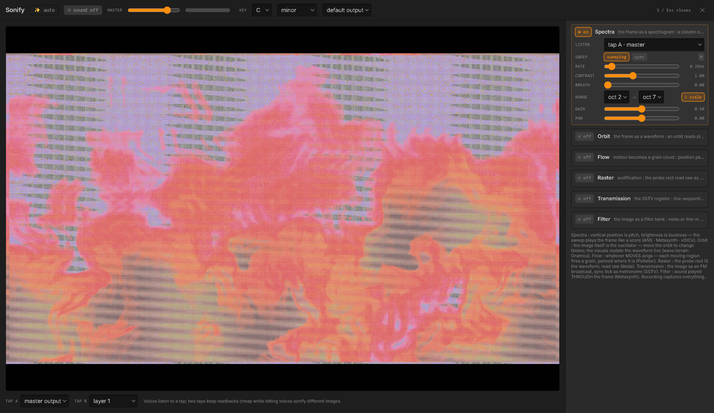

*The composite mirrored large with the probes drawn on it : the probe is the
instrument, and the voice strips on the right, each with its own tap, gain,
pitch and ♪ snap.*

## Assemble : the automatic editor (key `E`)

Concatenative synthesis for video : point the **assemble** tab at a folder of
films, and every file is segmented into shots and reduced to 18 visual
descriptors (brightness, motion, warmth, texture, drift…). The corpus becomes a
**point cloud where neighbours look alike**; an edit is a walk through it,
played live as a layer source, so it takes FX, blends and modulation like any
other picture.

- **Corpus** : `folder…` scans the folder's top level (`mp4 m4v mov webm mkv avi
  mpg mpeg mxf m2v dxv`). Codecs Chromium can't play (DXV, HAP, ProRes, DNxHD,
  MPEG-2) are converted **once** into the same cache your video imports use : first sweep of a heavy folder takes time, every later one is seconds.
- **Map** : the cloud, tinted by each shot's own colour. In *trajectory* mode,
  drag **A → B** and the edit travels that path.
- **Matching** : *free walk* (each clip chosen against the last), *trajectory*,
  or *follow the live output* (the edit chases what Opsia is showing, re-matching
  at every cut). The **similar ↔ contrast** dial asks for morphing joins or
  whiplash ones; **variety** loosens the choice; the weight sliders decide what
  "similar" means (set motion to full and colour to zero and it matches purely
  on movement).
- **Time** : output **length** + **loop**, then the pace machinery :
  **cut** sets the base cut length : `natural` keeps each shot's own duration;
  push right for a fixed pace (at **0.33s, a 10-second loop is ~30 cuts**; each
  cut then starts at a fresh moment inside its shot). The two **curves** (cut
  length · speed) shape how that pace and the playback rate evolve across the
  sequence : cross them for slow-motion stutter into accelerating cuts.
- **Generate** builds the edit onto the selected layer slot instantly; **Vary**
  re-rolls the same recipe; name + **save** keeps it in the bank; **export…**
  renders it to `Recorded/` via ffmpeg. Assemblages travel with sessions and
  scenes, and the Inspector shows a cut-timeline transport with `position` /
  `speed` as mod targets.

## Collage : a wall of films (key source `gen-collage`)

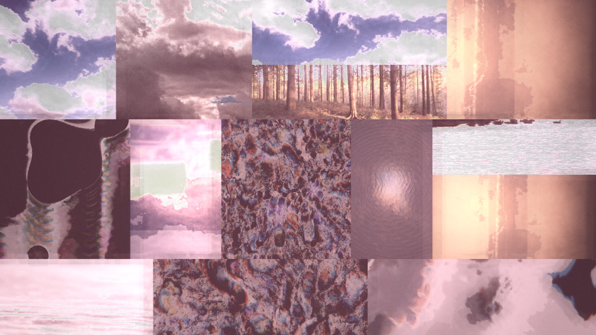

*Twelve different films at once, each cover-cropped into its own piece of the
Autocutter's partition : folder feed, no post work.*

Point the **Collage** source at a folder of videos and it plays every clip at
once, each inside its own piece of the **Autocutter's** cut-up partition : a
living mosaic where every fragment is a different film. Pick it as a layer source
(or the Background source), then open the folder from the Inspector.

- **Any format, any shape.** The folder scan takes the same codecs as Assemble
  and converts anything Chromium can't decode; portrait, landscape and 4K all
  **cover-crop** to their piece's shape, so nothing letterboxes or distorts.
- **Two feeds.** `folder` plays one film per piece; **`assemblages`** plays one
  of your saved Assemble edits per piece, each cutting on its own : selected from
  the Assemble bank in the same strip. The chosen edits copy onto the layer, so a
  session replays without the bank.
- **`films`** is how many decode at once (up to **50**); **more cuts than films**
  is fine : extra pieces show the same film at another crop and rotation.
  **`window`** loops a slice of each clip (0 = play the whole film, the smoothest
  setting); **`churn`** is how many pieces re-cut on their own fast clock, from
  all-holding to every-piece-its-own-montage.
- **`speed`** sets the films' playback rate and **`speed spread`** gives every piece its
  own rate around it; **`freeze`** stops the whole wall on its current frame (a toggle a
  modulator can play, see the [toggle law](#modulation-brain-8-modulators--matrix)).
  Layer Speed and the global speed scale the whole wall, films and clocks alike.
- **`deal`** re-deals the wall by hand, **`auto deal`** on a clock, and a **`crossfade`**
  dissolves one deal into the next instead of snapping. seams · contour · curve length ·
  torn paper · mask · rotate are the **Autocutter's own dials**, working identically here.
  **torn paper** tears like a real torn-magazine collage : along each tear one piece
  lies over the other, so only its ripped edge shows the white core
  of the paper (a hairline for long stretches, then deep bites), ragged at every scale
  with a few loose fibers, and it casts a soft shadow, longer away from the light. A
  tear over a masked hole drops its shadow on the layers beneath; the frame's own
  edges stay clean cuts;
  **`shape`** switches the pieces between the cut-up rectangles and a **Voronoi
  mosaic**, and a **contour mode** (normal / warped) chooses whether Contour frays
  **only the cut edges** (the film inside stays straight) or ripples the whole clip.
  Either way the film **adapts to its piece** : normal, warped and mosaic shapes all
  fill edge-to-edge with real video, no black in the cuts.
- **Modulate `cuts` freely.** One more cut splits ONE piece (the cut-up) or adds one
  shard (the mosaic) and every other piece keeps its place and its film, so an LFO on
  `cuts` grows and shrinks the wall instead of reshuffling it; `films` steps add or
  drop films without restarting the others.
- **FX before shapes** : turn it on and the source's own FX rack (the one under
  the Collage) processes the films only, then the seams, contours, torn paper and
  holes are drawn afterwards, crisp : blur, pixelate, glitch or recolor every film
  without softening the cut shapes. Off, the FX process the finished wall. (Torn
  paper then reads the neighbouring film mirrored across the tear.)
- **Light on the machine.** Frame uploads share a 4 ms budget per frame (the films
  that miss a frame go first on the next), auto deals faster than a second re-cut the
  wall among the films already playing instead of loading new files, a file that
  fails is never dealt again (its piece moves to another film), and a background
  Collage that isn't shown stops decoding after a second.
- **optimize** (a button in the strip) re-encodes the whole folder to 720p
  all-intra H.264 : the shape the wall's constant seeking wants. Slow (minutes for
  a big folder) but one-time and cached; measured to hold 60 fps with 50 films.

## Sessions, scenes & themes

Sessions are `.opsia.json` files: **New / Open / Save / Save As** in the toolbar,
plus **Ctrl/Cmd+S** (overwrites the current file, Save-As the first time). Theme,
worlds, scenes and the sequencer all travel inside the session file.

**A session file only changes when you save it.** Load, Open, New, Generate and
quitting ask **Save changes to “…”?** (Save · Don't save · Cancel), and only when
the session on screen changed since it was loaded or saved; Don't save keeps a
recovery copy in `Sessions/.history/_unsaved`. A learned MIDI pad never stops the
show with a dialog : it keeps the recovery copy and never writes the session file.
**Every overwrite keeps the version it replaced** (the newest 30, in the hidden
`.history` folder beside the session) : right-click **Load** → **Earlier versions
of “…”** brings one back, and Save puts it back in the file. A 60 s autosave ring
(the last hour) covers crashes, and **Restore** after a crash reconnects the
session to the file it came from. **Save As** names the session after its file. Opening a session
also **pre-converts every video in its folder** in the background. A session also notes
whether Sonify and its step sequence were playing, so switching Sonify on or off counts
as a change; only [Installation mode](#output--mapping-key-o) acts on it.

The file pickers (Open, Link a folder of sessions, a Collage or Assemble folder) open
where they were last used, remembered across launches.

**Every change morphs over the MORPH time, live** : a scene recall, Randomize,
Variation, the sequencer, loading a session, New and Generate. Nothing freezes and
nothing snaps : with the same sources and switches on both sides, every number eases
over the whole morph (modulation included : the old modulators keep running while
their assignments fade out and the new ones fade in). When anything structural
changes (a source, an effect, a blend mode, a switch like mirror), the picture is
handed over layer by layer (top first, staggered) : a layer slot free in both
compositions, right beside the layer, hosts the new layer while the old one fades, a
true crossfade, then the engine moves it into its own slot without reloading
anything; otherwise the old layer fades out and the new one in. A new layer fades in
only once its shaders have compiled, so nothing pops. At MORPH 0 a change cuts (a
session holds the picture still until the new one has compiled, then dissolves).

**Scenes** are full-instrument snapshots recalled by bare **`1`–`9`** or a
double-click in the bank; recall crossfades over the **MORPH** time. Scenes
carry their sequencer tags and are saved inside the session.

**Session Loader** (toolbar) : a dropdown of every saved session + a **Load**
button, so you can jump between saved sessions without the file dialog.
**Right-click Load** to link a folder of sessions : every session in it (and its
subfolders) joins the dropdown under the folder's name, in name order (number them
01, 02… and they list in show order). The folder is linked, not copied : a session
saved there later appears too. The same menu lists the linked folders : click one to
jump to its first session, × to unlink it (the files are never touched).

**Generate** (toolbar) : a dropdown of **100 visual themes** in 16 families
(Analog Video Synthesis, Glitch/Datamosh, Cameraless/Direct Film, Optical/Op-Art,
Organic/Reaction-Diffusion, Data/Parametric, Feedback/Afterimage,
Cinematic/Atmospheric, Retro Screen, Minimal/Structural, Datamosh & Compression,
**Living Surfaces** (lichen, rust, mold, burning paper, dry earth, grown textures),
**Dome** (made for a fulldome : no vignette, nothing framing the edges, slow motion
overhead), **Film Wall** (your own films through a Collage, graded and damaged : it plays
the session's Collage folder, or the last one picked on this computer, and with none yet
stands in with painted sources and says how to pick one), **Node Workshop** (one recipe
node per theme, on the layer that reads the others), and, at the end, **Feel Studies**,
one theme per Feel macro with everything else held still) + a **Generate** button. Each
theme is a *recipe* : a tight source/FX pool drawn from the whole instrument (nodes that
read another layer are handed one that is in the scene), a Vibe palette, a matching World
(coupling + audio routing), Feel biases, and a way of **moving** : it binds a few
modulators across its layers in its family's manner (slow breathing for Organic, Living
Surfaces and Cinematic, drawn cadences for film, stepped and on the beat for Glitch and
Data, sine and saw sweeps for Analog), so every active layer has at least one moving
parameter while the master and the World's audio route are left alone. Generate builds
a whole new, coherent, on-theme session in place (unsaved; Ctrl+S keeps it). Pressing it
again re-rolls a fresh variation within the same theme.

## Metasurface : the continuous scene-space

The **surface** section (in the right column's Layers view, under Layer 4)
turns the discrete bank into a **continuous 2D plane** (Bencina, NIME 2005): every
scene is a point, and a cursor
**blends** between them, so you *navigate* the bank by dragging rather than stepping
scene-to-scene. Drag anywhere to move the cursor (it turns the surface on); drag a **dot**
to arrange which scenes sit near which; **arrange** re-spreads them evenly.

The blend passes **through** each scene (at a scene's own point the output *is* that
scene) and interpolates smoothly in between : a **local, natural-neighbour-style** weighting,
so only the handful of scenes around the cursor contribute (far scenes don't muddy the mix as
the bank grows). **Structure** (shader ids, counts, enums, modulator types) can't interpolate,
so it **snaps to the nearest scene**; only numeric params ease, and only across the scenes that
share that structure at each slot (a Datamosh's `refresh` means nothing to a Blur). A structure
change dissolves with a **speed-aware crossfade** (slow drag = long dissolve, fast = short), and
a **dead-band** around each boundary keeps the shaders from flip-flopping when you sit on a seam.
A faint **territory map** on the pad shows each scene's region (tinted by scene, soft at the
seams), and a readout names the two scenes you're between and by how much. Scene positions travel
in the session; the whole plane is playable over OSC : **`/opsia/surface x y`** is Pandore's
Trill Square.

**Draw sequencer.** Flip to **draw** and sketch a path across the plane, then **play** : the cursor auto-traces the drawing so the output morphs through scene-space hands-free.
**time** sets how long one traversal takes (up to 60 s); **way** picks the direction (forward ·
backward · ⇄ ping-pong); **⟳ loop** closes the path end→start so forward play flows around
instead of teleporting; **jump %** randomly teleports the playhead to other spots on the path
(a stutter : 0 % is a clean trace, higher values fracture it); **wiggle %** adds a smooth
sinusoidal wobble around the traced position (a vibrato, distinct from jump). The drawn gesture
and its timing travel in the session. Drivable over OSC too: **`/opsia/surface/play`**,
**`/time`**, **`/jump`**, **`/way`**, **`/wiggle`**, **`/loop`**.

## Randomize & Vary

**Randomize** is structural: it doesn't just re-roll parameters, it rebuilds its
targets : picks generators per layer, builds FX racks of random length, enables
2–5 modulators and rolls a fresh mod-matrix. Every float draw comes from the
shader's **curated aesthetic sub-range**; colors stay matte.

Scopes (the `▾` next to the button): **All · Sources · Source Parameters ·
Source+FX · Source FX · Layers · Layer FX · Master FX · Finishing · Modulators ·
Meta Knobs · Sonification.** All except *Meta Knobs* and *Sonification* are also
OSC-fireable (see the [table below](#inbound-control--instrument)).

Built-in guarantees so a roll always *plays*:

- **Never black:** at least **two layers** come up active, and the stack's bottom
  visible layer is forced to a stack-safe blend (normal/add/screen/lighten) at
  solid opacity.
- **Never static:** after the matrix roll, every active layer that ended up
  untargeted receives one solid modulation assignment.
- **Never blinding:** Finishing randomize holds brightness-critical params
  (levels, gamma, gains, bloom, haze) in tight neutral bands; the Flash-safety
  limiter guards the output regardless.
- The Vibe Palette, Context, the Background, and World slot-8 routing survive
  every global roll.
- **Deliberate settings stay put:** anaglyph 3D, the film hold, the output shape, Vibe's
  chord mode, the film damage and Context's blur are never rolled (by Randomize, the
  walk or Vary); a pinned dice range keeps the current value; palettes (Palette,
  Colorizer, Vibe) roll as one hue from near-black to pale, never five clashing colors.

The **intensity** slider (amt) turns a full re-roll into a *walk*: below 100%,
each unit keeps its structure with probability (1 − intensity) and is merely
jittered. **Vary** is the third mode: a baseline-anchored variant : structure
completely fixed, every continuous value nudged around the captured baseline.

## Undo

100 levels, gesture-grouped (a slider drag is one step). The history snapshots
the **whole session surface** : composition, scene bank, sequence, worlds, and
session name, so an accidental **New** or **Generate** really is one `Ctrl+Z`
away, scenes and all. The auto-sequencer's own advances are excluded so they
don't flood your history.

---

## Sources (41 generators)

41 sources produce an image from nothing (all but two : Collage plays a folder of films,
Silhouette reads the Body camera). Any generator can fill **Source A or B**
of any layer (and all but a few can be the Background source). Each ships curated
Randomize sub-ranges and its own preset bank.

<details>
<summary><b>The full generator catalogue</b> (click to expand)</summary>

| Source | Description |
|---|---|
| **Drift Field** | Slow directional noise flow posterized into matte bands over near-black, with an accent tint and a restrained edge chroma-split. |
| **Slabs** | Sparse horizontal slabs on a stepped clock with slice-jitter and a rare accent cell : the slice/shuffle glitch register, built to be blended. |
| **Contour** | Slow marching contour lines over a drifting, domain-warped noise basin : topographic matte line-work. |
| **Grid Drift** | A flat grid whose rows and columns breathe out of alignment, occasionally slipping whole lanes, with sparse filled cells. |
| **Ten Print** | The Commodore one-liner maze : every cell one diagonal, / or \, dealt by a seeded coin-flip. **Reseed ▸** re-deals the lattice on a trigger; audio scatter shivers the maze apart segment by segment. |
| **Particle Drift** | Sparse points carried through a flow direction with capsule trails, wandering inside their cells. |
| **Interference** | Two near-frequency line fields beating into moiré, handled as matte texture (never op-art); the beat crawls at the detune rate. |
| **Column Scan** | Horizontal scan lines vertically displaced by a drifting internal signal; brightness follows the slope. |
| **Ash** | Sparse particulate falling at per-column rates with lateral wander and flicker : near-black particulate weather. |
| **Murmuration** | A flock of points steered by one shared, slowly-turning wind field : coherent density waves pass through the crowd. |
| **Filaments** | Vertical strands swaying like kelp, each with its own rate and phase; drift leans the whole bed. |
| **Erosion** | Anisotropic ridged noise advected downward, carving streaks that gather and split : the geological register. `relief` lights it as carved ground (banks up, channels cut in) under one low raking light (`light angle`). |
| **Membrane** | One large soft mass slowly deforming in the dark : a breathing thresholded silhouette shaded by depth. `relief` lights it as a soft body (wrapped light, like flesh or jelly). |
| **Veins** *(native)* | Leaf veins and roots from the space-colonization model of Runions et al. (2005, 2007), the one botanists use to reproduce real leaves. A blade grows from its margin and its fresh tissue releases growth signals; each pulls the nearest vein, veins branch toward fresh signals and a signal goes when a vein reaches it. `kind` : **leaf, open** (it only branches, like a ginkgo), **leaf, closed** (veins meeting fuse into loops, like most leaves), **roots** (down from one to three collars through the soil, pulled by gravity). Widths follow the pipe model (a vein carries all it feeds : thick midrib, hair-thin veinlets). `density` (vein spacing, root collars), `thickness`, `rate`, `blade` color and amount, `cycle` (grown → hold → fade → a new one) and `regrow ▸`. Six presets. |
| **Slime Mould** *(native)* | The transport network of a slime mould (Physarum polycephalum), grown live by hundreds of thousands of agents after Jones (2010) : each senses the trail ahead-left, ahead and ahead-right, turns toward the strongest, steps and lays more trail, and the trail spreads and evaporates. A fine mesh forms within seconds and matures into a web of thin veins that thicken with traffic, prune and reroute; seeded as a `disc` it contracts and then migrates and forages with branching fronts. `sensor` (how far ahead it smells : wider meshes), `sensor angle` and `turn` (wide : cells and foam, narrow : long cords), `decay`, `diffuse`, `agents`, `shape` (scattered / disc / ring), `scale` (kept to the frame height), `contrast`, `glow`, `regrow ▸`. |
| **Mycelium** *(native)* | A fungal colony that really grows (hyphal-tip model) : tips run out from a few spores nearly straight, branch, bend toward fresh ground and fuse into the network where they meet it; the threads eat the soil around them, so the colony advances as a front over a patchy ground, bundles into cords, stalls when the ground is spent, then dissolves and a new colony starts elsewhere. `rate` paces growth and life cycle, `scale` (finer network), `width`, `density` (branching and spores), `front` (bright young edge), `regrow ▸`. `relief` raises the threads off the ground under a raking light. |
| **Swell** | An open water surface seen from above, no horizon : 24 wave trains around the wind `direction`, each at the speed its length gives it on deep water (longer waves run faster), so the sea builds and breaks up instead of sliding. Shaded the way water is : the dark body, a faint sky mirror, the sun's glitter on facets turned to it (`light angle`), whitecaps and wind streaks with `chop`. |
| **Congeal** | A self-referential feedback field: sparse seeds injected, then a domain-warped, decayed copy resampled each frame : material congeals and dissolves. |
| **Slit Scan** | A slit-scan of an internal oscillator : each column is the signal frozen at an earlier moment (time = position), a scrolling time-history. |
| **Ramps** | Clean voltage-style gradient signals (H / V / diagonal / radial / diamond), optionally stepped and drifting : raw material to colorize or key. |
| **RGB Oscillators** | Each channel its own 2D oscillator (waveform × frequency × phase), detuned so colour separates into drifting interference : the analog-video register, kept matte. |
| **Recurse** | Recursive geometry : a shape redrawn into a space shrunk, slightly rotated and shifted off-centre, cascading inward (a spiral, deliberately not a radial kaleidoscope). |
| **Shapes** | Hard-edged primitive fields (circle / ring / bar / cross / triangle), tiled and animatable : a matte source, or a stencil keyed through the A/B mixer. |
| **Op-Art** | Hard-edged optical-illusion fields (waves, grids, moiré, herringbone) with illusory motion : curated and minimal, at home under anaglyph 3D. |
| **Direct Marks** | Hand-drawn direct-film marks : ruled lines, dots or scratches in flat ink, appearing on a gate you can drive from audio (marks on the beat). |
| **Dye Field** | Subtractive pigment pooling over a near-black emulsion, disciplined toward decay and crystallisation : painted-on-film dye, never additive glow. `relief` lights the pooled dye as a thin skin of paint. |
| **Colony** | Living matter that grows across a surface, one `kind` at a time : **lichen** on granite (grey-green, orange and pale crusts cracking into areolae as they age, a black rim where colonies meet, bare rock where the ground is poor), **mould** on agar (a white growing margin, a green sporulating centre, rings), **burning paper** (a dim ember front, scorch ahead, char and ash behind), **rust** on steel spreading from scratches (orange, then red-brown, pitted and flaking; `palette` toward copper gives verdigris). The fronts have the roughness measured on real growth, colonies stop short of each other, all lit as a relief. `ground` : its own surface, or transparent so it grows over the layer below. `regrow ▸` starts again, `regrow every` cycles on its own; `grain` sets the cell size so it looks the same from 1080p to a 4096² dome. |
| **Ground** | The surfaces under the living things, built the way the real ones form and lit as a relief : **cracked mud** drying (plates shrink apart, cracks widen and their edges curl, a thinner second generation splits them late; `drying` fixed or on a 45 s cycle), **sand ripples** migrating under a veering wind (gentle stoss, steep lee, heavy minerals in the troughs), **rock strata** (beds of very different thickness, hard ones standing proud, laminae, joints that never line up), **wood** end grain (early / late wood, rays, drying checks), **bark** (furrowed plates, fibre). `palette` shifts each to an alternate material (red clay, black sand, limestone, walnut, birch). |
| **Scan** | A real photographed surface : the 30 CC0 ambientCG scans (rock, bark, sand, steel, paper, plaster, lava, snow…) with their colour, height, normal and AO maps, laid across the frame with **hex tiling** (every tile shifted and blended, so the scan never visibly repeats) and relit by the organic relief light. `drift` slides it, `weather` darkens the hollows, `color` fades to its grays. Put **Colony** above it with a transparent `ground` and lichen or rust grows over the real rock or steel. |
| **Fluid** *(native)* | A real fluid, solved live (Stam's stable fluids on the GPU, with vorticity confinement). **ink** : two inks in still water, pushed by wandering nozzles, blooming, folding and threading as ink does in a glass. **smoke** : hot plumes from vents on the floor, lifted by their temperature, rolling into eddies and spreading under the ceiling as they cool. **fire** : the same gas burning, colored by its temperature (deep red to yellow-white, blackbody), puffing as the hot column necks off, soot above. `flow`, `sources`, `source size`, `wander`, `swirl` (keeps the eddies spinning), `buoyancy` (ink sinks below 0), `viscosity`, `fade`, `rate`, `detail` (grid, kept to the frame height so 4K and the dome look like 1080p). `stir ▸` turns the water, `clear ▸` empties it. About 1 to 1.5 ms a frame at any resolution. |
| **Reaction** *(native)* | A Gray-Scott reaction-diffusion field self-organising into drifting spots, stripes, labyrinths and splitting critters, with its own zoom/pan/rotate framing. `relief` lights the pattern as a surface (coral, brain coral, skin) under one low raking light. Full-precision state on its own grid : the pattern keeps its size in the frame at 1080p, 4K and on the dome, runs the same at any frame rate (`rate` up to 3), wraps around (no seams when zoomed out), and a `scale` change reshapes the living pattern instead of restarting it. `regrow ▸` starts over. |
| **Metamorph** | Birth-from-within (Blu's *Muto* register): a solid organic silhouette lives on screen; each cycle a new form is born from a point inside the old one, grows, and replaces it : endless metamorphosis, matte white-on-black. |
| **Sync Osc** | A morphing video-synth oscillator : one waveform morphing saw → triangle → sine, with a sync control from scrolling → frozen; colorized between two tints. |
| **Differential** | Visual polyrhythm : several wave trains at integer speed ratios beating against each other, rendered as pulsing topographic contour bands. |
| **Solid Color** | A flat colour fill or a smooth 3-stop linear gradient at any angle : the quietest source, to key / tint / grade against. |
| **Organic** | Living elemental textures in motion : fire (flames that accelerate as they rise and puff out of phase, coloured by temperature on the blackbody curve), water (sunlight focused onto the bed by real waves : caustics from refraction), or nature (growing canopy); `vary` shifts each toward an alternate season. |
| **Text** *(native)* | Typography as a source : type in the Inspector; choose font / size / weight / spacing / position; a sidechain layer can fill the glyphs. A `crawl` runs it as a ticker along the baseline, `shrink to fit` keeps it in frame, `letter drift` loosens the letters, `reveal` types it out, and `lines` set to *one at a time* shows a line per `next line ▸`. |
| **Parametric** *(native)* | A literal audio → image reading : the audio bus as a hard raster, waveform trace, spectrum bars, or scrolling spectrogram (needs Audio ingest for real sound). |
| **Collage** *(native)* | A wall of films cut up by the Autocutter partition : a folder of clips, or your saved Assemble edits, one per piece (see [Collage](#collage--a-wall-of-films-key-source-gen-collage)). |
| **Grown** *(native)* | A texture that grows itself : a tiny neural network trained on a real scan (lava, mossy rock, bark) runs in every cell of a grid. From nothing the texture of the photo emerges, stays alive and heals where you damage it. |
| **Silhouette** *(native)* | The body in front of the Body camera, cut out of the room : **cutout** (the camera where you are, nothing elsewhere), **matte** (white on black, to key another layer or feed a Matte node), **shadow** (a flat colored silhouette) or **hole** (the room with you taken out). `trail` leaves fading echoes of the body. Listed with the live inputs; needs the Body camera with Silhouette on and never turns the camera on by itself (see [Body](#body--embodied-control-key-b)). |

</details>

Two gestures mined from the EYESY lineage run through the field generators:

- **Reseed ▸** (Ten Print · Slabs · Grid Drift · Shapes) : an event input that
  re-deals the generator's whole stochastic layout in one cut. Fire it from the
  Inspector, over OSC, or bind **M** to an audio modulator for the
  re-deal-on-the-beat gesture. A shader-side latch fires exactly once per
  rising edge, whatever drives it.
- **Audio scatter** (Ten Print · Slabs · Grid Drift · Shapes · Filaments · Ash) : each element (band, lane, cell, strand, column) rides its **own** live
  audio sample from a shared 128-sample waveform texture, so fields ripple
  element-by-element instead of pulsing globally. Silent input = perfectly
  still. Mirrors to the output window.

> Beyond generators, a source slot can also hold an **imported video** (see
> [Video sources](#video-sources)), a **live capture** (webcam / screen / device),
> or a **HIVE** HEVC-over-TCP network stream : each treatable through the slot's
> own Source-FX rack.

---

## Effects

### Where FX live

There are **five effect racks**: **Source-A FX** and **Source-B FX** (one under each
source slot), **Layer FX**, **Master FX**, and **Background FX**.

- **Any standard ISF effect below can be placed in any of the five racks** : placement is not restricted by effect. The picker (grouped by sub-category) is the
  same everywhere. Each unit has enable, dry/wet **opacity** (double-click → 1),
  drag-reorder, presets, a dice `⚄`, and a **reset `↺`** (the whole effect back to
  its defaults).
- **Right-click any effect** (its chip, or its name in the Inspector) to **copy**
  it, then **paste its settings** onto another unit of the same shader, or **paste
  it as a new effect** into any rack that can host it (the menu says where a shader
  can and can't go), plus **Assign and randomize modulation**, which seeds random
  modulation (a modulator source + a **Mul** depth) across a spread of the effect's
  parameters, and **Randomize modulation** (shown once the effect carries modulation)
  which re-rolls the source + depth of what's already bound. Sources are drawn from
  the modulators you have **enabled**. Right-clicking a **source's** name in the
  Inspector header offers the same **Randomize modulation** when it carries any.
- **Effects travel between racks.** Right-click an effect's chip for **Copy to Master FX**
  or **Copy to Layer N FX** (a fresh copy, settings and all). Or **drag** a chip onto
  another rack (onto a chip to drop it before that one, or onto the `+ fx` box to drop it
  at the end) : a plain drag **moves** it, and its modulation goes with it; hold **Ctrl**
  (or Alt) to **copy** instead. Right-click the `+ fx` box to paste a copied effect into
  an empty rack. An effect a rack can't host (a layer-only node into the Master, say) is
  refused with a popup saying why, and the drop marker turns red while you hover.
- **Master chain presets** : the `chain presets…` box in the Master FX strip replaces the
  whole master chain with one of **100** designed chains and sets the Vibe to match (the
  finalizers stay). The newer ones sit in three groups : **Time & memory** (Réponse,
  Sediment, Chronoscan, Eternalism, Afterimage, Decimate, Corrode, Feedback on the master
  bus), **Node recipes** (a node that reads another layer is wired, when the preset is
  applied, to a layer in use) and **Dome** (dome-safe : Context's vignette off, nothing
  framing the edges); they keep the scene's palette mix. The `chain on/off` pill beside
  it bypasses every master effect except the finalizers.
- **The source pickers have sections** : **Organic** (living matter : reaction, growth,
  water, fire, ground), **Analog** (the analog video-synth lineage : RGB Oscillators, Sync
  Osc, Slit Scan, Ramps, Column Scan, Differential, Interference), then every other
  generator. Type `analog` or `organic` to list a whole section.
- **Every picker is searchable : by concept, not just name.** Click the `+ fx` box, a
  source picker, a preset list or the Generate menu and type : the list filters by name,
  family, *and* a set of **keyword tags** written in a musician's vocabulary. So a **visual
  delay** → **`delay`** surfaces Réponse / Chronoscan / Light Trails / Motif; **`reverb`** →
  Réponse / Feedback / Sediment / Wide Time; **`bitcrush`** → Byte Corrupt / Compress /
  Dither / Posterize / Pixelate; **`compressor`** / **`eq`** → Grade; **`wavefolder`** →
  Wavefold; **`paint`** → Toile / Dye Field; **`particles`** → Ash / Murmuration; and
  **`glitch`** / **`vhs`** / **`detune`** / **`strobe`** / **`filter`** / **`video synth`**
  each surface their family. (Family names still work ("glitch"), and "atct" still finds
  Autocutter by subsequence.)
- **Every effect, source and modulator names itself on hover** : a plain-English
  sentence or two on the item's name in the Inspector, saying what it does.
- **Native nodes**: the three **sidechain** nodes (Transfert, Convolution, Mosaïque) are
  **Layer-FX only** : they read another layer as their input. The self-contained
  nodes run in any rack; Parallax runs in a layer or the Master rack (it needs the
  whole-picture depth map). The five **TouchDesigner recipes** (Remap, Luma Blur,
  Gooey, Matte, Lookup) run in any rack : they can read another layer (a Master-rack
  Lookup can take layer 3 as its palette) and fall back to their own picture when
  none is picked.
- **The three master finalizers** (Vibe · Context · Finalizer) are **pinned, locked,
  and always last in the Master rack, in that order.** They can't be added, removed,
  reordered, or duplicated : only bypassed.

An effect's position in a rack matters: effects apply top-to-bottom. Source FX treat
one slot before the A/B mix; Layer FX treat the mixed layer before its blend; Master
FX treat the whole composite before the finalizers.

### The catalogue (52 effects)

<details>
<summary><b>The full effect catalogue</b> (click to expand)</summary>

| Effect | Description |
|---|---|
| **Posterize** | Quantize tones into matte, gamma-aware bands. |
| **Dither** | 4×4 Bayer ordered dithering at a chosen dot scale, quantizing into few levels : matte texture, not noise. |
| **Chroma Shift** | Restrained RGB split along a chosen axis : subtle chromatic aberration. |
| **Pixelate** | Aspect-correct mosaic quantization of the sampling grid. |
| **Displace** | Drifting value-noise domain warp of the sampling coordinates : asymmetric, never radial. |
| **Scanlines** | Line darkening as controlled texture, with an optional slow roll : darkening only, no glow. |
| **Edge** | Sobel luminance contours, mixable over the source : matte line-work. |
| **Grade** | Brightness / contrast / saturation / lift : the master-rack workhorse. |
| **Slice Shuffle** | Horizontal band displacement on a stepped clock : cuts, not flow. |
| **Smear** | Pseudo pixel-sort : bright pixels streak along a direction with decaying taps, gated to highlights. |
| **Palette** | Re-color by mapping luminance through a 2–5 stop gradient, with band/blend morph and dither : duotones to full palettes. |
| **Threshold** | Luma key to hard two-tone with a soft knee and optional invert : carve shapes. |
| **Solarize** | Invert everything whose luminance clears a level, with a soft knee (Sabattier). |
| **Mosh Blocks** | Macroblock corruption on a stepped clock : displaced, sometimes channel-swapped blocks (datamosh register). |
| **Grain** | Physically-modelled noise per medium : film (clumped, midtone-peaked), digital sensor (shot / read / fixed-pattern), CRT (snow / dropout), VHS (smear / chroma error). Its **parasites**, counted in real scanlines, add a rolling hum bar, a faint RF weave and impulse specks on CRT; on VHS, wobbling line edges, a frayed head-switch tear, white dropouts with a recovery tail and, pushed high, a drifting tracking band. |
| **Streak** | Uniform 16-tap directional blur : camera-drag motion smear (not luma-gated). |
| **Sharpen** | 3×3 unsharp mask : makes dithers bite and posterized bands snap. |
| **Fold** | A single-axis mirror at a movable seam with a slide offset : one deliberate fold, kept asymmetric. |
| **Transform** | Zoom / pan / rotate the sampling frame (wrap or clamp), with **edge crop** (independent up / down / left / right insets); with Shape set, clips the layer into a geometric silhouette. |
| **Stutter** | Probabilistic frame holds : horizontal bands freeze independently on their own irregular clocks, with optional blackout. |
| **Sync Loss** | Vertical hold rolling away plus horizontal tear bands on a stepped clock : the broken-monitor register. |
| **Row Echo** | Chance-selected row bands freeze onto their top line and repeat downward : a line-hold smear. |
| **Byte Corrupt** | Bit-depth crush plus per-block arithmetic scrambling that folds channels into each other : data damage, with a warped block grid. |
| **Ringing** | Alternating-sign high-pass edge echoes repeating at a fixed distance : compression ghosting / over-sharpened broadcast. |
| **Tracking** | VHS tracking error : a noisy head-switch band placed by position and crept by roll, a wandering freeze line, analog x-distortion and tinted chroma bleed. |
| **Motif** | Spatial counterpoint : re-instantiates the image's gesture elsewhere, transposed (translated / rotated / scaled / mirrored) as directional echoes, never radial. |
| **Feedback Zoom** | The image feeds back through a zoom and twist, echoes marching inward / outward : mix-decay so trails converge instead of blooming. |
| **Force Lines** | Incrustation along the image's own lines of force : luminance-contour bands slide along the local gradient's tangent (alternating directions), the image cut and inlaid along its own structure. |
| **Aperture** | A projector's gate over the image : iris, slit, or film-gate rectangle, with a real gate's couplings: **flicker** re-rolls the opening on a drawn cadence, **defocus** softens the image as the aperture closes. |
| **Distort** | Ten warp modes on one control set : wave, ripple, bulge, pinch, swirl, shear, glass, corrugate, pull, turbulent. |
| **Slit Buffer** | A write head sweeps across the frame, freezing the live image into a buffer as it passes : a real slit-scan (normal / inverted / pendulum). |
| **Difference Bloom** | Frame-difference motion key : only what moved survives, spread softly; still areas fall to near-black. |
| **Triangle Flicker** | Triangle-wave rhythmic brightness flicker with an optional hard strobe and beat channel-shuffle : clock it to tempo. |
| **Colorizer** | Analog CV colorizer : luminance through gain + bias, soft-clipped, then a smooth 3-colour gradient (a scan-processor colouring stage). |
| **Wavefold** | Analog wavefolder on the video signal : drive the value and repeatedly reflect it inside [0,1], carving hard contour bands. |
| **Rutt** | Rutt/Etra-style scan processor : horizontal scan lines displaced vertically by the image's own luminance (a wireframe topography). |
| **CRT Screen** | A whole-tube finish : barrel curvature, edge chromatic aberration, scanline grille, corner vignette, rounded bezel. |
| **NTSC** | Composite-video crosstalk : YIQ encode/decode with **dot-crawl** artifacts, a **carrier** beat, chroma **fringing**, and **interlace field modulation** (even/odd fields pulled apart in hue and warp); the analog-broadcast register, cheap enough to run per-pixel at 60 fps. |
| **Pixelmask** | Stencil the image through a pattern (aperture grille / shadow mask / dot / line / bayer / noise); an RGB-triad option gives real phosphor stripes. |
| **Light Trails** | max()-blend trails : the brightest pixels persist and streak (long-exposure light-painting); optional drift. |
| **Decay** | Analogue generation loss : chroma bleed, block crush, head-switch jitter, a bounded feedback ghost, tape noise and dropout lines; only ever degrades. |
| **Abstraction** | One knob from representation to abstraction : luma-driven displacement + posterize + desaturation; a source dissolving into moving matter. |
| **Wide Time** | A temporal average across the last N frames : the image crossfades with its own recent past into evolving scapes (mean / brightest / add / screen / difference / darkest / burn, the blown-out one). Because those modes brighten or darken by construction, a **preserve** dial re-anchors the output's exposure to the live image (0 = the raw accumulated look, 1 = fully re-anchored) so you can keep the base colours readable without pre-compensating with contrast. |
| **Hue Rotate** | Rotate the image's hue, optionally weighted by luminance : the missing colour primitive, beautiful under a slow LFO. |
| **RGB Shift** | The three channels pulled apart geometrically (offset + independently scaled about centre) with an animated wobble : the channel-separation look. |
| **Granular** | Video granular synthesis : the frame shattered into a grid of windowed grains, each rotated / scattered / scaled, with a persistent buffer for temporal smear. |
| **Tiles** | An analysis/resynthesis grid : each cell its average colour, redrawn as a tile whose size follows its luminance (bright swells, dark shrinks to nothing). |
| **Optical Rain** | Shatters the image's edges into downward-drifting vertical streaks, each carrying a red/cyan disparity : a floating tactile texture under anaglyph 3D. |
| **Phosphene** | The retinal afterimage that names the instrument : a bright stimulus burns a lingering complementary-colour negative ghost that slowly decays. |
| **Compress** | Real intra-frame compression artefacts (the JPEG/MPEG keyframe look): macroblocks crushed toward DC + coarse low-frequency reconstruction, chroma subsampled so colour bleeds across luma edges. |
| **Databend** | The byte-editing register (the stream, not the motion): bands tear and jump on a stepped clock, some hold-and-repeat their top line, channels rotate out of registration. |
| **Pixel Sort** | The signature glitch pixel-sort : contiguous runs inside a threshold band pulled toward their brightest value along an axis, streaks stopping dead at the band edges. |

</details>

### Native nodes

These run a TypeScript class behind a header-only ISF (so the auto-UI, presets and
modulation still work). They keep **inter-frame state** : flow fields, frame rings,
accumulators. The three **sidechain** nodes (Transfert, Convolution, Mosaïque) read
another layer, so they are **Layer-FX only** and get a layer picker in the Inspector; the
**self-contained** nodes run in any rack (Faultline is happiest on the Master, where
the whole programme glitches at once).

The last five are **classic TouchDesigner recipes** : the TOP moves people reach for
in TD, as one-click rack effects. Each reads an optional other layer through a
labelled picker in the Inspector (**map**, **control**, **palette**; the three-input
**Matte** gets two : *input 2* and *matte*) and falls back to its own picture when
none is picked, so all five run in any rack.

<details>
<summary><b>The full node catalogue (25)</b> (click to expand)</summary>

| Node | Description |
|---|---|
| **Transfert** | Imprint another layer's **motion** onto this one (optical-flow transfer) : *Déplacement* warps by the sidechain's flow, *Traînée* is a flow-steered line blur. |
| **Convolution** | Treat another layer as a convolution **kernel** : every bright pixel of this layer stamps a scaled copy of the sidechain's shape, transferring its glare / texture / energy. |
| **Mosaïque** | **Spatial concatenative synthesis** ([Assemble](#assemble--the-automatic-editor-key-e)'s sibling on the other axis; after CIS + Image-Melding). The frame is cut into patches, and each is replaced by the **corpus tile** (from the sidechain layer) whose colour + structure match best : tiles flip/rotate and **re-tint** to fit, matches **hold** across frames so it doesn't boil. Cell **shape** goes grid → **brick** → **voronoi** (organic polygons of varying size) → **warp** (a noise-bent grid), with an **irregular** amount and a **drift** that slowly evolves the shapes; **melt** softens the seams. |
| **Réponse** | Temporal convolution : the layer's last 16 frames summed through a shaped attack/decay envelope (reversible): a convolution-reverb for image. |
| **Feedback** | A full video-feedback engine (LZX-Memory-Palace-class) : the last frame re-sampled through a drifting off-centre transform + self-displacement, held at the edge of chaos by AGC + a noise floor. **Couple** runs a second buffer under a diverged transform and cross-mixes it (emergent behaviour no single loop shows); a delay-tap ring with **RGB delay** (channels sheared in time) and an echo **route** (back into the loop, or feedforward onto the output only); blend modes. A **keyer** gates what re-enters : on **luma** (key black / white) or **chroma** (key desaturated / colourful), so only the keyed region trails; a **placement** switch puts the spatial process on the recirculating buffer (*feedback* : a wandering tunnel) or on the incoming live image (*painting* : the source smeared into a still accumulator that holds its shape); and a per-repeat **hue cycle** and **sat drift** bleach the trails toward grey or intensify them toward neon as they age. |
| **Datamosh** | The codec-mosh look, real-time and codec-free: optical flow quantised to macroblocks advects a feedback buffer (the P-frame smear). Refresh (the I-frame) down + a scene cut = the bloom; **sticky/melt/fluid** modes; **actants** : sparse autonomous frozen patches that drift along the flow; **manifest** reveals a new source only where there's motion; auto-bloom on detected cuts; motion-transfer from a sidechain; **flow-shaping** : a **mosh gate** restricts the smear to moving or to still regions, **edge-repel** pushes the flow off the image's own contours, and **re-sharpen** claws back the mush. |
| **Scanner** | A flatbed-scanner slit-scan : a head sweeps the frame, capturing each line at a different instant; anything moving mid-sweep smears and tears across the scanlines. |
| **Autocutter** | A cut-up collage : the frame recursively split into pieces, shuffled among their slots (and optionally rotated); the layout holds while live video keeps playing inside every piece, and re-cuts on `cut ▸` or an auto **rate**. Four dials shape the cut itself: **contour** bends the straight seams into uneven curves that still tessellate perfectly (past 1 it shreds), **curve length** trades many small wiggles for a few long, simple curves, **torn paper** tears the cuts like a torn-magazine collage (one piece over the other, the white core of the paper showing only along the upper piece's ragged edge, loose fibers, a soft shadow; the frame's own edges stay clean cuts), and **mask** peels pieces away into transparent holes : at full mask a single piece survives, and each new cut elects a different one. **Shape** switches between the rectangles and an irregular **Voronoi mosaic** (denser, more organic : every dial behaves the same in both). Set an **auto rate** and a **crossfade** to dissolve one cut layout into the next instead of snapping. Ships 9 presets from *Clean cut-up* to *Last piece*. |
| **Chronoscan** | Per-pixel time displacement over a ~32-frame ring : a control field (slit-scan gradient, luminance, noise…) sets how far into the past each pixel reads, so each region lives in a different present. |
| **Sediment** | Long-term image memory : a decaying long-exposure accumulator (seconds to **minutes**) plus a sparse keyframe store, so the deep past stays recallable and resurfaces through the present. |
| **Parallax** | Real 2.5D from the shared depth map : near features sway more than far ones, with depth-of-field around a focus plane and aerial fog (needs the Depth engine set in the header). |
| **Eternalism** | Persistence-of-vision as a signal path (Ken Jacobs): two temporal taps a gap apart alternate across a black shutter interval at a drawn rate : an unfrozen slice of time, held micro-motion going nowhere. |
| **Afterimage** | Goethe's complement : where a bright form **departs**, its negative/complementary ghost blooms back and decays; chroma sweeps the ghost from dark subtraction to full complement. |
| **Pulfrich** | Monocular 3D from a temporal eye-delay : one eye reads a delayed image (per-pixel, keyed by depth or luminance) so lateral motion becomes stereo depth; the disparity is temporal, not spatial. |
| **Corrode** | Durational corrosion that only ever grows : a blotch field seeds and creeps as the integrated bury level rises, eating the picture over minutes; it never recovers until you **exhume** (reset). |
| **Decimate** | Time-lapse / sample-and-hold : grabs a frame only every so often and holds between grabs; smooth crossfades the last two grabs from hard snap to continuous slow-tween. |
| **Melt** | A seam-local dissolve that **creeps** : reads the picture's own light/dark edges and, inside a band along each, dissolves the node's **own previous frame** back one-sided along the edge normal, so the boundaries between forms soften and slowly walk outward. Edge-driven, not motion-driven, so it keeps melting a still picture; **creep** direction/speed, band **width**, and an edge **gate**. |
| **Faultline** | A dirty vision-mixer : a **rate** clock and a **dirt** probability fire momentary **structural faults** at the output and the picture is completely clean between them (the SLIP skip-law moved to the blend stage). Each fire is one discrete fault : **dropout** (the signal loses lock and cuts out in sweeping streaks), **cut** (a hard cut to the frame frozen at the fire instant), **timebase** (a head-switch knock : scanline-block shear + field roll + a torn switch band), **noise** (a sweeping switching-static band), or **roulette** (a fresh pick each fire). **Depth** severity, **hold** length, **fire ▸** by hand / OSC / a modulator. Best on the Master rack. |
| **Sillage** | Advected-noise feedback (IBFV, van Wijk 2002) : a dye buffer is dragged each frame along a **flow field** and topped up with fresh filtered noise, so the noise smears into flow-aligned filaments (a line-integral / LIC look) and **decays into structure** instead of glowing : a wake of dye trailing the motion, reading as material, not neon. The field is a divergence-free **curl-noise** base (**field** : always flowing, so even a still image streams) plus the image's own **optical flow** (**motion** : its movement advects the dye); steer the wake anywhere with **wind** (a drift of strength *push* in any *angle*) and **swirl** (a spiral about the centre). **dye** tints the wake by the picture so it reads as its own substance, **flow** the streak length, **injection** the decay rate, **grain** the noise frequency. |
| **Toile** | Reworks the picture as a **painting that follows its own structure** : a structure tensor finds each contour's orientation, and the image is smoothed into strokes running **along** it (anisotropic Kuwahara), so forms flatten into coherent paint (steady frame-to-frame, not speckling) while the **edges are preserved**, not washed out. **line** adds flow-XDoG ink : clean outlines measured across each contour and smoothed along it, following the image's own structure. **brush** size, **flatten** hardness, **paint** amount, **line edge** threshold. The real *Peint* + *Griffé* as a rack effect. |
| **Remap** | TouchDesigner's **Remap TOP** : another layer's red and green channels become the coordinates each pixel of this layer reads from (red = x, green = y). A gradient layer bends the picture smoothly, a noisy one shatters it. **absolute** is TD's behaviour, **offset** displaces around mid-grey instead; **scale** / **offset x·y** reshape the map, **extend** picks hold / repeat / mirror past the edge, **swap roles** makes this layer the map. |
| **Luma Blur** | TouchDesigner's **Luma Blur TOP** : a blur whose width follows a control image's brightness : **black width** where the control is dark, **white width** where it is bright (pixels at 1080p). The control is another layer, or this layer's own brightness. **control = depth focus** reads the shared depth map around a **focus** plane instead : one depth stays sharp and the rest melts, a real **depth-of-field** blur (Resolume 7.28's Depth Blur, from a node you already have). |
| **Gooey** | The **blur-then-threshold** recipe : the picture is blurred (at half resolution) and cut at a brightness **level**, so shapes that sit close together melt into soft single blobs, the metaball / lava-lamp look. **blur** sets how far shapes reach for each other, **softness** the edge; **fill** shows the crisp source, the blurred colour pushed to full strength, or a white matte; **outside** keeps some of the source around the blobs. |
| **Matte** | TouchDesigner's **three-input Matte TOP** : this layer shows where the matte is bright, **input 2** where it is dark. Both inputs are other layers, picked in the Inspector. **matte channel** (luma / R / G / B / alpha), **low / high** levels to choke or soften the edge, **invert**, **swap 1 and 2**. No matte = this layer keys itself by its own brightness; no input 2 = black. |
| **Lookup** | TouchDesigner's **Lookup TOP with a live palette** : this layer is recoloured through a line drawn across **another layer**, so that layer's moving colours become the colour table. **index** by brightness, each channel on its own, or hue; **axis** + **position** place the line, **band** averages a stripe around it (calm colours from a busy palette), **offset** cycles the table, **cycles** repeats it, **mirror** folds it. No palette layer = the picture is its own palette. |

</details>

### Master finalizers : pinned, always last

| Stage | Description |
|---|---|
| **Vibe Palette** | The always-on colour-**mastering** stage: an **opacity** dry/wet on top, auto-levels (temporally smoothed min/max), gamma tone placement, palette map, source mix-back, contrast, saturation, and split-tone. Decides the whole output's look; survives every global Randomize. Ships 56 palettes. |
| **Context** | The always-on **depth** finalizer: temporal trails, a soft key light with volumetric bloom (place it on its pad, or **✎ draw** a path and **play** it : the light travels the drawing with the Metasurface's draw sequencer, direction, loop, time, jump and wiggle; **Vibe Color** lights it in the color the Vibe Palette is painting with), atmospheric haze, spatial blur (yours alone : it starts at 0, and New, Randomize, Variation, Generate and Worlds never set it; its ring-shaped blur and bloom are the default look, and `smoothing` gives the soft version), a depth vignette, a **void / edge-dissolve** (the frame's edges eaten toward black), and a **surface material** (project the composition onto one of 30 scanned materials; **evolution** keeps it from sitting still, as if a little wind moved the projector or the camera). Every parameter at zero is a clean passthrough. When Proximity, Coalesce, Flow, Gesture⇄Texture, the sequencer's Breathe / Arc or a modulator add blur, haze, trails or depth on top of the sliders, a line under Context's header says what the picture really gets (e.g. `live blur 0.23 · haze 0.13 ← Proximity, Coalesce`), and its **neutral** button puts those macros back to 0.5. |
| **Finalizer** | The last always-on stage: a final grade (input black/white + gamma + per-channel R/G/B gain, and an **opacity** that fades the whole picture to black), sharpen, and physically-modelled grain over everything (its **crt** and **vhs** characters carry the same scanline **parasites** as the [Grain](#the-catalogue-52-effects) effect), plus an **output shaper** (clip the frame to any of ~21 silhouettes with a drop-shadow, filled by a colour or the Background; a clean edge at any resolution, or as soft as its **feather** asks), the **anaglyph 3D stage** (`stereo`: off / red-cyan / grayscale, with depth, convergence and invert : this is where the shaders described as "at home under anaglyph" get their glasses), the **Cameraless film hold** (a hand-made-film pass: draw-clock hold + boil / flutter, granulation and splice; **grab ▸** re-draws or re-freezes it on a trigger), and **film damage**, modelled on real prints and working with or without the hold : **dust** that changes every film frame (24 fps, Super 8 18; mostly tiny specks, rarely a big mottled clump, dark on the print or white sparkle from the negative, the odd fibre), **scratches** that run along the strip (they last, wander slowly, break up, dark / white / emulsion-coloured, sometimes in tramlines), a **gate hair**, the **film gauge** (35 mm / 16 mm / Super 8 scales it all) and **dirt on** (print / mixed / negative), plus **burst ▸** : a dirty stretch of film passes the gate (four to eight times the dust for about a second, even with dust at 0), to fire on a beat or an onset (bind M, MIDI or OSC). Sizes are in fractions of the frame, so a 1080p render and an 8K dome master look the same. All of it ships **off on a fresh or New session** and is switched on by the direct-film Worlds (Griffé · Peint · Pressé) or by hand, so a blank slate never opens with specks over the picture. The **output shape comes last**, after the film hold and the damage : the film weaves and gathers dust inside a fixed aperture, and the fill outside stays clean. Neutral at defaults. |

In the **Finishing** view (key `F`) each stage is split into labeled sections : Vibe
Palette (palette · color chord · tone · split-tone), Context (softness · distance ·
light · surface material), Finalizer (grade · character · 3D · hand-made film · film
damage · output shape). A section's on/off switch sits in its header, and a section
switched off folds away until you turn it on (or click its header); rows that do nothing
right now are grayed, with the reason in their tooltip. Each stage's **↺** puts it back
as a New session starts it, every parameter included (modulators stay bound).

`toggleFinishing` bypasses/enables the three as one bank; they are excluded from
Randomize (only their own dice re-rolls their params, holding brightness-critical
bands neutral). After the finalizers, the **Flash-safety limiter** has the true
last word on the frame.

### Blend modes

19 modes, shared by the layer→stack blend and (via `sourceBlend`) the A/B mix,
in index order (for OSC): `normal, add, subtract, multiply, screen, overlay,
softlight, hardlight, darken, lighten, difference, exclusion, dodge, burn, wrap,
weave, lumakey, consume, lightercolor`.

**lightercolor** (TouchDesigner / Photoshop's *Lighter Color*) keeps the WHOLE pixel
of whichever side is brighter, so hues never mix channel by channel the way
**lighten** does : two pictures interlock as clean shapes instead of blending.

Weave, lumakey and consume are **relation modes**, at their best on the A/B mix:

- **weave** : each source's brightness displaces the other's picture, then the two
  interleave : a woven two-source warp;
- **lumakey** : B keys into A by luminance;
- **consume** : a *stateful competition field*: A and B fight for territory
  frame-by-frame (a reagent surface remembers who held each pixel), so the mix
  boils and creeps instead of crossfading.

They work as layer blends too, against the stack below : weave displaces the layer and
the stack by each other's brightness and interleaves them, lumakey keys out the layer's
near-black background, and consume runs the same competition field between the layer
and the stack (the brighter side eats).

---

## Resolume OSC mapper (key `K`)

A matrix to drive **any Resolume address from Palinopsia's signals**, sketched and
re-sketched live : rows are Palinopsia, columns are Resolume, click a cell to connect.
It grew out of a Max patch built for the same job (`udpreceive` → per-feature routes →
`speedlim` → `matrix 18 30` → `udpsend`), and keeps its habits.

- **Open .avc** reads a Resolume composition straight from its file : layers (with
  their names and groups), groups, columns, the current deck's loaded clips, every
  composition / group / layer effect chain, and each dashboard's links with the
  parameter each one drives. That becomes the columns, grouped per composition /
  selected clip / group / layer / columns / clips : **dashboard links** first (the usual
  way a Resolume set is built to be played), then masters, opacity, bypass / clear,
  effect bypass / mix / parameters, column and clip **connect** triggers. Groups fold
  shut; a folded group still shows the columns that carry a connection. **↻** re-reads
  the file after you change the set and save, keeping every connection whose address
  still exists.
- **Rows** : any modulator, Meta knob, audio / vision / body feature, or **any `/opsia`
  address** (the whole OSC surface). 18 by default, like the patch (8 modulators, 6
  picture features, 4 sound features). Each row has a **smooth** and a **gain**.
- **Pins** : click a hole to connect, drag to paint several, right-click a pin to set
  its **amount**. A pin wears its signal family's color (modulators, Meta knobs, audio,
  vision, body, OSC), grows with its amount and glows with what it carries; each column
  group has its own color band, rows show how many pins they carry, and the line under
  the board says what is under the cursor. Several rows into one column combine by
  **mean / max / sum**.
- **Columns** : **float** (with a **low / high** range : Resolume parameters take 0..1),
  **toggle** (0 / 1 with hysteresis) or **trigger** (sends 1 each time the value rises
  past the middle), a **smooth**, and a **test** (double-click the column : a float
  sweeps up and back, a trigger fires, a toggle flips) to find the control in Resolume.
- **Learn** : turn on Resolume's OSC **output** (Preferences › OSC, target
  `127.0.0.1` : Palinopsia's OSC input port) and move any control in Resolume : its exact
  address becomes a column. Transport positions and meters are ignored.
- **Add an address by hand** for anything else.
- **scene → column** : recalling Palinopsia scene N connects Resolume column N (+ an
  offset), the patch's scene trigger.
- **8 snapshots** of the connections : click recalls, shift+click stores.
- **🎲 Roll the pins** : every row gets none, one or two new connections at random
  amounts, among the unfolded groups' float and toggle columns (never a trigger, so no
  clip or column launches at random, and never the composition master); **↶** puts the
  previous pins back. MIDI-learnable.
- **Lock** : no connection, row or column can change (sending, snapshot recall and
  scene follow keep working).
- The mapping is **saved with the session**, lock and all.

Sending runs at the chosen **rate** (5–60 Hz); only connected columns send, a float only
when it moved, all in one batched message per tick. The **Resolume** section of the
audio/midi/osc tab shows whether it is sending (where, how many pins, messages a second),
turns it on and off, and opens the mapper. In Resolume : Preferences › OSC ›
**Input** on (port 7000 by default); set the same host and port on the page.

---

## OSC implementation

All addresses live under `/opsia`; anything else is ignored. **Every continuous
control takes a normalized `0..1` float** scaled to the target's declared range.
Enums accept a name (`s`), an int index (`i`), or a `0..1` float across members.
Bools/toggles are true at `≥ 0.5`. Triggers fire on the **rising edge**. **BPM is
the only raw value.** All indices in addresses are **1-based**.

The **OSC** section of the audio/midi/osc tab is in two halves : **↙ IN** (listen on/off,
the port, the address to send to, the last message) and **↗ OUT** (the destination,
**FEEDBACK** and **MARK**; the body rules' OSC goes there too), each with a light that
blinks with its traffic and its messages a second, also shown in the folded header.
**monitor** opens the OSC monitor : every message coming in and going out, live (time,
direction, address, values, and where an outgoing one went), filtered by direction and
by address, with pause and clear; its **latest** view keeps one row per address (last
value, how many, how long ago). It records only while open; the OSCQuery web stream is
another protocol and is not shown.

### Inbound (control → instrument)

**Layers** : `/opsia/layer{1..4}/…` (canonical; the segmented form
`/opsia/layer/{1..4}/…` is also accepted).

| Address | Type | Meaning |
|---|---|---|
| `…/opacity` | f | Layer opacity (0..1) |
| `…/speed` | f | Layer speed (0..1 → 0..20×) |
| `…/mix` | f | A/B source mix |
| `…/trail` | f | Feedback trail amount |
| `…/blend` | i / f / s | Layer blend mode (index, 0..1 across 19, or name) |
| `…/sourceblend` | i / f / s | A/B blend mode |
| `…/mute` · `…/solo` · `…/feedback` | bool | Toggles (≥ 0.5) |
| `…/source/{A\|B}` | s | Set source shader (id / name / `none`) |
| `…/source/{A\|B}/{input}` | f · color · point2D | A source shader input |
| `…/source/{A\|B}/fx/{i}/{input}` | f · color · point2D | A Source-FX unit input |
| `…/fx/{i}/{input}` | f · color · point2D | A Layer-FX unit input |
| `…/coupling/mode` | i / f / s | `off·lean·hocket·cut·gate·drift` |
| `…/coupling/amount` · `…/tightness` | f | Coupling depth / tightness |
| `…/coupling/feature` | i / f / s | `level·flux·transient·centroid·band·pitch` |

**Video transport** : `/opsia/layer{n}/video[/{A|B}]/…`. Without an explicit
slot, the message lands on the layer's first video slot (A, then B). Ignored
unless the slot actually holds a video.

| Address | Type | Meaning |
|---|---|---|
| `…/video/play` · `…/loop` · `…/grain` | bool | Play/pause · loop · granulation on (≥ 0.5) |
| `…/video/direction` | i / f / s | `forward·reverse·pendulum` |
| `…/video/speed` | f | Clip speed, 0..1 log across 1/64×..128× (the slider's range) |
| `…/video/position` | f | **One-shot seek** to 0..1 within the in/out trim |
| `…/video/in` · `…/video/out` | f | Trim points (0..1; kept ordered) |
| `…/video/grainsize` | f | Grain length (0..1 → 0.05..1 s) |
| `…/video/grainspray` · `…/grainrev` · `…/grainjit` | f | Scatter · reverse probability · speed jitter |
| `…/video/grainsync` | i / f / s | `free·1/16·1/8·1/4·1/2` (BPM grain clock) |

**Master** : `/opsia/master/…`

| Address | Meaning |
|---|---|
| `master/fx/{i}/{input}` | Master-FX unit input (the locked finalizers are excluded here) |
| `master/vibe/{input}` · `master/context/{input}` · `master/finalizer/{input}` | The three locked finalizers' inputs |

**Background** : `/opsia/bg/…`

| Address | Meaning |
|---|---|
| `bg/opacity` · `bg/depth` (alias `bg/shadow`) | f (0..1) |
| `bg/speed` | f 0..1 → 0..4× (`0.0625` = the default 0.25×) |
| `bg/blend` | bool → **group** (≥ 0.5) else **blend in** |
| `bg/randomize` | trigger : the Background's own dice |
| `bg/source` · `bg/source/{input}` · `bg/fx/{i}/{input}` | Background source (a ground's id or name, or `none`; anything else is ignored) / its inputs / FX inputs |

**Feel macros & temperament** : each a single `0..1` float:
`/opsia/density`, `/gesture`, `/coalesce`, `/proximity` (field macros; 0.5 = centre)
· `/opsia/flow` (0.5 = centre) · `/tonicity`, `/shutter`, `/drift`,
`/superflicker` (temperament; 0 = off).

**Meta / transport / structure**

| Address | Type | Meaning |
|---|---|---|
| `/opsia/meta/{1..16}` | f | Drives meta knob *n* (smoothed) |
| `/opsia/bpm` | f | Tempo : **raw**, clamped 20..800 |
| `/opsia/world` | s / i | Select World (name, or 1-based index) |
| `/opsia/seq/run` | level | Run (≥ 0.5) / stop the sequencer |
| `/opsia/seq/skip` | trigger | Advance to next scene |
| `/opsia/scene/{n}` | trigger | Recall scene *n* (1-based) |
| `/opsia/randomize[/{scope}]` | trigger | Fire Randomize (scope defaults to `all`; `sources`, `sourceparams`, `sourcefx`, `sourcefxonly`, `layer`, `layerfxonly`, `master`, `finishing`, `modulators`) |
| `/opsia/panic` | trigger | **Panic flush** : drop every self-feeding buffer (same as key `0` / the ⚡ Flush button); advertised over OSCQuery |
| `/opsia/surface` | f f | **Metasurface** cursor : two `0..1` floats (x, y) on the scene plane; sending it turns the surface on (Pandore's Trill Square) |
| `/opsia/surface/active` | bool | Enable / disable the Metasurface |
| `/opsia/surface/play` | bool | **Draw sequencer** : auto-trace the drawn path |
| `/opsia/surface/time` | f | Draw-path loop time (seconds, or ms if > 120) |
| `/opsia/surface/jump` | f | Draw-path jump jitter (`0..1` → 0–100 %) |
| `/opsia/surface/way` | f | Draw-path direction: `0` fwd · `1` back · `2` ping-pong |
| `/opsia/surface/wiggle` | f | Draw-path smooth wobble (`0..1` → 0–100 %) |
| `/opsia/surface/loop` | bool | Close the draw path into a loop |

**Audio sensors** (pushed by the "audio brain"; bypass the store, feed the audio bus
directly): `/opsia/audio/{level|flux|transient|centroid|pitch|noisiness}` and
`/opsia/audio/band/{1..6}` : all `f`, `0..1`.

Type resolution: `float` → `min + v·(max−min)`; enum → nearest member;
`bool`/`event` → `v ≥ 0.5`; `color` → 3–4 raw `0..1` args (or one → grayscale);
`point2D` → 2 per-axis args.

> For continuous playhead motion, prefer binding a modulator to the transport's
> `M` targets (an LFO loops, S&H jump-cuts, audio scrubs); `…/video/position`
> over OSC is a **one-shot seek** per message. A seek also mirrors to the
> output window's own decoders.

### Outbound (instrument → control, "feedback")

When enabled, the instrument diffs its streamable parameters and pushes the changed
ones to a peer (e.g. Pandore's UI mirrors yours). Same `/opsia/…` addresses
(layers in the canonical `layer{n}` form), same `0..1` convention; **every
outbound value is a single float `f`** (enums/bools normalized). Streamed: every
layer control, meta knobs, BPM (raw), the three master finalizers' float inputs,
background controls + source inputs, all macros/temperament, world (1-based
index), and `seq/run` : plus, while a slot holds a video, its transport
(`video/{A|B}/play·direction·loop·speed·in·out·grain·grain*`). **Not** streamed:
`/opsia/audio/*`, `/opsia/seq/skip`, and `video/…/position` (the playhead flies
at frame rate; it's advertised for discovery but never echoed).

Behaviour: a diff loop on a `max(40, interval)` ms timer; a leaf is sent only when it
moves by ≥ `0.0015`; a first-pass burst cap (~97 leaves/tick) spreads the initial
sync over subsequent ticks; a full resend on (re)start.

The composited **picture** is also streamed back as vision features (the inward half of
the loop, so the image can play a sound brain): `/opsia/vision/{brightness | contrast |
motion | edges | entropy | centroidX | centroidY | warmth | saturation | hue | depth |
depthSpread | flowX | flowY | divergence | curl | coherence}`, each `f` `0..1`, on the
same outbound target.

Separately, the [Body page](#body--embodied-control-key-b) emits its own bangs: with
its **OSC out** on, each time a gesture rule fires it sends a `/body/<name>` message
(value `1`) to the same OSC-out target, so an embodied gesture can play the sound side
in Pandore.

### OSCQuery

An HTTP server on **OSC port + 1** (loopback only) serves a self-describing address
tree so Pandore / dataFLOU auto-bind every parameter. `?HOST_INFO` reports the OSC
port, UDP transport, and a WebSocket value-stream on the same HTTP port
(`LISTEN` / `IGNORE` per path; pushes `{FULL_PATH, VALUE}` frames while a client is
attached). Advertised leaves are typed `f` with `RANGE`, `VALUE` and `DESCRIPTION`.
The advertised tree covers the streamable set plus the audio sensors and `seq/skip`;
source/FX-unit inputs and scene/randomize triggers are **handled but not advertised**
(address them directly).

### Setup

| Thing | Default | Notes |
|---|---|---|
| Inbound OSC (UDP listen) | port **9000** | bound `0.0.0.0`; enable in the osc/audio tab |
| OSCQuery HTTP / WS | **9001** (OSC + 1) | `127.0.0.1` only |
| Outbound feedback | host `127.0.0.1`, port **9001** | enable + host/port/interval in the osc/audio tab |
| Outbound interval | **100 ms** | floor 40 ms |

Enabling the inbound listener starts the UDP receiver + OSCQuery server and returns
this machine's IPv4 addresses so you know where to point the controller. All OSC
config persists to `localStorage`.

---

## dataflou mesh

Palinopsia can be a **node of a dataflou mesh**, the decentralized parameter network
its sibling instruments speak : nodes on the same local network find each other (mDNS),
exchange what parameters they have, and wire any node's sources to any node's
destinations, with no central controller. The **dataflou** section of the audio/midi/osc
tab has the whole setup :

- **ON THE MESH / OFF** joins or leaves (off by default, remembered on this machine).
- **name** : how the other nodes see this Palinopsia. **universe** : only nodes of the
  same universe see each other (`default` unless you split a room into several).
- **network** : every other node, online or remembered (dataflou never forgets a node
  that went offline; **forget** removes it from the whole mesh), with what it publishes
  (↗) and takes (↙). Open one to see its parameters, each with a picker : **→ Palinopsia…**
  wires that source to one of Palinopsia's destinations, **← Palinopsia…** feeds that
  destination from one of Palinopsia's sources.
- **connections** : every wire on the mesh that Palinopsia knows of (its own, and the ones
  the other nodes announce), with ✕ to unwire. The header shows the values received and
  sent per second.

What Palinopsia declares (81 entries, about 7 KB, small enough for microcontroller
nodes) :

| | Paths | Notes |
|---|---|---|
| ↙ destinations | `meta/1..16` (also sources), `layer/1..4/opacity · speed · mix`, `feel/density · proximity · gesture · coalesce · flow · drift`, `scene/recall` (0 to 9), `scene/next`, `scene/randomize` (bools), `bpm` (20 to 300) | each plays exactly like its `/opsia` OSC address, once per change |
| ↗ sources | `audio/level · flux · transient · centroid · pitch · noisiness`, `vision/brightness · contrast · motion · edges · warmth · saturation · hue · centroidX · centroidY`, `body/bodyPresent · bodyMotion · handLeftHeight · handRightHeight · handLeftX · handRightX · handsApart · moveEnergy`, `mod/1..8` | 0 to 1, sent 30 times a second, only while a node listens |

dataflou maps every value from its source's range onto its destination's, so a 0..1
here meets a synth's 20..20000 Hz there. A wire Palinopsia makes on its own destinations
is kept (per universe) and comes back by itself when the other node reappears.

The node is written in TypeScript in the main process (`src/main/dataflou/`) after
dataflou's reference core, message for message : mDNS `_dataflou._tcp` with the `sku` /
`univ` TXT keys, the CBOR topology protocol over TCP (HELLO, DECLARE, DIGEST, SUBREQ,
STREAMREQ…) and the UDP data plane on the TCP port + 1. It was tested against the
reference C++ node in both directions.

---

## Stack

| Layer | Choice |
|---|---|
| Shell | Electron + electron-vite + TypeScript + React 18 + Tailwind + Zustand |
| Engine | WebGL2 + [`interactive-shader-format`](https://github.com/msfeldstein/interactive-shader-format-js) runtime; WebGPU compute is post-MVP |
| Control | `osc` (main) in/out + OSCQuery HTTP tree; Web MIDI in the renderer |
| Video | `ffmpeg-static` ingest (DXV/HAP/ProRes… → all-intra cache) + `<video>` hardware decode; WebCodecs (HEVC) for HIVE; ffmpeg for recording delivery |
| Audio | Web Audio (local analyser + the Sonify AudioWorklet engine) + OSC audio bus |
| Output | Fullscreen HDMI · Spout (DX11) / Syphon (Metal) · NDI (built in) · HIVE (HEVC/TCP + mDNS) · DXV3 real-time recording : every consumer reads the clean picture through its own GPU conversion + asynchronous readback ring (`engine/frameCapture.ts`), none stalls the render loop |

## Architecture

```
src/
  main/       Electron main : OSC in/out, OSCQuery, output window, HIVE in/out,
              video ingest (ffmpeg → all-intra cache), Assemble corpus analysis
              + edit export, the NDI runtime (find / install), Installation mode
              (start with the computer, self-healing, the log file)
  preload/    contextBridge API surface (window.api), plus the Spout / Syphon / NDI
              senders, the NDI receiver and the DXV3 file writer (in the window's
              own process : a 4K frame costs 30–90 ms to move to another one)
  renderer/   React UI + the WebGL2 engine
    engine/   Compositor (per-layer ISF → blend → stack), modulation engine,
              audio bus, coupling, Feel macros + Proximity, macro-form sequencer,
              Video/Capture/Hive/Text/Parametric/Assemble sources, native nodes
              (convNodes), strobe limiter, output shaper, PBR
    shaders/  ISF .fs files + registry (curated ranges) + presets
    audio/    the Sonify engine : AudioWorklet + voice managers + auto-voice
    assemble/ the corpus matcher : descriptor costs, live matching, PCA map
  shared/     types shared across processes (incl. the descriptor definitions,
              so corpus and live image are measured with one ruler)
native/spout/ N-API DX11 Spout sender addon (vendored Spout2 SDK)
native/syphon/ macOS Syphon (Metal) server addon, built from the Syphon source in CI
docs/         specs (convolution · cameraless · sequencer), research notes, and
              the screenshots used by this README
```

The store holds one **single write path** : UI edits, session loads, OSC and MIDI all
reconcile into the engine through `syncFromState`, so nothing races. Per-frame
overlays (modulation, Feel macros, Meta-knob gestures, the sequencer's long-forms)
write **straight into the compositor** through a shared frame-value bus, so
co-engaged systems stack on the same parameter instead of clobbering each other, and none of it ever re-renders React.

---

## Aesthetic guardrails

The seed ISF library **is** the voice: glitch / datamosh / dither / chroma-shift /
feedback trails / posterize / displacement / scanlines, plus disciplined generative
fields. **No** kaleidoscope, plasma, Lissajous, or additive-glow-on-black. Near-black
canvas, one accent, glitch as controlled texture. New parameters are a fixed, curated
set : never an open-ended pile of knobs.

*Not a clip-launcher VJ app · not a node patcher · not a timeline compositor · not a
3D engine · not defined by analog-video-synth emulation · not cheap psychedelia.*

---

## Credits & license

Built by **Vincent Fillion** ([filliformes](https://github.com/filliformes)).
Vendors the [Spout2](https://github.com/leadedge/Spout2) SDK (BSD) for the native
sender; bundles [`ffmpeg-static`](https://github.com/eugeneware/ffmpeg-static) for
video ingest and recording delivery; PBR materials from
[ambientCG](https://ambientcg.com) (CC0). HIVE interop follows
[gllm/HIVE](https://codeberg.org/gllm/HIVE). The audiovisual-relations design
draws on the Chion → Coulter → Basanta → Boucher/Piché lineage on sound/image
relations; the durational and afterimage families draw on the ecological-media
lineage (Jacobs' Eternalism, Lowder's frame-weaving, Goethe's complements, the
Pulfrich effect).

MIT : see [LICENSE](LICENSE).
